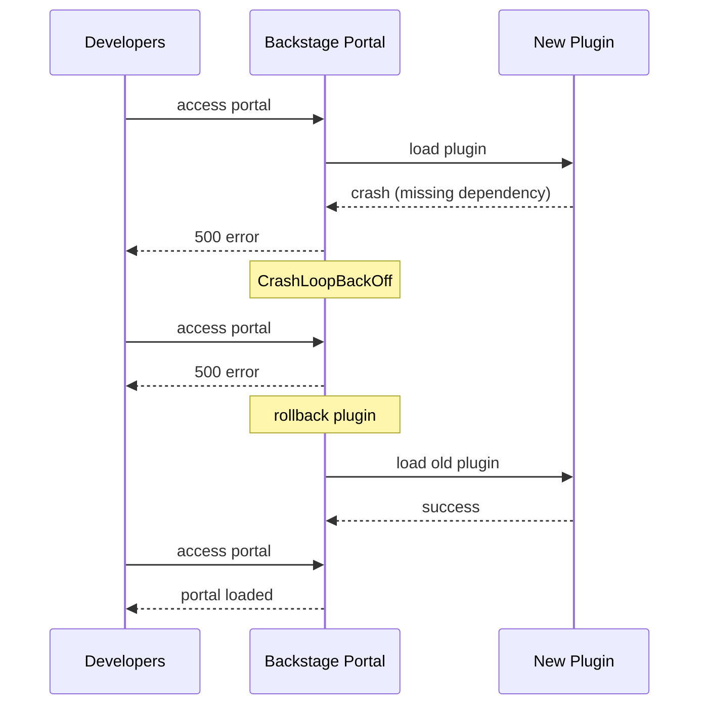

# Incident: Spotify Backstage Plugin Failure (2022)

> **Category:** Incident Case Study / Stylized
> **Severity:** S2 — developer portal degraded for ~2 hours
> **K8s Version:** 1.22 (GKE)
> **Area:** Developer Platform / Backstage

| Field | Detail |
|-------|--------|
| **Company** | Spotify |
| **Trigger** | Backstage plugin update crashes portal |
| **Blast Radius** | All developer portal users |
| **Mean Time to Detect** | ~5 min |
| **Mean Time to Resolve** | ~2 hours |

## Source

- [Spotify engineering: Backstage at scale](https://engineering.spotify.com/2022/02/15/backstage-at-scale/)
- [Spotify tech: Developer portal reliability](https://engineering.spotify.com/2022/06/01/developer-portal-reliability/)

## Timeline (stylized)

| Time | Event |
|------|-------|
| T+0:00 | New Backstage plugin deployed via Helm |
| T+0:02 | Plugin crashes on startup (missing dependency) |
| T+0:05 | Backstage pod restarts in CrashLoopBackOff |
| T+0:10 | Developer portal returns 500 errors |
| T+0:15 | PagerDuty fires: "Backstage error rate > 50%" |
| T+0:20 | On-call identifies: plugin crash |
| T+0:30 | Rollback plugin version |
| T+0:45 | Backstage pod recovers |
| T+2:00 | Full recovery after cache refresh |

## What happened

## Root cause

1. **Plugin crash** — new plugin had a missing npm dependency.
2. **No dependency validation** — plugin was deployed without checking dependencies.
3. **No canary rollout** — plugin was deployed to production in one step.
4. **No health check** — Backstage pod didn't have a liveness probe for plugin health.

## Fix

1. Rollback plugin version.
2. Wait for Backstage pod to recover.

## Prevention

| Measure | Implementation |
|---------|----------------|
| **Dependency validation** | Check all dependencies before deployment |
| **Canary rollout** | Deploy plugin to one namespace first |
| **Health checks** | Add liveness probe for plugin health |
| **Plugin isolation** | Run plugins in separate pods |
| **Rollback automation** | Auto-rollback if error rate > 10% |

## Related

- [Disaster Cases](../disaster-cases.md)
- [Deployments](../../03-workloads/deployments.md)
- [Incidents README](./README.md)
