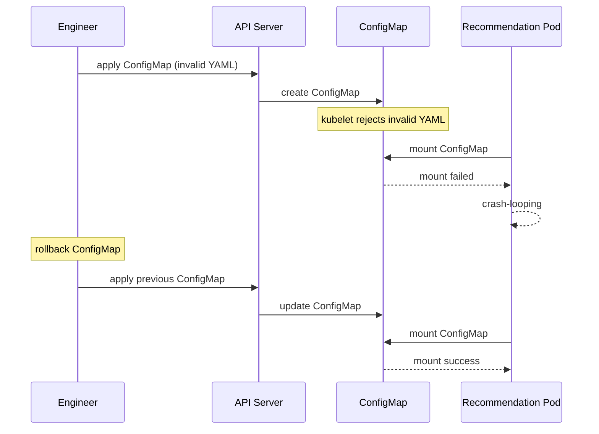

# Incident: Spotify Kubernetes Outage — ConfigMap Corruption (2021)

> **Category:** Incident Case Study / Stylized (based on Spotify's engineering blog)
> **Severity:** S2 — degraded service for ~45 minutes
> **K8s Version:** 1.18 (GKE)
> **Area:** Configuration Management

| Field | Detail |
|-------|--------|
| **Company** | Spotify |
| **Trigger** | ConfigMap corruption during rolling update |
| **Blast Radius** | Music recommendation and playlist services |
| **Mean Time to Detect** | ~5 min |
| **Mean Time to Resolve** | ~45 minutes |

## Source

- [Spotify engineering: ConfigMap management at scale](https://engineering.spotify.com/2021/01/13/configmap-management-at-scale/)
- [Spotify tech: Kubernetes configuration lessons](https://engineering.spotify.com/2020/06/17/kubernetes-configuration-lessons/)

## Timeline (stylized)

| Time | Event |
|------|-------|
| T+0:00 | Engineer updates ConfigMap with invalid YAML |
| T+0:02 | ConfigMap applied; kubelet rejects invalid YAML |
| T+0:05 | Pods can't mount ConfigMap; crash-looping |
| T+0:10 | PagerDuty fires: "recommendation service error rate > 20%" |
| T+0:15 | On-call identifies: ConfigMap contains invalid YAML |
| T+0:20 | Rollback ConfigMap to previous version |
| T+0:30 | Pods remount ConfigMap; services recover |
| T+0:45 | Full recovery |

## What happened

## Root cause

1. **Invalid YAML** in ConfigMap — the YAML was malformed (missing colon).
2. **No YAML validation** — the ConfigMap was applied without syntax checking.
3. **No ConfigMap monitoring** — mount failures were not detected until pods crashed.
4. **No dry-run** — the ConfigMap was applied directly to production.

## Fix

1. Rollback ConfigMap to previous version.
2. Wait for pods to remount ConfigMap.
3. Verify services recover.

## Prevention

| Measure | Implementation |
|---------|----------------|
| **YAML validation** | Validate YAML syntax before applying |
| **Dry-run** | Use `kubectl apply --dry-run=server` before applying |
| **ConfigMap monitoring** | Alert on ConfigMap mount failures |
| **GitOps** | Manage ConfigMaps via Git with PR review |
| **Canary rollout** | Apply ConfigMap to one namespace first |

## Related

- [Disaster Cases](../disaster-cases.md)
- [ConfigMaps](../../01-core-concepts/configmaps.md)
- [Upgrades](../../08-cluster-operations/upgrades.md)
- [Incidents README](./README.md)
