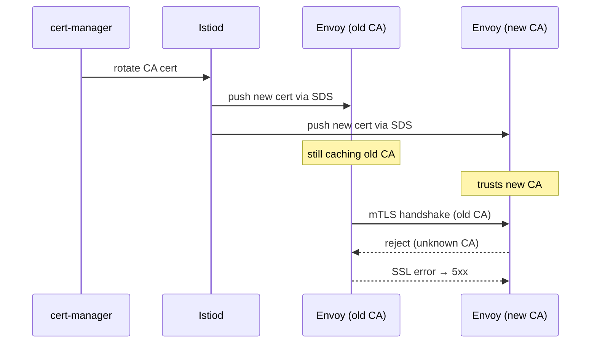

# Incident: Spotify Istio Cert Rotation → 5xx Cascade (2020)

> **Category:** Incident Case Study / Stylized (based on Istio cert rotation patterns)
> **Severity:** S2 — intermittent 5xx for ~45 min
> **K8s Version:** 1.17 (GKE)
> **Area:** Service Mesh / mTLS / Certificate Management

| Field | Detail |
|-------|--------|
| **Company** | Spotify |
| **Trigger** | cert-manager auto-rotation + Istio mTLS strict mode |
| **Blast Radius** | Internal API calls (10-15% 5xx) |
| **Mean Time to Detect** | ~3 min |
| **Mean Time to Resolve** | ~45 min |

## Timeline (stylized)

| Time | Event |
|------|-------|
| T+0:00 | cert-manager rotates Istio CA cert (new CA, old CA still valid for 24h) |
| T+0:02 | Envoy sidecars pick up new cert via SDS |
| T+0:05 | Some sidecars still trust old CA; mTLS handshake fails intermittently |
| T+0:08 | PagerDuty fires: "internal API 5xx > 10% for 3 min" |
| T+0:12 | On-call sees `SSL certificate verify failed` in Envoy logs |
| T+0:15 | Root cause: cert rotation window too narrow — old CA expired before all sidecars refreshed |
| T+0:20 | Temporarily disable Istio strict mTLS (set to `PERMISSIVE`) |
| T+0:25 | All sidecars accept both old and new certs |
| T+0:40 | Re-enable strict mTLS after cert cache fully refreshed |
| T+0:45 | Incident resolved |

## What happened

## Root cause

1. **cert-manager** rotated the Istio CA cert at T+0:00 with a `notAfter` window of only 1 hour for the old cert.
2. **Envoy sidecars** cache their certificate chain and refresh via SDS (Secret Discovery Service). Some sidecars refreshed immediately, others lagged by up to 5 minutes.
3. During the window, sidecars with the **new CA** rejected mTLS handshakes from sidecars still using the **old CA**, causing intermittent 5xx.
4. **No cert overlap window** — the old cert expired before all sidecars had refreshed.

## Fix

1. Set Istio's `PeerAuthentication` to `PERMISSIVE` mode (accept both mTLS and plaintext).
2. Wait for all sidecars to refresh their cert cache (T+0:25).
3. Re-enable `STRICT` mTLS after confirming all sidecars trust the new CA.

## Prevention

| Measure | Implementation |
|---------|----------------|
| **Cert overlap window** | Configure cert-manager with `renewBefore: 24h` so new certs are issued well before old ones expire |
| **Staged rollout** | Rotate cert in staging → verify all sidecars refresh → then prod |
| **SDS cache monitoring** | Alert on sidecars with stale cert cache (Istio `citadel_agent_cert_expire`) |
| **mTLS transition policy** | Use `PERMISSIVE` during cert rotation, `STRICT` after validation |
| **Canary cert rotation** | Rotate cert for one namespace first, verify, then cluster-wide |

## Interview angle

> "How do you safely rotate mTLS certificates in a service mesh without causing downtime? What's the role of SDS and cert overlap windows?"

## Related

- [Disaster Cases](../disaster-cases.md)
- [Service Mesh](../../12-service-mesh/README.md)
- [Security](../../06-security/security.md)
