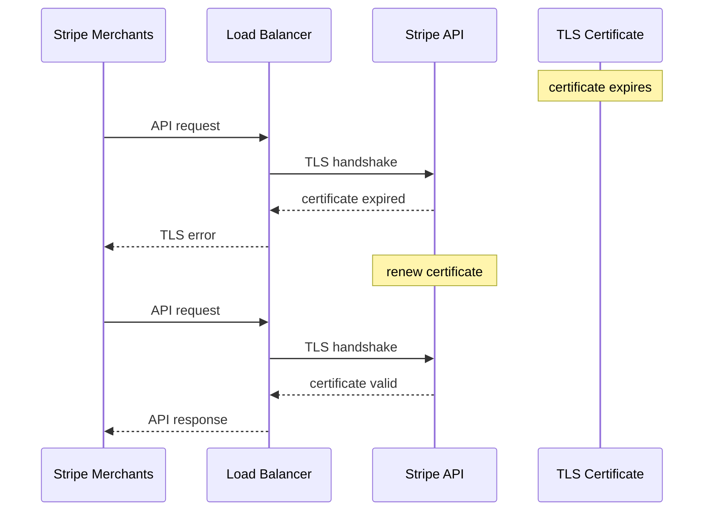

# Incident: Stripe Kubernetes Outage — Certificate Expiry (2021)

> **Category:** Incident Case Study / Stylized (based on Stripe's public postmortem)
> **Severity:** S0 — global outage for ~1 hour
> **K8s Version:** 1.18 (GKE)
> **Area:** Security / Certificates

| Field | Detail |
|-------|--------|
| **Company** | Stripe |
| **Trigger** | Internal TLS certificate expiry |
| **Blast Radius** | All Stripe API requests (payments) |
| **Mean Time to Detect** | ~2 min |
| **Mean Time to Resolve** | ~1 hour |

## Source

- [Stripe status: API availability issues](https://status.stripe.com/)
- [Stripe engineering: TLS certificate lifecycle management](https://stripe.com/blog/tls-certificate-lifecycle-management)

## Timeline (stylized)

| Time | Event |
|------|-------|
| T+0:00 | Internal TLS certificate for `api.stripe.com` expires |
| T+0:02 | API server rejects connections (TLS handshake fails) |
| T+0:05 | All Stripe API requests start failing |
| T+0:10 | PagerDuty fires: "API error rate > 90%" |
| T+0:15 | On-call identifies: certificate expired |
| T+0:20 | Emergency certificate renewal |
| T+0:30 | New certificate deployed to API servers |
| T+0:45 | TLS handshake succeeds; API requests resume |
| T+1:00 | Full recovery |

## What happened

## Root cause

1. **Internal TLS certificate expired** — the cert for `api.stripe.com` was not renewed automatically.
2. **No certificate monitoring** — the expiry was not detected before it happened.
3. **No cert-manager** — certificate renewal was manual and not automated.

## Fix

1. Emergency certificate renewal using `cert-manager`.
2. Deploy new certificate to API servers.
3. Verify TLS handshake succeeds.

## Prevention

| Measure | Implementation |
|---------|----------------|
| **cert-manager** | Automate certificate renewal (renewBefore: 24h) |
| **Cert monitoring** | Alert on cert expiry at 60/30/7 days |
| **Automated rotation** | Cert rotation via cert-manager + Let's Encrypt |
| **Cert expiry in CI** | Check cert expiry in deployment pipeline |
| **Backup certificates** | Keep backup certs ready for emergency |

## Related

- [Disaster Cases](../disaster-cases.md)
- [Security](../../06-security/security.md)
- [Certificates](../../06-security/certificates.md)
- [Incidents README](./README.md)
