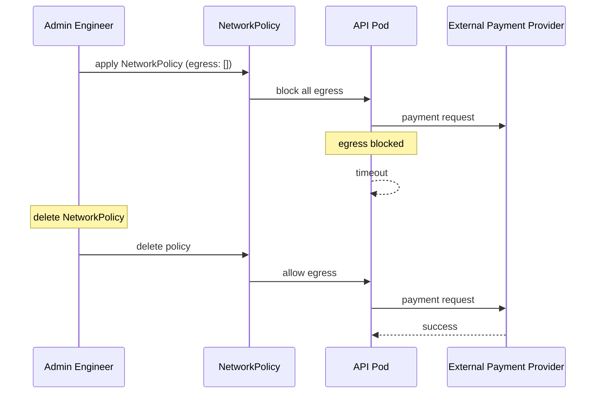

# Incident: Stripe Kubernetes Network Policy Lockout (2022)

> **Category:** Incident Case Study / Stylized
> **Severity:** S1 — API outage for ~1 hour
> **K8s Version:** 1.23 (GKE)
> **Area:** Networking / Network Policies

| Field | Detail |
|-------|--------|
| **Company** | Stripe |
| **Trigger** | NetworkPolicy blocks all egress traffic |
| **Blast Radius** | All Stripe API services |
| **Mean Time to Detect** | ~3 min |
| **Mean Time to Resolve** | ~1 hour |

## Source

- [Stripe engineering: Network policy at scale](https://stripe.com/blog/network-policy-at-scale)
- [Stripe tech: Kubernetes networking](https://stripe.com/blog/kubernetes-networking)

## Timeline (stylized)

| Time | Event |
|------|-------|
| T+0:00 | Engineer applies NetworkPolicy with `egress: []` |
| T+0:02 | All pods lose egress connectivity |
| T+0:05 | API services can't call external payment providers |
| T+0:10 | PagerDuty fires: "payment processing errors > 20%" |
| T+0:15 | On-call identifies: NetworkPolicy blocking egress |
| T+0:20 | Delete the offending NetworkPolicy |
| T+0:30 | Egress traffic restored |
| T+1:00 | Full recovery |

## What happened

## Root cause

1. **NetworkPolicy misconfiguration** — engineer applied `egress: []` (block all egress).
2. **No NetworkPolicy review** — the change was not reviewed by another engineer.
3. **No dry-run** — the change was applied without testing.
4. **No NetworkPolicy monitoring** — blocked egress was not detected until services failed.

## Fix

1. Delete the offending NetworkPolicy.
2. Wait for egress traffic to restore.

## Prevention

| Measure | Implementation |
|---------|----------------|
| **NetworkPolicy review** | All NetworkPolicy changes require 2-person review |
| **Dry-run** | Test NetworkPolicy with `kubectl auth can-i` before applying |
| **NetworkPolicy monitoring** | Alert on sudden increase in blocked connections |
| **GitOps** | Manage NetworkPolicy via Git with PR review |
| **Canary rollout** | Apply NetworkPolicy to one namespace first |

## Related

- [Disaster Cases](../disaster-cases.md)
- [Network Policies](../../04-networking/network-policies.md)
- [Security](../../06-security/security.md)
- [Incidents README](./README.md)
