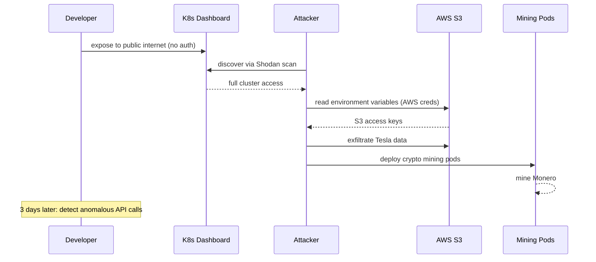

# Incident: Tesla Cryptojacking via Kubernetes Dashboard (2018)

> **Category:** Incident Case Study / Stylized (based on Tesla's public disclosure)
> **Severity:** S1 — cloud resource compromise
> **K8s Version:** 1.10 (AWS)
> **Area:** Security / Cloud / Supply Chain

| Field | Detail |
|-------|--------|
| **Company** | Tesla |
| **Trigger** | Exposed Kubernetes dashboard with no authentication |
| **Blast Radius** | AWS cloud resources (crypto mining, data exfiltration) |
| **Mean Time to Detect** | ~3 days |
| **Mean Time to Resolve** | ~24 hours |

## Source

- [RedLock research: Tesla Cloud Cryptojacking](https://redlock.io/press/tesla-cloud-cryptojacking)
- [ZDNet: Tesla cryptojackers exposed customer data](https://www.zdnet.com/article/tesla-cryptojackers-exposed-customer-data-in-the-cloud/)

## Timeline (stylized)

| Time | Event |
|------|-------|
| T+0:00 | Developer exposes K8s dashboard to public internet (no auth) |
| T+0:05 | Attacker discovers dashboard via Shodan scan |
| T+0:10 | Attacker accesses dashboard, sees AWS credentials in environment variables |
| T+0:15 | Attacker uses AWS credentials to access S3 buckets |
| T+0:20 | Attacker deploys crypto mining containers on Tesla's AWS |
| T+0:30 | Attacker exfiltrates Tesla data to external server |
| T+3d | Tesla's security team detects anomalous AWS API calls |
| T+3d+1h | Incident response: rotate credentials, shut down mining pods |

## What happened

## Root cause

1. **Kubernetes Dashboard exposed** to the public internet without authentication.
2. **AWS credentials stored in environment variables** — accessible from the dashboard.
3. **No network segmentation** — the dashboard had access to S3 buckets.
4. **No monitoring** on unusual AWS API calls (crypto mining, data exfiltration).

## Fix

1. **Disable K8s Dashboard** or restrict to `localhost` with `kube-proxy`.
2. **Rotate all AWS credentials** immediately.
3. **Deploy network policies** to restrict dashboard access.
4. **Enable AWS CloudTrail** monitoring for unusual API patterns.

## Prevention

| Measure | Implementation |
|---------|----------------|
| **No public dashboard** | K8s Dashboard always behind VPN or localhost proxy |
| **RBAC for dashboard** | ServiceAccount with minimal permissions |
| **No env-based credentials** | Use IRSA, Workload Identity, or External Secrets |
| **Network policies** | Restrict dashboard to admin namespace only |
| **CloudTrail monitoring** | Alert on unusual `DescribeInstances`, `GetSessionToken` calls |
| **Pod Security Standards** | Restrict containers from reading environment variables of other containers |

## Related

- [Disaster Cases](../disaster-cases.md)
- [Security](../../06-security/security.md)
- [RBAC](../../06-security/rbac.md)
- [Incidents README](./README.md)
