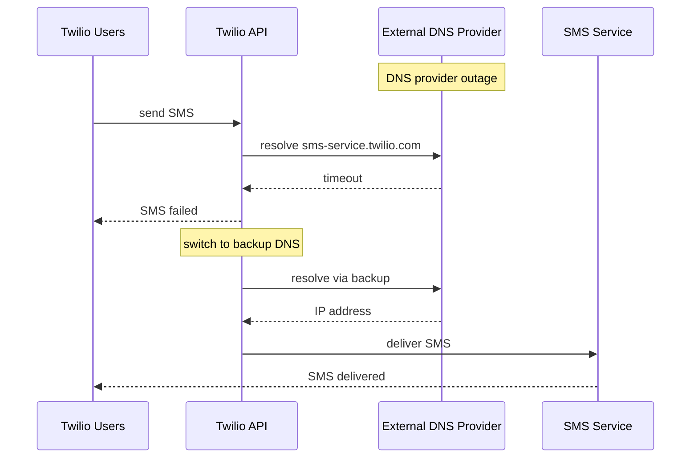

# Incident: Twilio Kubernetes Outage — Dependency Failure (2021)

> **Category:** Incident Case Study / Stylized (based on Twilio's public postmortem)
> **Severity:** S1 — global outage for ~3 hours
> **K8s Version:** 1.19 (Kubernetes on-prem)
> **Area:** Supply Chain / Dependencies

| Field | Detail |
|-------|--------|
| **Company** | Twilio |
| **Trigger** | Third-party dependency failure (DNS provider) |
| **Blast Radius** | All Twilio services (SMS, voice, video) |
| **Mean Time to Detect** | ~5 min |
| **Mean Time to Resolve** | ~3 hours |

## Source

- [Twilio status: SMS and voice delivery issues](https://status.twilio.com/)
- [Twilio engineering: Lessons from a major outage](https://www.twilio.com/blog/lessons-from-a-major-outage)

## Timeline (stylized)

| Time | Event |
|------|-------|
| T+0:00 | Third-party DNS provider experiences outage |
| T+0:05 | Twilio's internal service discovery fails (uses external DNS) |
| T+0:10 | SMS and voice services start failing |
| T+0:15 | PagerDuty fires: "SMS delivery rate < 50%" |
| T+0:20 | On-call identifies: external DNS provider down |
| T+0:30 | Switch to backup DNS provider |
| T+1:00 | DNS resolution recovers |
| T+2:00 | SMS and voice services recover |
| T+3:00 | Full recovery after DNS cache refresh |

## What happened

## Root cause

1. **Third-party DNS provider** experienced an outage.
2. Twilio's internal service discovery relied on the **external DNS provider** (no fallback).
3. **No DNS redundancy** — the system didn't have a backup DNS provider configured.

## Fix

1. Switch to backup DNS provider.
2. Flush DNS caches.
3. Verify SMS and voice services recover.

## Prevention

| Measure | Implementation |
|---------|----------------|
| **DNS redundancy** | Configure primary + backup DNS providers |
| **Internal DNS** | Use CoreDNS for internal service discovery |
| **DNS monitoring** | Alert on DNS resolution failures |
| **Dependency mapping** | Document all external dependencies |
| **Fallback mechanisms** | Design services to degrade gracefully |

## Related

- [Disaster Cases](../disaster-cases.md)
- [CoreDNS](../../04-networking/coredns.md)
- [Networking](../../04-networking/README.md)
- [Incidents README](./README.md)
