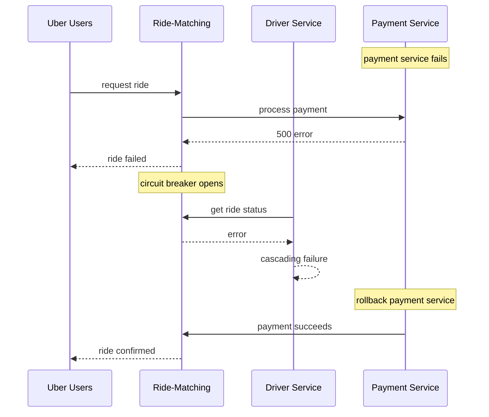

# Incident: Uber Kubernetes Outage — Cascading Failure (2020)

> **Category:** Incident Case Study / Stylized (based on Uber's engineering blog)
> **Severity:** S1 — global outage for ~2 hours
> **K8s Version:** 1.17 (Kubernetes on-prem)
> **Area:** Microservices / Cascading Failure

| Field | Detail |
|-------|--------|
| **Company** | Uber |
| **Trigger** | Cascading failure from a single service |
| **Blast Radius** | All Uber services (rides, eats, payments) |
| **Mean Time to Detect** | ~3 min |
| **Mean Time to Resolve** | ~2 hours |

## Source

- [Uber engineering: Cascading failure in microservices](https://www.uber.com/blog/cascading-failure-in-microservices/)
- [Uber tech: Scaling microservices at Uber](https://www.uber.com/blog/scaling-microservices-at-uber/)

## Timeline (stylized)

| Time | Event |
|------|-------|
| T+0:00 | Payment service starts returning 500 errors |
| T+0:02 | Ride-matching service calls payment service; gets errors |
| T+0:05 | Ride-matching service starts failing (circuit breaker opens) |
| T+0:10 | Driver service calls ride-matching; gets errors |
| T+0:15 | Driver service starts failing |
| T+0:20 | PagerDuty fires: "ride-matching error rate > 30%" |
| T+0:25 | On-call identifies: payment service is the root cause |
| T+0:30 | Payment service rollback |
| T+0:45 | Payment service recovers |
| T+1:00 | Ride-matching service recovers |
| T+2:00 | All services recovered |

## What happened

## Root cause

1. **Payment service failure** — a bad deployment caused the payment service to return 500 errors.
2. **No circuit breaker** — ride-matching service didn't have a circuit breaker for payment service.
3. **Cascading failure** — payment service failure cascaded to ride-matching, then to driver service.
4. **No timeout** — ride-matching service waited 30 seconds for payment service response.

## Fix

1. Rollback payment service to previous version.
2. Enable circuit breaker on ride-matching service.
3. Add timeouts to all inter-service calls.

## Prevention

| Measure | Implementation |
|---------|----------------|
| **Circuit breaker** | Istio `DestinationRule` with `outlierDetection` |
| **Timeouts** | Set `timeout` on all service mesh routes |
| **Retry budgets** | Limit retry attempts to prevent thundering herd |
| **Fallback behavior** | Return cached data or default response on failure |
| **Chaos testing** | Regularly test cascading failure scenarios |

## Related

- [Disaster Cases](../disaster-cases.md)
- [Service Mesh](../../12-service-mesh/README.md)
- [Incidents README](./README.md)
