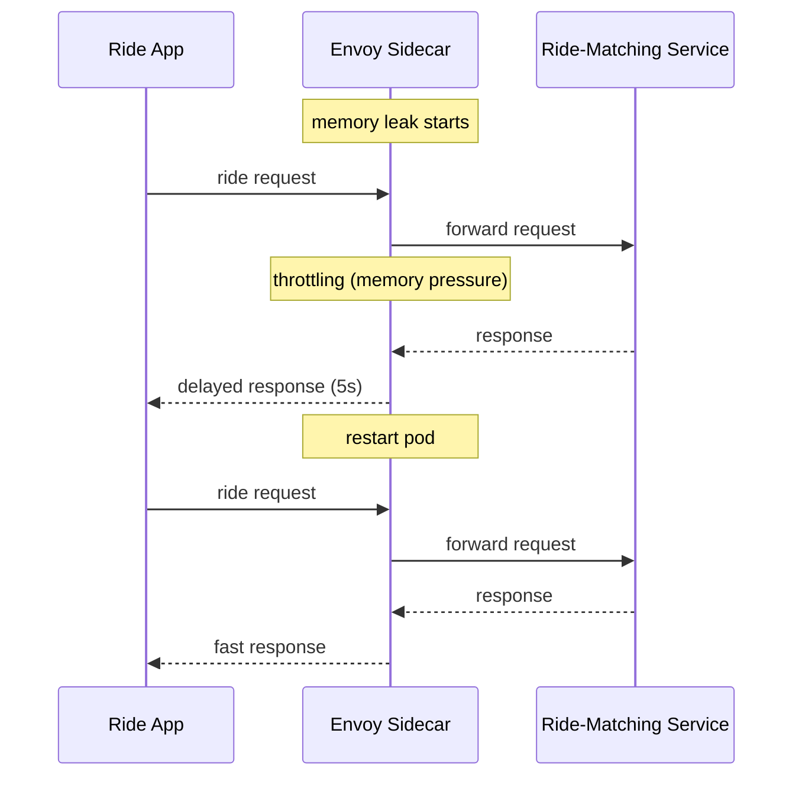

# Incident: Uber Service Mesh Latency Spike (2022)

> **Category:** Incident Case Study / Stylized
> **Severity:** S2 — ride-matching latency spike for ~30 min
> **K8s Version:** 1.22 (Kubernetes on-prem)
> **Area:** Service Mesh / Envoy

| Field | Detail |
|-------|--------|
| **Company** | Uber |
| **Trigger** | Envoy sidecar memory leak causes latency spike |
| **Blast Radius** | Ride-matching and payment services |
| **Mean Time to Detect** | ~5 min |
| **Mean Time to Resolve** | ~30 min |

## Source

- [Uber engineering: Envoy at scale](https://www.uber.com/blog/envoy-at-scale/)
- [Uber tech: Service mesh reliability](https://www.uber.com/blog/service-mesh-reliability/)

## Timeline (stylized)

| Time | Event |
|------|-------|
| T+0:00 | Envoy sidecar memory leak starts |
| T+0:05 | Envoy proxy starts throttling requests |
| T+0:10 | Ride-matching latency spikes to 5s |
| T+0:15 | PagerDuty fires: "ride-matching latency > 5s" |
| T+0:20 | On-call identifies: Envoy memory leak |
| T0:25 | Restart affected pods |
| T+0:30 | New Envoy sidecars start; latency drops |
| T+0:45 | Full recovery |

## What happened

## Root cause

1. **Envoy memory leak** — a bug in the Envoy sidecar caused memory to grow over time.
2. **Envoy throttling** — when memory pressure increased, Envoy started throttling requests.
3. **No Envoy monitoring** — the memory leak was not detected until latency spiked.

## Fix

1. Restart affected pods.
2. New Envoy sidecars start with clean memory.

## Prevention

| Measure | Implementation |
|---------|----------------|
| **Envoy monitoring** | Alert on Envoy memory usage > 80% |
| **Envoy upgrades** | Keep Envoy updated to latest stable version |
| **Pod restart policy** | Auto-restart pods with high memory usage |
| **Canary Envoy updates** | Test Envoy updates in staging first |

## Related

- [Disaster Cases](../disaster-cases.md)
- [Service Mesh](../../12-service-mesh/README.md)
- [Istio](../../12-service-mesh/istio.md)
- [Incidents README](./README.md)
