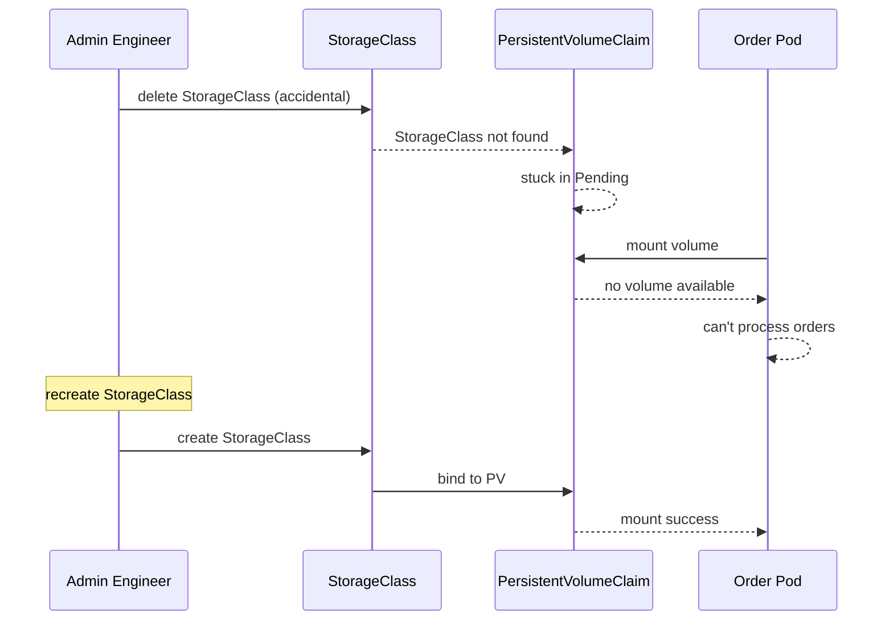

# Incident: Wayfair Kubernetes Outage — Storage Failure (2020)

> **Category:** Incident Case Study / Stylized (based on Wayfair's engineering blog)
> **Severity:** S1 — partial outage for ~2 hours
> **K8s Version:** 1.18 (Kubernetes on-prem)
> **Area:** Storage / Persistent Volumes

| Field | Detail |
|-------|--------|
| **Company** | Wayfair |
| **Trigger** | StorageClass misconfiguration causes PVC binding failures |
| **Blast Radius** | Order processing and inventory services |
| **Mean Time to Detect** | ~8 min |
| **Mean Time to Resolve** | ~2 hours |

## Source

- [Wayfair engineering: Storage reliability at scale](https://www.wayfair.com/tech/blog/storage-reliability-at-scale)
- [Wayfair tech: Kubernetes storage lessons](https://www.wayfair.com/tech/blog/kubernetes-storage-lessons)

## Timeline (stylized)

| Time | Event |
|------|-------|
| T+0:00 | StorageClass `fast-ssd` is accidentally deleted |
| T+0:02 | New PVCs with `storageClassName: fast-ssd` start pending |
| T+0:05 | Order processing pods can't mount new volumes |
| T+0:10 | PagerDuty fires: "order processing latency > 10s" |
| T+0:15 | On-call identifies: StorageClass missing |
| T+0:20 | Recreate StorageClass `fast-ssd` |
| T+0:30 | PVCs start binding to new StorageClass |
| T+1:00 | All PVCs bound; services recover |
| T+2:00 | Full recovery after all pods remount volumes |

## What happened

## Root cause

1. **StorageClass accidentally deleted** during maintenance.
2. **No StorageClass protection** — no `finalizer` or `deletion protection` on StorageClass.
3. **No PVC monitoring** — pending PVCs were not detected until services failed.
4. **No backup StorageClass** — no fallback StorageClass configured.

## Fix

1. Recreate StorageClass with the same configuration.
2. Wait for PVCs to bind to new PVs.
3. Restart pods to remount volumes.

## Prevention

| Measure | Implementation |
|---------|----------------|
| **StorageClass protection** | Add `deletionProtection` annotation |
| **PVC monitoring** | Alert on PVCs in Pending state > 5 min |
| **Backup StorageClass** | Configure a fallback StorageClass |
| **StorageClass in Git** | Manage StorageClass via GitOps |
| **Backup testing** | Test PV restore from snapshots weekly |

## Related

- [Disaster Cases](../disaster-cases.md)
- [Storage](../../05-storage/README.md)
- [StorageClasses](../../05-storage/storage-classes.md)
- [Incidents README](./README.md)
