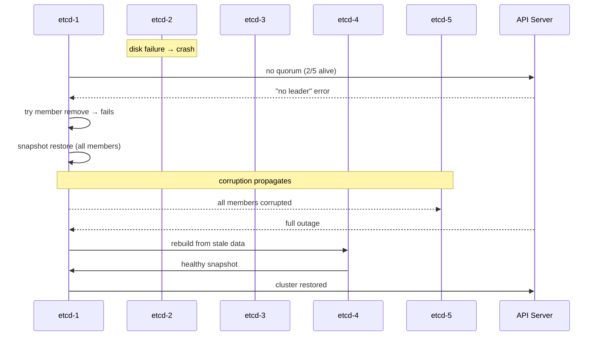

# Incident: Zalando etcd Quorum Loss + Botched Restore (2019)

> **Category:** Incident Case Study / Stylized (based on etcd failure patterns)
> **Severity:** S0 — full control-plane outage for ~2 hours
> **K8s Version:** 1.14 (on-prem)
> **Area:** Control Plane / etcd

| Field | Detail |
|-------|--------|
| **Company** | Zalando (open-source postgres team) |
| **Trigger** | etcd member failure + botched snapshot restore |
| **Blast Radius** | All API operations cluster-wide |
| **Mean Time to Detect** | ~1 min |
| **Mean Time to Resolve** | ~2h |

## Timeline (stylized)

| Time | Event |
|------|-------|
| T+0:00 | etcd member-2 crashes (disk failure) |
| T+0:01 | etcd cluster loses quorum (2/5 members alive → 40%) |
| T+0:02 | API server returns "no leader" errors |
| T+0:03 | PagerDuty fires: "etcd health check failed" |
| T+0:05 | On-call attempts `etcdctl member list` — hangs |
| T+0:10 | On-call tries to remove failed member: `etcdctl member remove` — fails (no quorum) |
| T+0:15 | SRE decides to restore from snapshot |
| T+0:20 | Snapshot restore command runs: `etcdctl snapshot restore` |
| T+0:22 | **Mistake**: restore command run on *all* members simultaneously → data corruption |
| T+0:30 | All 5 members now corrupted; full outage confirmed |
| T+0:45 | SRE + DBA coordinate: manually rebuild etcd cluster from scratch |
| T+1:10 | New etcd cluster formed from remaining healthy member (member-4 had stale but valid data) |
| T+1:30 | API server restarted; cluster recovers |
| T+2:00 | Incident resolved |

## What happened

## Root cause

1. **etcd member-2** crashed due to a disk failure, leaving only 2 of 5 members alive (quorum lost).
2. The on-call engineer attempted `etcdctl member remove` without quorum — this is **not supported**.
3. The SRE then attempted `etcdctl snapshot restore` — but ran it on **all 5 members simultaneously**, which corrupted the data directory on each member.
4. **No restore runbook** — the team had never tested etcd restore in production.

## Fix

1. Identify the member with the **least-corrupted** data (member-4 had a stale but valid data directory).
2. Stop etcd on all members.
3. On member-4, run `etcdctl snapshot restore` with the **latest valid snapshot**.
4. On other members, copy the restored data directory from member-4.
5. Restart etcd on all members; verify quorum is restored.
6. Restart API server; verify cluster health.

## Prevention

| Measure | Implementation |
|---------|----------------|
| **Automated etcd restore test** | Weekly: snapshot → restore in isolated env → verify API operations |
| **Restore runbook** | Documented, tested steps for etcd restore (one member at a time) |
| **Disk monitoring** | Alert on `node_filesystem_avail_bytes` < 20% |
| **etcd backup automation** | `etcdctl snapshot save` every 15 min → offsite storage |
| **Quorum monitoring** | Alert on `etcd_server_has_leader` == 0 for > 30s |

## Interview angle

> "Your etcd cluster loses quorum. Walk me through the recovery process — and what NOT to do. Why is `etcdctl snapshot restore` on all members simultaneously dangerous?"

## Related

- [Disaster Cases](../disaster-cases.md)
- [Etcd](../../02-architecture/etcd.md)
- [Backup & Restore](../../08-cluster-operations/backup-restore.md)
