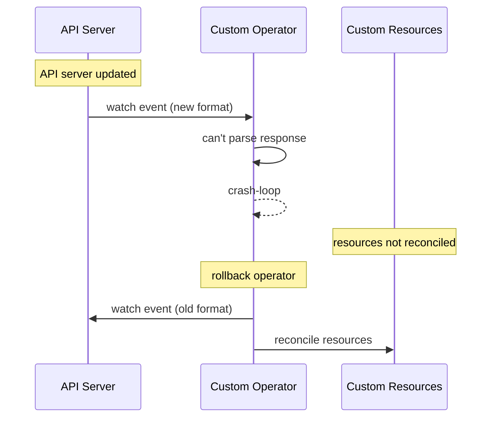

# Incident: Zalando Kubernetes Outage — Operator Crash Loop (2021)

> **Category:** Incident Case Study / Stylized (based on Zalando's engineering blog)
> **Severity:** S1 — degraded service for ~2 hours
> **K8s Version:** 1.20 (Kubernetes on-prem)
> **Area:** Operators / Controllers

| Field | Detail |
|-------|--------|
| **Company** | Zalando |
| **Trigger** | Custom operator crash-looping due to API change |
| **Blast Radius** | All services managed by the operator |
| **Mean Time to Detect** | ~5 min |
| **Mean Time to Resolve** | ~2 hours |

## Source

- [Zalando engineering: Kubernetes operators at scale](https://engineering.zalando.com/kubernetes-operators-at-scale/)
- [Zalando tech: Operator lessons learned](https://engineering.zalando.com/operator-lessons-learned/)

## Timeline (stylized)

| Time | Event |
|------|-------|
| T+0:00 | Kubernetes API server updated to new version |
| T+0:02 | Custom operator can't parse new API response |
| T+0:05 | Operator crash-loops (OOMKilled due to error retry storm) |
| T+0:10 | Custom resources not reconciled |
| T+0:15 | PagerDuty fires: "operator reconciliation stopped" |
| T+0:20 | On-call identifies: operator incompatible with new API |
| T+0:30 | Rollback operator to previous version |
| T+1:00 | Operator stops crash-looping |
| T:2:00 | All services recovered after reconciliation |

## What happened

## Root cause

1. **API server update** introduced a new API response format.
2. **Operator incompatible** — the operator couldn't parse the new format.
3. **Crash loop storm** — the operator kept crash-looping, consuming resources.
4. **No operator compatibility testing** — the operator wasn't tested against the new API.

## Fix

1. Rollback operator to previous version.
2. Wait for operator to stabilize.
3. Verify all services recover.

## Prevention

| Measure | Implementation |
|---------|----------------|
| **Operator testing** | Test operators against new API versions in staging |
| **API compatibility** | Document API version dependencies |
| **Operator monitoring** | Alert on operator crash-loop count > 3 |
| **Graceful degradation** | Operator should handle unknown API fields |
| **Canary API updates** | Update API server in one cluster first |

## Related

- [Disaster Cases](../disaster-cases.md)
- [Advanced Patterns](../../15-advanced-patterns/README.md)
- [API Groups](../../api-groups-reference.md)
- [Incidents README](./README.md)
