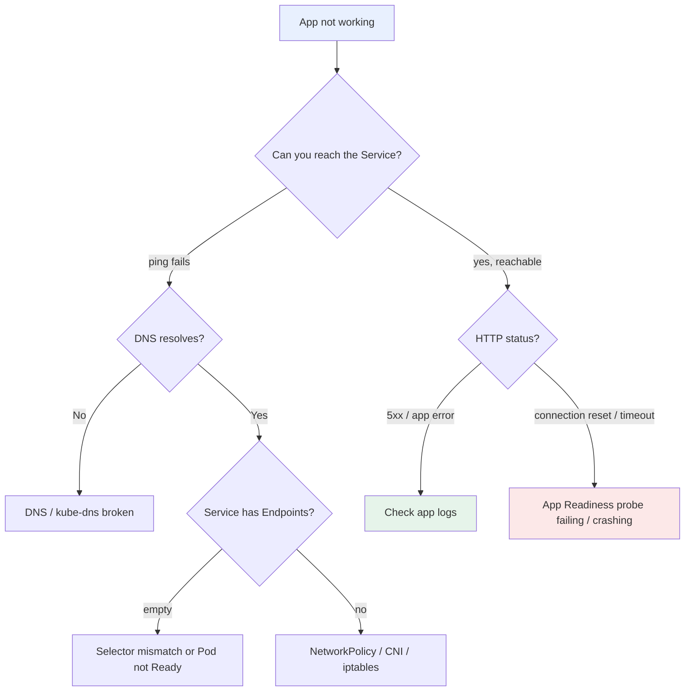
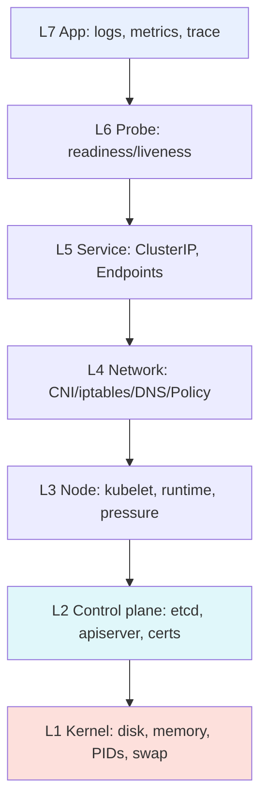
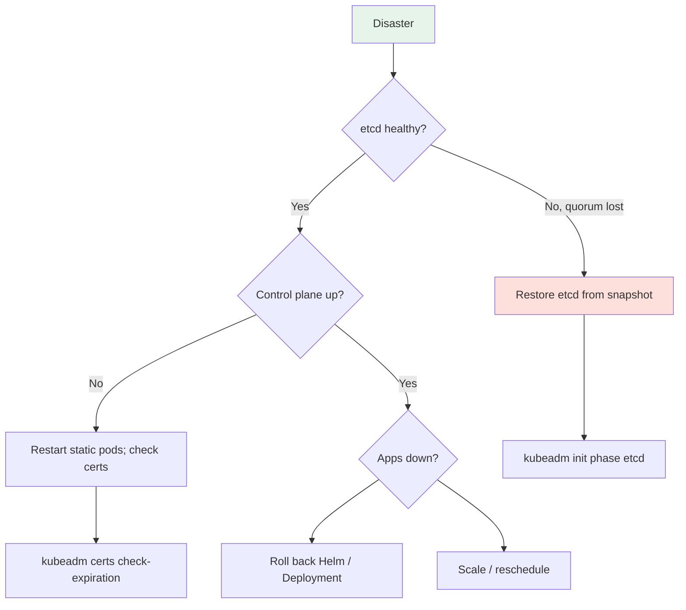

# Kubernetes Troubleshooting Encyclopedia

> **Category:** Troubleshooting / Reference

Your field guide to "it's broken." Start at the top **decision tree**, then dive into the per-component **diagnostic tables** (symptom → diagnosis command → fix). K8s breaks in layers (kernel, runtime, kubelet, node, network, pod) — isolate the layer first.



## Layer model (troubleshooting order)



## 0. First diagnosis kit

```bash
kubectl cluster-info                         # are the masters up?
kubectl get nodes                            # any NotReady?
kubectl get endpoints <svc>                  # is my Service selecting anything?
kubectl describe pod <pod>                   # look for Events at the bottom
kubectl logs <pod> --previous                # logs of the crashed container
kubectl get events -A --sort-by=.lastTimestamp # the universal timeline
kubectl top nodes; kubectl top pods -A       # real CPU/mem vs requested
```

## 1. Pods

| Symptom / Status | Diagnosis | Likely cause | Fix |
|------------------|-----------|--------------|-----|
| `ImagePullBackOff` / `ErrImagePull` | `kubectl describe` shows `<image> not accessible` | wrong tag, wrong registry, missing imagePullSecret (401), registry down | `kubectl get secret`, check tag, test `docker pull` from a node |
| `ErrImageNeverSupported` | image manifest type unsupported | wrong arch (e.g. linux/amd64 image on arm64) or not an OCI image | rebuild with correct `--platform` |
| `CrashLoopBackOff` / `Error` | `kubectl logs <pod> --previous` | app exits non-zero (panic, DB connection, misconfig) | read logs; `--previous` for the last crashed container |
| `OOMKilled` | `ExitCode 137`, `OOM` in dmesg | container exceeded memory; limit too tight, leak | `kubectl top`, raise `limit` or `request`, fix the leak |
| `Pending` (no ress) | `0/1 nodes are available: N pod(s) had insufficient CPU`. | request > node free capacity | scale the cluster or lower requests |
| `Pending` (PVC) | `persistentvolumeclaim <x> not found` / `waiting for a volume` | PVC not bound, no storage class, quota exhausted | `kubectl get pvc`, check `storageclass`/`volumeBinding` |
| `Pending` (Affinity/ taints) | `node(s) didn't match node selector` / `node(s) had untolerated taint` | `nodeSelector`/`tolerations` mismatch | add toleration, relax affinity |
| `Running` but not Ready | readiness probe failing | app not listening, wrong port, slow startup | check `readinessProbe` port/path; raise `initialDelaySeconds` |
| `Running` but no traffic | Service endpoints empty | label/selector mismatch | `kubectl get --show-labels` to match |
| Stuck in `Terminating` | finalizer not releasing | `foregroundDeletion` finalizer, or a controller holding it | `kubectl get pod <x> -o jsonpath={.metadata.finalizers}`; patch `finalize` if orphaned |

## 2. Services & networking

| Symptom | Diagnosis | Likely cause / Fix |
|---------|-----------|--------------------|
| empty `Endpoints` | `kubectl get endpoints <svc>`; `kubectl get pods -l <selector>` | selector doesn't match any Pod label — fix the label or `spec.selector` |
| `kube-dns`/`CoreDNS` pods not Ready | `kubectl get pods -n kube-system` | CNI not installed yet (apply it), or Pod is `CrashLoopBackOff` (`logs`) |
| DNS name not resolving | from a Pod: `nslookup <svc>` / `getent hosts <svc>` | CoreDNS down, or NodeLocalDNS cache issue; check `resolv.conf` of the Pod |
| Service reachable by IP but not name | `/etc/resolv.conf` wrong | fix `search`/`nameserver`; `hostAliases` workaround |
| `kube-proxy` crashloop | `kubectl logs -n kube-system kube-proxy-...` | stale IPVS rules or iptables version mismatch; on upgrade, clear `ip6tables`/`iptables` and restart |
| cross-pod can't talk within node | `ping <pod-ip>` fails but node up | CNI plugin bug/MTU mismatch; check `ip a`, CNI logs (`/var/log/containers`) |
| NodePort/Service `connection refused` from outside | `firewalld`/`iptables` blocks; cloud Security Group blocks | open the NodePort range or use an `externalTrafficPolicy: Local` + healthz |

## 3. Control plane

| Symptom | Diagnosis | Likely cause / Fix |
|---------|-----------|--------------------|
| `kubectl` timeouts / `connection refused` | `kubectl cluster-info`; `curl -k https://<node>:6443/healthz` | kube-apiserver static pod crashed (`crictl ps | grep apiserver`); `crictl logs` it; check the manifest in `/etc/kubernetes/manifests`; ensure `/etc/kubernetes/pki` certs aren't expired (`kubeadm certs check-expiration`) |
| etcd quorum loss / split-brain | `etcdctl member list`, `etcdctl endpoint health` | one CP node is unreachable (3/3 → 1/3 = loss of quorum). Add an etcd member back or restore from a snapshot. |
| `x509: certificate signed by unknown authority` | after renewing CA/certs | clients need new `kubeconfig`; `kubectl config set-credentials ...` / regenerate via `kubeadm` or `kubectl` bootstrap |
| `too many requests` / `RequestLimitTooLarge` | apiserver overload | reduce watch clients (`--max-mutating-requests`), enable `--max-requests-inflight=300`, add control-plane nodes |
| scheduler/controller-manager down | pods not assigned, endpoints stale | `crictl ps | grep kube-controller-manager`; check the static pod manifests; cert issue |
| `RBAC: forbidden` even for admins | `system:masters` token lost / impersonation | rotate an admin bootstrap token or use `kubeadm init phase` to regenerate `admin.conf` |

## 4. Nodes

| Symptom | Diagnosis | Likely cause / Fix |
|---------|-----------|--------------------|
| `NotReady` | `kubectl describe node`; `journalctl -u kubelet` | kubelet stopped, or `kubelet` can't talk to the container runtime (`containerd` down); check `crictl ps` on the node |
| `MemoryPressure` / `DiskPressure` / `PIDPressure` | `df`, `free`, `ps aux | wc -l` | full disk, or runaway Pod; `crictl rm` stuck containers, clean `/var/lib/containerd` |
| kubelet `--eviction-hard` kills pods | pods churning, high restart count | raise thresholds or add node headroom; set `systemReserved` |
| `container runtime is down` | `crictl info` → `containerd` socket error | restart containerd; check `/etc/crictl.yaml` & socket path |
| `PIDs: 11079` (max) | node PID exhaustion | `sysctl kernel.pid_max`; limit pods, or raise `pid.max` and `max_pod_id`; runc PID leak fix |
| swap not disabled after install | kubelet refuses to start | `swapoff -a`; ensure `/etc/fstab` has no swap line |

## 5. Scheduling & resources

| Symptom | Diagnosis | Likely cause / Fix |
|---------|-----------|--------------------|
| `0/x nodes are available` + `Insufficient memory` | `kubectl describe pod` events | raise `request`, scale cluster, or right-size workloads |
| `node(s) didn't match NodeSelector` / `had untolerated taint` | `spec.nodeSelector`, `tolerations` | relax selector or add a toleration (`node.kubernetes.io/unschedulable:NoSchedule`) |
| pods `stuck` despite nodes having free CPU | cluster-autoscaler not enabled, or max `maxNodesTotal` | enable cluster-autoscaler; check ASG limits |
| `LimitRange` rejects Pod | `create Pod exceeded minimum` | raise the limit or request above the min |
| `ResourceQuota` exhausted | `kubectl describe quota` → `requests.cpu`/`requests.memory` used==limit | raise the quota or delete excess resources |
| `topologySpreadConstraints` conflict | `pod has node affinity/nodeSelector"` with spread | widen max skew/domain |

## 6. Storage

| Symptom | Diagnosis | Likely cause / Fix |
|---------|-----------|--------------------|
| PVC `Pending` for >10min | `kubectl describe pvc`; `kubectl get storageclass` | no `volumeBinding: WaitForConsumer` + dynamic provisioner missing, or quota exhausted |
| `mounts volume` errors / read-only FS | `journalctl -u kubelet`; node `dmesg` | stale NFS/EBS mount, or `Read-only file system` on node disk |
| `StaleVolumeAttachment` | `kubectl get volumeattachments` | kubelet can't unmount (EBS stuck); detach manually in AWS/EBS CSI, or node reboot |
| `ReadWriteOnce` pod can't move to another node | PVC bound to node A | expected (RWO); use `ReadOnlyMany`/`ReadWriteMany` or live-migrate via snapshot |
| disk I/O slow (`fstrim` logs) | `fio`/iostat on node | overlay2/XFS on cloud disk; enable `overlay2.override_kernel_check` or use a CSI with snapshots |

## 7. Security & RBAC

| Symptom | Diagnosis | Likely cause / Fix |
|---------|-----------|--------------------|
| `forbidden: unable to validate` / `cannot patch` | `kubectl auth can-i ... --list` | ServiceAccount missing Role/ClusterRoleBinding |
| `serviceaccounts/x token denied` | `--token`/`--as` expired | rotate SA token; use `boundServiceAccountTokenVolume` with expiration |
| PSP/PSA admission errors on upgrade | `--enforce=restricted` | migrate PodSecurity (namespace labels) to PSA; PSP removed in 1.25+ |
| cert-manager `Challenge failed` | `kubectl describe challenge` | DNS01 not propagating (propagation delay), or CAA missing; check DNS provider creds |
| seccomp/apparmor `violation` | PodSecurity admission `restricted` | add `seccompProfile: RuntimeDefault`; drop capabilities |

## 8. Helm & operators

| Symptom | Diagnosis | Likely cause / Fix |
|---------|-----------|--------------------|
| `helm upgrade` fails / partially applied | `helm history`, `helm status -o json` | rollback (`helm rollback`), or use `--atomic`/`--wait` |
| stale resources after `helm uninstall` | CRDs owned by the chart left behind | `helm uninstall --keep-history` then `kubectl get mycrds`; delete manually |
| operator stuck in `reconcile error` loop | manager logs; `kubectl get events` | RBAC missing for the CRD; fix the Role/ClusterRole the operator needs |
| `CRD apiextensions.k8s.io/v1` conversion error | upgrade | ensure all versions of the CRD have `v1` served + stored; run the conversion webhook |

## 9. Performance

| Symptom | Diagnosis | Likely cause / Fix |
|---------|-----------|--------------------|
| tail CPU throttling (`container_cpu_cfs_throttled_periods_total` > 0) | Prometheus | hard CPU `limit` set too low → remove limit; right-size request |
| high scheduling latency | `histogram_quantile(0.99, ...)` scheduler | too many pods pending (queue backpressure); scale scheduler or workers |
| API high latency | apiserver `request_latencies_summary` | watches too numerous; tune `--max-mutating-requests`; add masters |
| etcd slow / `mvcc: database space exceeded` | `etcdctl defrag`, `etcdctl endpoint status` | compact + defragment; set `--auto-compaction-retention`; the "etcd is full" disaster |

## 10. Disaster recovery checklist


- Back up **etcd** (`etcdctl snapshot save`), the **kubeconfig** CA, and `pv-backups` on a cron.
- Back up **cluster state**: `kubectl get all,secrets,configmaps -A -o yaml`.
- Test restore in a **staging** cluster monthly.

## Interview Questions

**Q: How do you quickly tell whether a problem is the application or the cluster?**
A: Test a known-good Pod (e.g. `kubectl run probe --image=nginx -- sleep 3600`, then `curl <svc>`). If the probe also fails, it's cluster (network/DNS/endpoint) — if only your app's Pod fails, it's app-level. Then `kubectl describe` + `kubectl logs --previous`.

**Q: What command rebuilds a Pod's broken state and how do you read its story?**
A: `kubectl describe pod <x>` (bottom = Events timeline), `kubectl logs -f <x>` for live, `kubectl logs --previous <x>` for the last crashed container, and `kubectl get events --sort-by=.lastTimestamp` for a cluster-wide timeline.

## Related Resources
- [Disaster Cases](disaster-cases.md)
- [Observability](../13-observability/observability.md)
- [Pods](../03-workloads/pods.md)
- [Services](../04-networking/services.md)
- [etcd](../02-architecture/etcd.md)
- [Disaster Recovery](../08-cluster-operations/backup-disaster-recovery.md)
