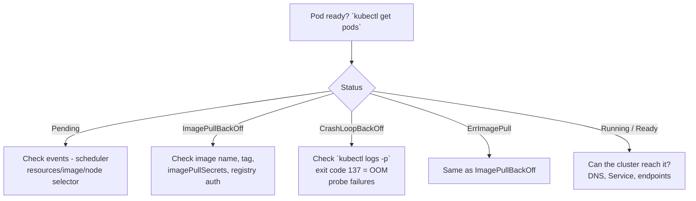

# Troubleshooting Patterns

> **Category:** Operations / Debugging

Kubernetes troubleshooting is mostly pattern-matching: "what does my Pod's status say, and what do its events say next". This doc is a methodical checklist you can walk through for the most common failure modes.

## The 5-Layer Lens

When something is broken, look in this order:

1. **Object** — the Pod / Deployment / Service / Ingress itself
2. **Events** — `kubectl describe` tells you *why* K8s did what it did
3. **Pod** — the container's logs, restart count, exit code
4. **Node** — resource pressure, kubelet, runtime
5. **Network / DNS** — can things route to each other? DNS resolves?

## Decision Tree: "My app is down"



## Pattern 1: Pod stuck in `Pending`

### `kubectl describe` is decisive

```bash
kubectl describe pod myapp-pod-xyz
# Look in the Events section, bottom — that's the scheduler's reasoning.
```

### Common causes and fixes

| Event reason | Meaning | Fix |
|--------------|---------|-----|
| `FailedScheduling` | No Node fits the Pod's requirements | Loosen limits/requests, `nodeSelector`, or check `kubectl get nodes` |
| `Insufficient cpu/memory` | Not enough free resources | Scale nodes, lower requests, or `kubectl describe` the `Node` to see allocatable |
| `node(s) didn't match node selector` | Node label mismatch | `kubectl get nodes -L topology.kubernetes.io/zone,kubernetes.io/arch` |
| `node(s) had taint` | Taint + no matching toleration | Add a toleration, or `kubectl get nodes -L` to see taints |
| `FailedAttachVolume` | PVC/PV mismatch | `kubectl get pv,pvc` + the StorageClass |

### Resource request audit

```bash
kubectl describe pod myapp-pod | grep -i "limits\|requests"
# Are requests > what's free? Run:
kubectl top nodes     # how much is already allocated?
kubectl describe node worker-1 | grep -A4 "Allocated resources"
```

## Pattern 2: `ImagePullBackOff` / `ErrImagePullBackOff`

### Checklist

1. **Image name and tag are correct** — typo in `nginx:latst`?
2. **Private registry** — `imagePullSecrets` present?
3. **Registry auth** — `docker login`, then create the secret:
   ```bash
   kubectl create secret docker-registry regcred \
     --docker-server=https://index.docker.io/v1/ \
     --docker-username=... --docker-password=...
   # Reference it:
   kubectl patch serviceaccount default -p '
     {"imagePullSecrets": [{"name": "regcred"}]}'
   ```
4. **Image is public + reachable** — try pulling it on your laptop.

### `kubectl describe` shows the actual auth error

```bash
kubectl describe pod myapp | grep -A2 -i imagepull
# e.g. "authentication required" → wrong/missing dockerconfigjson
#      "repository does not exist" → typo or private image
```

### Secret shape check (must be `dockerconfigjson`)

```yaml
apiVersion: v1
kind: Secret
type: kubernetes.io/dockerconfigjson   # ← required, not "docker-registry" string
data:
  .dockerconfigjson: <base64>
```

The old `type: kubernetes.io/docker-registry` is **not** a valid value — use `kubernetes.io/dockerconfigjson`.

## Pattern 3: `CrashLoopBackOff` (restarts)

### Step 1 — previous instance logs

```bash
kubectl logs -p myapp-pod-xyz       # logs from the LAST (failed) exit
kubectl logs --previous myapp-pod-xyz
```

### Step 42 — exit code 137 means OOM (killed by the kernel)

Exit code `137` = 128 + 9 (SIGKILL) → the kubelet/OOM-killer terminated the container.

```bash
# Confirm:
kubectl describe pod myapp-pod-xyz | grep -i "signal\|reason"
# OOMKilled or "Memory cgroup out of memory"
```

**Tune `resources.limits.memory`** up, or find the leak via profiling. Remember: setting `limits` **creates a hard ceiling** → OOM; setting `requests` only sets a scheduling floor.

### Liveness/readiness probe killed it

```yaml
livenessProbe:
  httpGet:
    path: /healthz
    port: 8080
  initialDelaySeconds: 5
  periodSeconds: 10
```
If `/healthz` returns 500, the liveness probe **kills and restarts** the Pod → `CrashLoopBackOff`.

**Fix:** increase `initialDelaySeconds` + `failureThreshold`, or fix the app's health endpoint.

### Run it locally with the same args

```bash
kubectl exec myapp-pod-xyz -- ps aux
# Then match the exact command to run locally:
kubectl exec myapp-pod-xyz -- cat /proc/1/cmdline | tr '\0' ' '
```

## Pattern 4: `Pending` but resources look fine — check **taints/tolerations**

```bash
kubectl get nodes -o json | jq '.items[].spec.taints'        # who's tainted?
kubectl get nodes -L node-role.kubernetes.io/control-plane   # control-plane nodes are tainted
```
Control-plane Nodes carry `node-role.kubernetes.io/control-plane:NoSchedule`. If you deploy a workload here you'll need a toleration.

## Pattern 5: "Service has no endpoints" (`kubectl get endpoints` empty)

### Selector mismatch

```bash
kubectl get svc myapp -o yaml | grep -A4 "selector"
kubectl get pods -l app=web        # must produce >0 results
# The selector on the Service must match the Pod's labels EXACTLY.
```

### Pods aren't Ready

```bash
kubectl get pods -o wide                       # is Pod "Running" AND "Ready"?
kubectl describe pod notready-pod              # any failing readiness probe?
kubectl get pods -l app=web -o json | jq .items[].status.conditions
```

### Headless Service + StatefulSet mismatch

For a headless Service (`clusterIP: None`) consumed by a StatefulSet, the naming is fixed: `podname-0.svc.ns.svc.cluster.local`. A mismatch is usually a label issue.

## Pattern 6: DNS not resolving / `NXDOMAIN`

### Check CoreDNS itself first

```bash
kubectl -n kube-system get pods -l k8s-app=kube-dns
kubectl -n kube-system logs -l k8s-app=kube-dns --tail=20
```

### Test from a Pod network namespace

```bash
kubectl run -it --rm --restart=Never busybox --image=busybox -- sh
> nslookup kubernetes.default     # CoreDNS internal
> nslookup host 8.8.8.8           # upstream DNS (does the node have internet?)
> nslookup myapp.default.svc.cluster.local
```

### DNS in containers ≠ DNS in your host

The Pod's `/etc/resolv.conf` points at CoreDNS. Host network isn't using it. Don't test DNS from `kubectl debug node` against a `hostNetwork: true` Pod.

## Pattern 7: Slowness / latency

### Measure where

```bash
# Node-level saturation:
kubectl top nodes
# CPU throttling (cpu_cfs_throttled_periods_total / cpu_cfs_period_microseconds)
kubectl exec pod -- cat /sys/fs/cgroup/cpu/cpu.cfs_quota_us
```

### Check for OOM / restarts over time

```bash
kubectl get --raw "/apis/metrics.k8s.io/v1beta1/pods" | jq '.items[] | select(.containers[].usage.cpu != null)'
```
If a Pod is in a slow OOM-kill / restart loop you'll see churn.

### Inspect throttling directly

```bash
kubectl exec myapp -- cat /sys/fs/cgroup/cpu.stat
# nr_throttled_periods vs throttled_time — throttling == CPU throttled despite "headroom".
```
If using **CPU limits**, throttling can cause latency spikes even when the node isn't busy.

## Pattern 8: NetworkPolicy silently drops traffic

```bash
kubectl get networkpolicy -A
# The first NetworkPolicy in a Namespace changes the default from "allow all" to "deny all ingress".
```

**Symptom:** `kubectl port-forward` or a probe works, but app→app traffic fails. Check if an egress/ingress policy blocks it.

## Pattern 9: RBAC forbidden (403)

```bash
kubectl auth can-i <verb> <resource> -n <ns> --as=system:serviceaccount:<sa>
# e.g.
kubectl auth can-i get pods --as=system:serviceaccount:ci:runner
```

**Common cause:** the app's ServiceAccount can't reach its own resources because a Role/RoleBinding was removed. Always check the **audit log** if your control-plane emits one.

## The Debug Checklist (one command wins)

```bash
# Everything about a Pod in one shot:
kubectl get pod $POD -o wide
kubectl describe pod $POD
kubectl logs $POD
kubectl logs -p $POD                 # previous
kubectl top pod $POD
# Node it's on:
kubectl top nodes
# Is it scheduled where you think?
kubectl get node $(kubectl get pod $POD -o jsonpath='{.spec.nodeName}') -o yaml
# Any events at cluster level?
kubectl get events -A --sort-by='.firstTimestamp' | tail -30
```

## Interview Questions

**Q: A Pod is `ImagePullBackOff`. You've confirmed the image name is correct and public. What else could cause it?**
A: (1) Missing/mis-typed `imagePullSecret` for a private registry, (2) invalid `config.json` base64 in the `dockerregistry` secret (wrong type or `kubernetes.io/docker-registry` instead of `kubernetes.io/dockerconfigjson`), (3) registry rate-limit/rejecting the kubelet, (4) registry cert verification — the kubelet uses the node's CA bundle, not the Pod's. Check `kubectl describe` for the *exact* message, which says "401 Unauthorized" vs "repository does not exist".

**Q: `CrashLoopBackOff` with exit code 137 — what's happening and how do you fix it?**
A: 137 = 128+9 (SIGKILL) usually from the **OOM killer**. The Pod exceeded its memory **limit** (or the node has no memory pressure but cgroup OOM). Fix by raising `resources.limits.memory`, fixing the leak (profile), or removing the limit if it was set too low. Check `kubectl describe` for `OOMKilled` and `message: "Memory cgroup out of memory"`.

**Q: Your Service `kubectl get endpoints` shows nothing. Walk the diagnosis.**
A: `kubectl describe svc <name>` to read its `.spec.selector`; confirm the Pods it targets actually carry matching labels (`kubectl get pods -l <selector>`). If labels match, check Pod readiness (`status.conditions` for `Ready`) — a Pod that's Running but fails its readiness probe won't receive traffic, so no endpoints. Finally verify the `targetPort` matches the container port.

**Q: How do you debug DNS resolution from within the cluster?**
A: Run a throwaway Pod (`kubectl run busybox --image=busybox --rm -it --restart=Never`) and run `nslookup <svc>.<ns>.svc.cluster.dev`, `getent hosts`, and `wget`. First confirm CoreDNS pods are Running (`kubectl -n kube-system get pods -l k8s-app=kube-dns`); then test upstream DNS against `8.8.8.8`. The Pod's `/etc/resolv.conf` should point to `10.x.x.x` (CoreDNS ClusterIP).

**Q: When does a NetworkPolicy actually take effect, and what's the common gotcha?**
A: A NetworkPolicy **enforces** only when there is an **allow** policy selecting the Pod; otherwise traffic is unaffected. Gotcha: the **first** NetworkPolicy on the namespace flips the default ingress from "allow all" to "deny all" — so a single allow-all policy that forgets the egress direction will break outbound traffic.

**Q: How do you differentiate "app is broken" from "Kubernetes is broken"?**
A: Get a shell in the Pod (`kubectl exec`) and curl its own localhost — if localhost works it's Kubernetes (network/DNS/service), if localhost fails it's the app. `kubectl port-forward` the Pod to your machine and hit it directly to isolate from the Service layer.

## Related Resources

- [kubectl Debug](kubectl-debug.md)
- [Cluster Operations](../08-cluster-operations/README.md)
- [Security](../06-security/README.md)
- [Networking](../04-networking/README.md)
