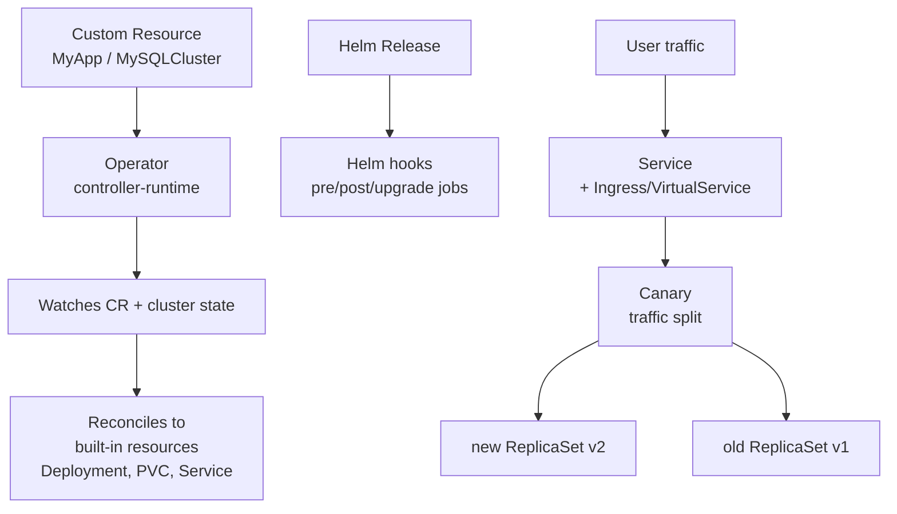

# 15. Advanced Patterns

> **Category:** Design Patterns / Extensibility

Beyond plain Deployments live the patterns that let you **run your own controllers**, **customize rollout**, and **glue services together**. This category covers CRDs + Operators, advanced deployment strategies (canary/blue-green), the Helm hook lifecycle, and the standard sidecar/ambassador/init-container pod patterns.

## Core Concepts

| File | Topic |
|------|-------|
| [crds-operators.md](crds-operators.md) | CustomResourceDefinitions + the Operator pattern (controller-runtime / OLM) |
| [helm-hooks.md](helm-hooks.md) | Helm hooks (lifecycle: pre/post install/upgrade/delete/test) |
| [blue-green-canary.md](blue-green-canary.md) | Blue/Green + Canary strategies, feature flags, traffic shifting |
| [pod-patterns.md](pod-patterns.md) | Sidecar, Ambassador, Adapter, Init-container patterns |
| [knative.md](knative.md) | Knative Serving + Eventing (serverless, scale-to-zero) |
| [sandbox-runtimes.md](sandbox-runtimes.md) | gVisor / Kata Containers via RuntimeClass |

## Architecture

## Key Questions

- **What is a CRD + Operator?** A `CustomResourceDefinition` extends the K8s API with a new kind (`kind: MyApp`). An **Operator** is a custom controller that watches that kind and reconciles it to standard resources — encoding a human SRE's runbook into code.
- **When does a Pod use an Init container vs. a Sidecar?** Init: setup that must finish first (DB migration, fetching secrets). Sidecar: runs alongside forever (logging agent, proxy, queue worker).
- **How is Canary different from a rolling update?** A rolling update (`maxSurge`/`maxUnavailable`) replaces in place; a canary *routes a fraction of traffic* to the new version independently (via Ingress/service mesh/weight-based routing) before fully cutting over.
- **What is a Helm hook?** A manifest annotated `helm.sh/hook: pre-upgrade` runs at a point in the lifecycle (e.g., DB migration before an upgrade). Unlike normal templates, hooks are not part of steady state.

## Related Resources

- [Service Mesh](../12-service-mesh/service-mesh.md) (traffic shifting)
- [Helm](../10-package-management/helm.md) (templates, hooks)
- [Deployments](../03-workloads/deployments.md) (rollouts)
- [CI/CD](../11-ci-cd-gitops/ci-cd.md) (GitOps)
- [Security](../06-security/README.md) (admission, PSP/PSA)
