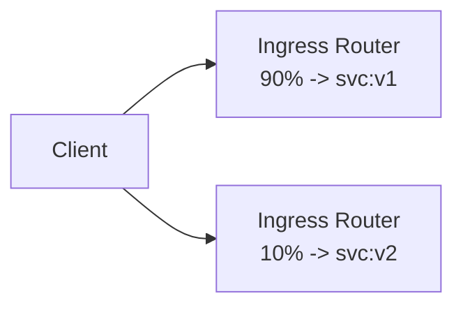

# Blue/Green & Canary Deployments

> **Category:** Advanced Patterns

Two strategies for safer rollouts: **Blue/Green** (switch all traffic at once) and **Canary** (shift a fraction of traffic). Both decouple "deploy the new version" from "expose it to users" — so you can validate before full rollout.

## When to Use Which

| Strategy | How | Best for |
|----------|-----|----------|
| **Rolling update** | Replace in place (Deployment `maxSurge`/`maxUnavailable`) | Low-risk, stateless apps |
| **Blue/Green** | Run old + new, flip the router at once | DB-migrating apps, fast rollback |
| **Canary** | Route a % of traffic to new, ramp up | Risky changes, measuring real impact |

## Architecture — Blue/Green

```mermaid
graph LR
    subgraph "Before flip"
        LB[Load Balancer / Ingress] --> BlueSVC[svc:Blue<br/>v1 replicaset]
        LB -.-> GreenSVC[svc:Green<br/>v2 replicaset<br/>&#40;not live&#41;]
    end
    subgraph "After flip"
        LB2[Load Balancer / Ingress] -->|switch selector| GreenSVC2[svc:Green<br/>v2 replicaset]
        LB2 -.-> BlueSVC2[svc:Blue<br/>v1 replicaset<br/>&#40;drained&#41;]
    end
```



Two Services (`blue`/`green`) + two ReplicaSets. You deploy the new ReplicaSet under the *inactive* Service, test it directly, then point the **Ingress** (or the Service's `selector`) at it.

### Blue/Green via Service selector flip

```bash
# 1. Deploy v2 under the "green" identity:
kubectl apply -f app-v2-green.yaml        # Deployment with label version=green
# 2. Test it directly:
kubectl run probe --image=curlimages/curl -- curl -s http://app-green/
# 3. Flip the router Service to green:
kubectl patch service app-live -p '{"spec":{"selector":{"version":"green"}}}'
# 4. Monitor, keep blue around for 1-2 deploys, then delete it.
```

### Blue/Green via Ingress (no Service rewrites)

```yaml
apiVersion: networking.k8s.io/v1
kind: Ingress
metadata:
  name: app
  annotations:
    nginx.ingress.kubernetes.io/canary: "true"   # not this one; this is canary
spec:
  rules:
  - host: app.example.com
    http:
      paths:
      - backend:
          service:
            name: app-green          # <- flip this to switch versions
            port: { number: 80 }
```

## Architecture — Canary



Canary uses **traffic splitting** — a percentage routed to the new version. The split can live in:
- **Ingress controller** (NGINX canary annotation, ALB weighted target groups)
- **Service mesh** (Istio `VirtualService` weights, Linkerd `TrafficSplit`)
- **Service-level** (a headless Service + app-side routing)

### Canary weights (Istio)

```yaml
apiVersion: networking.istio.io/v1beta1
kind: VirtualService
metadata: { name: app }
spec:
  hosts: [app.example.com]
  http:
  - route:
    - destination: { host: app-svc, subset: v1 }
      weight: 90
    - destination: { host: app-svc, subset: v2 }
      weight: 10
```
Ramp from 10 -> 50 -> 100 over hours, watching metrics; then promote v2 to the default subset.

### Canary via NGINX ingress annotation

```yaml
# stable service: app-stable (port 80)
# canary service: app-canary
apiVersion: networking.k8s.io/v1
kind: Service
metadata:
  name: app-stable
spec: { selector: { app: app, version: stable }, port: 80 }
---
apiVersion: apps/v1
kind: Deployment
metadata: { name: app-stable }
spec:
  replicas: 4
  selector: { matchLabels: { app: app, version: stable } }
  ...
---
apiVersion: apps/v1
kind: Deployment
metadata:
  name: app-canary           # only a few replicas
  annotations:
    nginx.ingress.kubernetes.io/canary: "true"
    nginx.ingress.kubernetes.io/canary-weight: "10"
...
```

## Feature Flags + Header-Based Routing

Canary by header (send internal-team traffic to v2):
```yaml
# Istio:
- condition:
    headers:
      cookie:
        regex: ".*beta-user=.*"
  route:
  - destination: { subset: v2 }
- route:                          # everyone else
  - destination: { subset: v1 }
```

## Rollback

- **Blue/Green**: flip the router back. Instant. (The cost: you always run 2x resources.)
- **Canary**: stop increasing the weight; promote or demote — no rollback of v2 required since v1 is still serving 90%.
- **Rolling update**: `kubectl rollout undo deployment/<name>` to the last ReplicaSet.

## Common Issues

| Symptom | Cause | Fix |
|---------|-------|-----|
| Canary traffic shows 0% on v2 | Ingress doesn't support weight/canary annotation ignored | Confirm controller (NGINX `nginx.ingress.kubernetes.io/canary`, not a plain `IngressClass`) |
| Blue/Green "flip" leaves old traffic | Clients cached the old VIP/IP | Ensure the router Service uses the label `selector` you flipped, not an EndpointSlice from a static IP |
| Canary ramped too fast | No observability on the new version | Gate weight increases on a success-rate SLO (error < 0.1%) |

## Interview Questions

**Q: How is a canary deployment different from a rolling update?**
A: A rolling update (`maxSurge`/`maxUnavailable`) replaces Pods *in place* — every client sees the new version as it rolls, and a failure affects everyone at that step. A canary routes a **percentage** of traffic to the new version while the old version keeps serving the rest — you measure the canary (errors, latency) before ramping, so a problem is contained to a fraction of users.

**Q: What does "flip the router" mean in blue/green?**
A: Old and new run side-by-side behind two Services (or one Ingress `backend.serviceName`). "Flipping" = changing the router's target (the Service `selector` or Ingress `backend`) to point at the green Service. Traffic switches instantly; rollback is flipping back.

**Q: How do you canary by HTTP header instead of weight?**
A: In Istio, a `VirtualService` route `match: { headers: {cookie: regex: ".*beta=.*"} }` sends matching requests to v2, others to v1. NGINX uses `nginx.ingress.kubernetes.io/canary-by-header`. This is how you ship v2 to internal testers before customers.

**Q: Why keep the old version around in blue/green instead of deleting it immediately?**
A: Rollback. If v2 has a live bug, you want to re-point the router back to v1 in seconds. Deleting v1 means a slow forward-fix only. Keep v1 drained but present until the next deploy succeeds.

## Related Resources
- [Deployments](../03-workloads/deployments.md)
- [Deployment Strategies](../03-workloads/deployment-strategies.md)
- [Service Mesh](../12-service-mesh/service-mesh.md) (traffic shifting)
- [Ingress](../04-networking/ingress.md)
- [CI/CD](../11-ci-cd-gitops/ci-cd.md)
