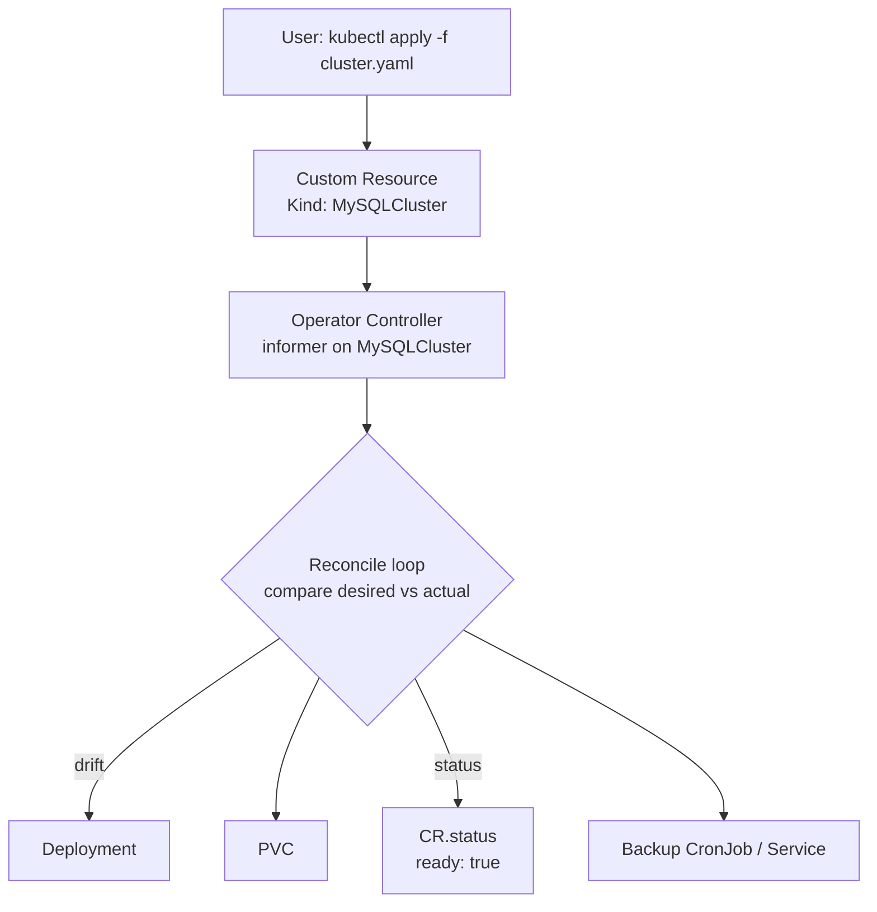

# CRDs & Operators

> **Category:** Advanced Patterns

A **CustomResourceDefinition (CRD)** extends the Kubernetes API with a *new kind* (e.g. `kind: MyApp`). An **Operator** is a custom controller that *watches* that kind and reconciles it into built-in resources — it is your team's runbook encoded as code.

## Why They Exist

- K8s core has no notion of a database or queue. A CRD models it: `kind: PostgresCluster`.
- An Operator encapsulates domain logic: when you create a PostgresCluster, also create N Services, PVCs, a backup CronJob, and a restore Job.
- Operators expose status (reconcile-loop health) so GitOps `kubectl describe mycluster` shows real state.

## Architecture



The reconcile loop is: **observe** (read the CR + children) -> **diff** -> **act** (create/update/delete children) -> **status**. It should be **idempotent** and **converge**.

## CRD Definition (declarative schema)

```yaml
apiVersion: apiextensions.k8s.io/v1
kind: CustomResourceDefinition
metadata:
  name: mysqlclusters.apps.example.com
spec:
  group: apps.example.com
  names:
    kind: MySQLCluster
    plural: mysqlclusters
    singular: mysqlcluster
    shortNames: [mysql]
    categories: [database]
  scope: Namespaced
  versions:
  - name: v1
    served: true
    storage: true
    schema:
      openAPIV3Schema:
        type: object
        properties:
          spec:
            type: object
            properties:
              size:
                type: integer
                minimum: 1
                maximum: 32
                default: 3
              image:
                type: string
            required: [size]
  conversion:
    strategy: None
```

With the CRD applied, `kubectl get mysqlclusters` works. Always ship a **status subresource** (`subresources.status: {}`) so controllers can write `status` independently of spec.

## Operator Frameworks

| Framework | Language | Trade-off |
|-----------|----------|-----------|
| operator-sdk (Go) | Go | Full power; best perf; steep |
| Helm Operator | Helm charts | Easiest; just render a chart per CR |
| Ansible Operator | Ansible | Good for infra glue; slower |
| kubebuilder | Go scaffolding | Lower-level than operator-sdk; popular for libraries |

Helm Operator example:
```yaml
apiVersion: helminstaller.example.com/v1
kind: HelmDeployment
metadata:
  name: my-redis
spec:
  chart: redis
  releaseName: redis
  values:
    architecture: replication
```
It watches the CR and, on change, runs `helm upgrade --install` — turning a chart into a reconciled CR.

## OLM (Operator Lifecycle Manager)

OLM ships and upgrades Operators on a cluster via a catalog of `ClusterServiceVersion` (CSV) manifests.

```bash
kubectl get csv -n operators
kubectl get packagemanifest
kubectl apply -f my-operator.clusterserviceversion.yaml
```
OLM resolves **dependencies** between Operators (a database Operator that requires a specific CRD from another) and does rolling upgrades of the Operator itself.

## Writing a Reconcile Loop (Go / controller-runtime)

```go
func (r *MySQLClusterReconciler) Reconcile(ctx, req ctrl.Request) (ctrl.Result, error) {
    cluster := &dbv1.MySQLCluster{}
    if err := r.Get(ctx, req.NamespacedName, cluster); err != nil {
        return ctrl.Result{}, client.IgnoreNotFound(err)   // deleted -> stop
    }
    // 1. ensure a Deployment with cluster.Spec.Size replicas
    // 2. ensure a Service
    // 3. ensure a backup CronJob
    // 4. set cluster.Status.Ready = (deployment ready)
    return ctrl.Result{}, nil
}
```
Key rules: never store mutable cluster state in the CR (it is desired state); return errors to re-queue; set **finalizers** if the Operator must clean up external resources before the CR is deleted.

## Finalizers & Garbage Collection

```yaml
metadata:
  finalizers:
  - mysqlcluster.apps.example.com   # the Operator must remove this before the CR is deleted
```
Without a finalizer, deleting the CR instantly destroys the child workload resources — but external resources (cloud DB instance) leak. The reconcile loop removes the finalizer after cleanup succeeds, then the API server deletes the CR.

## Common Issues

| Symptom | Cause | Fix |
|---------|-------|-----|
| `no matches for kind "MySQLCluster"` | CRD not applied, or installed in a different namespace (CRDs are cluster-scoped) | `kubectl get crd mysqlclusters.apps.example.com` |
| Operator crashloops | nil-pointer in reconcile / bad status write | `kubectl logs deploy/<operator>`, add `ctrl.Log` |
| CR stuck `Terminating` | finalizer never removed | debug the Operator; if safe, `kubectl patch cr <name> -p '{"metadata":{"finalizers":null}}' --type=merge` |
| OLM "requires" error | dependency CSV not in catalog | install the dependency chart/CSV first |

## Interview Questions

**Q: What is the difference between a CRD and an Operator?**
A: A CRD is just the *schema + REST endpoint* for a new kind (`CustomResourceDefinition`). An Operator is a *controller* that watches that kind and reconciles real resources. The CRD is declarative API; the Operator is imperative business logic.

**Q: What is a finalizer, and why do CRs get stuck "Terminating"?**
A: A finalizer is a string in `metadata.finalizers` that the reconciling controller must remove before the resource is actually deleted. A CR gets stuck terminating because **the controller that owns the finalizer isn't running / isn't removing it** — fix by debugging or (last resort) stripping finalizers via patch.

**Q: When would you use the Helm Operator vs. a Go Operator?**
A: Helm Operator when your workload is already a well-behaved Helm chart and you just want CRD-driven lifecycle. Go operator when you need to encode non-Helm logic (status conditions, finalizer-based external cleanup, complex reconciliation that can't be expressed as a chart render).

## Related Resources
- [Helm](../10-package-management/helm.md)
- [Workloads](../03-workloads/README.md)
- [Security](../06-security/README.md)
- [Cloud Integrations](../09-cloud-integrations/README.md)
