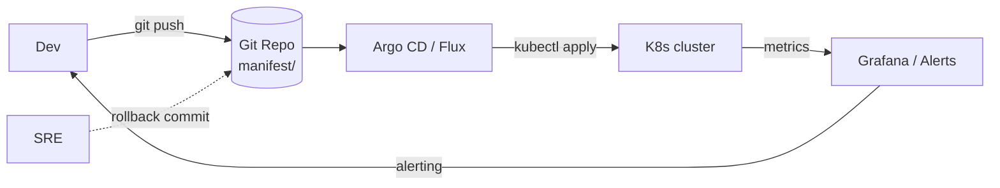

# GitOps

> **Category:** Advanced Patterns / Cluster Operations

**GitOps** is the practice of using Git as the **single source of truth** for cluster state and driving all changes through **Git commits** (not manual `kubectl apply`). A **GitOps controller** (Argo CD, Flux) continuously reconciles the live cluster toward the state declared in Git — and in many setups **bootstraps the cluster itself from Git** so a brand-new control plane self-assembles into its desired state with zero manual steps.

## The GitOps Contract

Three invariants make something "GitOps" (per the CNCF GitOps Working Group):

1. **Declarative** — the entire system is described declaratively in Git.
2. **Treats Git as the single source of truth** — drift is detected by diffing live state against Git.
3. **Self-healing** — a controller reconciles any divergence automatically.



## Core Tools

| Tool | Form | Notable for |
|------|------|-------------|
| **Argo CD** | Kubernetes operator | UI + multi-cluster sync, AppProject RBAC |
| **Flux** | Kubernetes operator (fluxd lineage) | `flux bootstrap`, OCI artifacts, kustomize-native |
| **Jenkins X** | opinionated platform | pipelines-as-code + preview envs |

## Argo CD — the flagship

```yaml
# Application CR — tells Argo CD what to sync
apiVersion: argoproj.io/v1alpha1
kind: Application
metadata:
  name: prod
  finalizers:
  - resources-finalizer-argocd.argoproj.io
spec:
  project: default
  source:
    repoURL: https://github.com/your-org/k8s.git
    targetRevision: HEAD
    path: prod
  destination:
    server: https://kubernetes.default.svc
    namespace: default
  syncPolicy:
    automated:
      prune: true            # delete resources removed from Git
      selfHeal: true         # reconcile drift back to Git state
    syncOptions:
    - CreateNamespace=true
```
`prune: true` + `selfHeal: true` = the cluster will **self-heal to Git**. If someone `kubectl deletes` a Deployment, Argo CD recreates it within ~3 minutes.

## Flux — GitOps from the cluster up

```bash
flux bootstrap github \
  --owner=your-org \
  --repository=k8s \
  --branch=main \
  --path=./clusters/prod
```
`flux bootstrap` **installs Flux and commits the manifests it generated** back to Git — so a `kubeadm`-provisioned cluster finishes setup by pulling its own desired state. Flux natively speaks **OCI artifacts** (`oci://github.com/your-org/charts/app:tag`) and **kustomize**, and reconciles Helm releases via `HelmRelease` (the basis of the Helm-Operator pattern).

## Bootstrapping a brand-new cluster

A true GitOps bootstrap:

1. `kubeadm init` (or a managed cluster comes up).
2. `flux bootstrap` / `argo cd admin` installs the operator from a pinned manifest.
3. The operator takes over: it reads `clusters/prod/` from Git and **applies every manifest** — namespaces, Operators, Secrets (via SOPS-sealed-secrets or ExternalSecrets), and apps.
4. Result: **no manual `kubectl apply` ever** — a new cluster matches `main` in minutes.

## Sealed Secrets / SOPS — secret management in GitOps

Since Git is public (often), you commit **encrypted** secrets:

- **Bitnami Sealed Secrets**: a controller holds a private key; you run `kubeseal --format=yaml < secret.yaml` to get a `SealedSecret` that **only that cluster** can decrypt. The SealedSecret lives in Git; the plaintext never does.
- **Mozilla SOPS** + `kustomize-sops`: GPG/keybase/age encrypts values inline in `kustomization.yaml`. Flux decrypts at apply-time.

## Multi-environment via kustomize (or Helm)

```
clusters/
  prod/kustomization.yaml   <- commonLabels + image tag = 1.2.3
  staging/kustomization.yaml <- patches image tag = 1.2.3-rc1
  overlays/                 <- per-cluster variance (ingress class, DNS)
```
Each cluster directory points Flux/Argo at a kustomization; promotion = a PR that bumps the image tag in `clusters/staging` then `clusters/prod`.

## Common Issues

| Symptom | Cause | Fix |
|---------|-------|-----|
| `OutOfSync` forever | someone `kubectl apply`-ed drift | `force: true`/prune; enforce automation gate so drift is reverted |
| Sync hooks fail | resource blocked by a `ResourceQuota` | add `ApplyOutOfQuota` strategy / fix quota |
| `helm dependency` chart not found | missing `Chart.lock` / repo credentials | commit charts to Git, or set repo creds as `RepositoryCredentials` |
| Secret shows `REDACTED` | SOPS-sealed secret decrypted but value masked in UI | expected; plaintext lives only inside the Pod |

## Interview Questions

**Q: What does "self-healing" mean in GitOps?**
A: The controller (Argo CD/Flux) continuously diffs the live cluster against Git. If an admin `kubectl delete`s a Deployment, the controller **detects the drift** and reapplies it from Git automatically (within its reconciliation window, ~3 min default) — the cluster heals itself back to the committed state.

**Q: What's the difference between `argocd app sync` and `apply`?**
A: `apply` is a **request** — if a manifest is invalid or a webhook fails, it errors but may leave partial state. `sync` is a **transactional, ordered apply** with finalizer + prune: it respects resource ordering, waits for readiness, can `--auto-prune`, and on failure rolls back to the prior state — it's the GitOps primitive, not raw `apply`.

**Q: How do you handle secrets in a GitOps repo?**
A: You never commit plaintext. Options: (1) **Bitnami Sealed Secrets** — commit a `SealedSecret` that only one cluster's controller can decrypt; (2) **Mozilla SOPS + kustomize/Flux** — encrypt values inline with GPG/PGP, decrypted at apply time; (3) **ExternalSecrets** — commit the *ExternalSecret* descriptor that pulls from Vault/AWS Secrets Manager. Pick (1) for simplicity, (3) for cross-cloud.

**Q: What is `flux bootstrap` and why is it important?**
A: It's a one-liner that **installs Flux AND commits Flux's own manifests back to Git** from the cluster. So the operator that reconciles your apps is itself reconciled by itself — a cluster that can re-provision itself from Git with no manual `kubectl apply`. The start of true self-healing bootstrap.

## Related Resources
- [CI/CD](../11-ci-cd-gitops/ci-cd.md)
- [Argo CD](../11-ci-cd-gitops/argo-cd.md)
- [Flux](../11-ci-cd-gitops/flux.md)
- [Helm](../10-package-management/helm.md)
- [Secrets](../06-security/secrets.md)
- [Cloud Integrations](README.md)
