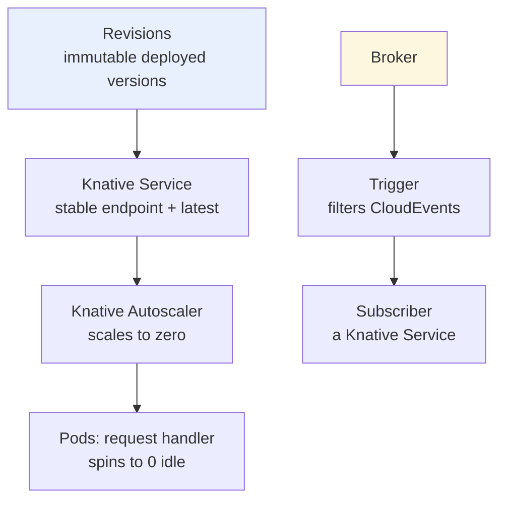

# Knative — Serverless on Kubernetes

> **Category:** Advanced Patterns / Serverless

**Knative** is a Kubernetes-based platform to deploy, run, and manage **serverless** (functions / short-lived request-handling) workloads. It provides request-driven autoscaling (to zero), revisions, and eventing — on top of any Kubernetes cluster. It comes in two big halves: **Serving** and **Eventing**.

## Architecture



## Serving — scale to zero, revisions, traffic split

A `Service` (`svc`) owns a `Configuration` (builds Revisions) + a `Route` (traffic target). Each deploy creates an **immutable Revision**; the Route can point 100% at one Revision or **split traffic** (canary) across several. The **Knative Autoscaler** scales Pods based on **concurrent requests per Pod**, and scales to **zero** when idle (with a configured `minScale`).

```yaml
apiVersion: serving.knative.dev/v1
kind: Service
metadata: { name: hello }
spec:
  template:
    metadata: { annotations: {
      autoscaling.knative.dev/minScale: "0"
      autoscaling.knative.dev/maxScale: "5"
      autoscaling.knative.dev/target: "10"     # 10 reqs/pod
    } }
    spec:
      containers:
      - image: gcr.io/knative-samples/helloworld-go
  traffic:
  - revisionName: hello-00001
    percent: 90
  - revisionName: hello-00002
    percent: 10                            # canary
```

## Eventing — Broker, Trigger, Channel, Subscription

Knative Eventing routes **CloudEvents**:
- **`Broker`** — an event intake + a dead-letter sink (in a namespace).
- **`Trigger`** — filters events by attribute/type and routes them to a **subscriber** (a Knative Service or any addressable).
- **`Channel` + `Subscription`** — durable event stream (backed by Kafka/Redis/mt-channel).
- **`Source`** — produces events into a Broker/Channel (KafkaSource, ApiServerSource, CronSource...).

```yaml
apiVersion: eventing.knative.dev/v1
kind: Broker
metadata: { name: default, namespace: ticketing }
---
apiVersion: eventing.knative.dev/v1
kind: Trigger
metadata: { name: send-mail }
spec:
  broker: default
  filter:
    attributes:
      type: com.example.ticket.created
  subscriber:
    ref:
      apiVersion: serving.knative.dev/v1
      kind: Service
      name: mailer
```

## Why not just Deployments + HPA?

- **Scale to zero** — HPA keeps ≥1 replica; Knative scales to 0 (cost for bursty/event-driven).
- **Revisions** — immutable versions + traffic split (canary/rollback) built in.
- **Eventing model** — standard CloudEvents + decoupled Broker/Trigger vs. bespoke queues.

## Common Issues

| Symptom | Cause | Fix |
|---------|-------|-----|
| Service stuck at 0 replicas and never responds | `minScale=0` + cold start / wrong concurrency | set a higher `target`; check the revision `Active` condition |
| Traffic not splitting | stale `Route` status / different `metadata` | `kubectl describe route <svc>`, ensure Revisions are `"active"` |
| Trigger not firing | Broker address not resolvable / wrong `type` filter | check Broker `Address`, and that the event `type` matches the filter |
| Revisions pile up | no `revisionCleanup` config | Knative GC prunes them via `PodAutoPatch`... set `autocreate: false` on the Route if needed |

## Interview Questions

**Q: How does Knative scale to zero when HPA can't?**
A: Knative has its own **autoscaler** that watches the **activator** — a per-namespace request gate. When traffic arrives, the activator queues it and the autoscaler spins up Pods; when idle (with `minScale: 0`), Pods scale to zero and the activator steps aside. HPA only goes to 1; Knative goes to 0.

**Q: What's the difference between a Broker and a Channel?**
A: A **Channel** is a durable, fan-out event stream (Subscribers read from it) — good for replay/persistence. A **Broker** is request/response-style event intake scoped to a namespace, with a **Trigger** that filters by CloudEvent type and forwards to a Subscriber — the canonical "event mesh" abstraction.

**Q: What is a Knative Revision, and why is it immutable?**
A: A Revision is an immutable snapshot of the code + config for a Service generation. Immutability lets you safely do **traffic splitting** (canary 90/10) and **instant rollback** (flip the Route back) — there's no mystery about which code a Revision points to.

## Related Resources
- [CRDs & Operators](../15-advanced-patterns/crds-operators.md)
- [Blue/Green & Canary](blue-green-canary.md)
- [Service Mesh](../12-service-mesh/service-mesh.md)
- [CI/CD](../11-ci-cd-gitops/ci-cd.md)
