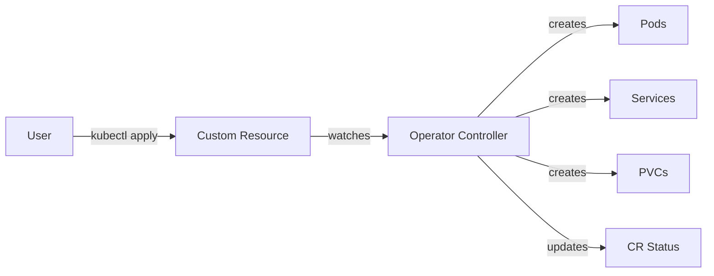

# Kubernetes Operators

> **Category:** Advanced Patterns / Automation
> Operators extend Kubernetes to manage complex applications — they combine CRDs + Controllers + Domain Knowledge.

## What is an Operator?

An Operator is a **custom controller** that watches a CRD and automates domain-specific tasks:

| Without Operator | With Operator |
|------------------|---------------|
| Manual `kubectl` commands | `kubectl get webapp` → auto-deploy |
| CronJobs for backups | Controller watches CRD → auto-backup |
| Scripts for scaling | CRD changes → controller scales |
| Manual failover | CRD changes → controller fails over |

## Operator Pattern

```
CRD (what you want)  →  Controller (how to achieve it)  →  Resources (Pods, Services, etc.)
```



## Example: Nginx Operator

### Step 1: CRD

```yaml
apiVersion: apiextensions.k8s.io/v1
kind: CustomResourceDefinition
metadata:
  name: nginxapps.stable.example.com
spec:
  group: stable.example.com
  versions:
  - name: v1
    served: true
    storage: true
    schema:
      openAPIV3Schema:
        type: object
        properties:
          spec:
            type: object
            properties:
              image:
                type: string
              replicas:
                type: integer
                minimum: 1
            required:
            - image
          status:
            type: object
            properties:
              phase:
                type: string
              readyReplicas:
                type: integer
    subresources:
      status: {}
  scope: Namespaced
  names:
    plural: nginxapps
    singular: nginxapp
    kind: NginxApp
    shortNames:
    - na
```

### Step 2: Custom Resource

```yaml
apiVersion: stable.example.com/v1
kind: NginxApp
metadata:
  name: my-nginx
  namespace: default
spec:
  image: nginx:1.25
  replicas: 3
```

### Step 3: Controller Logic (Pseudocode)

```
Reconcile NginxApp:
  1. Read CR spec (image, replicas)
  2. Check if Deployment exists
     - No → Create Deployment with spec
     - Yes → Update if spec changed
  3. Check if Service exists
     - No → Create ClusterIP Service
     - Yes → Update if needed
  4. Check if replicas match
     - No → Scale Deployment
  5. Update CR status (phase, readyReplicas)
```

### Step 4: Controller Code (Go/Kubebuilder)

```go
// main.go (simplified)
func (r *NginxAppReconciler) Reconcile(ctx context.Context, req ctrl.Request) (ctrl.Result, error) {
    // 1. Get the NginxApp CR
    var nginxApp v1.NginxApp
    if err := r.Get(ctx, req.NamespacedName, &nginxApp); err != nil {
        return ctrl.Result{}, client.IgnoreNotFound(err)
    }

    // 2. Ensure Deployment exists
    deploy := &appsv1.Deployment{
        ObjectMeta: metav1.ObjectMeta{
            Name:      nginxApp.Name,
            Namespace: nginxApp.Namespace,
        },
        Spec: appsv1.DeploymentSpec{
            Replicas: &nginxApp.Spec.Replicas,
            Selector: &metav1.LabelSelector{
                MatchLabels: map[string]string{"app": nginxApp.Name},
            },
            Template: corev1.PodTemplateSpec{
                ObjectMeta: metav1.ObjectMeta{
                    Labels: map[string]string{"app": nginxApp.Name},
                },
                Spec: corev1.PodSpec{
                    Containers: []corev1.Container{{
                        Name:  "nginx",
                        Image: nginxApp.Spec.Image,
                    }},
                },
            },
        },
    }

    // 3. Create or Update
    if err := ctrl.SetControllerReference(&nginxApp, deploy, r.Scheme); err != nil {
        return ctrl.Result{}, err
    }
    if err := r.Create(ctx, deploy); err != nil {
        if !apierrors.IsAlreadyExists(err) {
            return ctrl.Result{}, err
        }
    }

    // 4. Update status
    nginxApp.Status.Phase = "Running"
    nginxApp.Status.ReadyReplicas = deploy.Status.ReadyReplicas
    r.Status().Update(ctx, &nginxApp)

    return ctrl.Result{}, nil
}
```

## Popular Operators

| Operator | Purpose | Source |
|----------|---------|--------|
| **Prometheus Operator** | Manages Prometheus, AlertManager, ServiceMonitor | prometheus-operator |
| **Cert Manager** | Manages TLS certificates | cert-manager |
| **Elastic Cloud on K8s** | Manages Elasticsearch clusters | elastic/cloud-on-k8s |
| **Strimzi** | Manages Kafka clusters | strimzi |
| **Vitess** | Manages MySQL databases | vitess |
| **MongoDB Community** | Manages MongoDB replicas | mongodb |
| **Redis Operator** | Manages Redis clusters | Redis |

## Operator Lifecycle Manager (OLM)

```bash
# Install OLM
curl -sL https://raw.githubusercontent.com/operator-framework/operator-lifecycle-manager/master/deploy/upstream/quickstart/crds.yaml | kubectl apply -f -
curl -sL https://raw.githubusercontent.com/operator-framework/operator-lifecycle-manager/master/deploy/upstream/quickstart/olm.yaml | kubectl apply -f -

# Install Prometheus Operator via OLM
kubectl create bundle deployment prometheus --namespace operators --from=quay.io/prometheus-operator/prometheusbundle:latest
```

## Operator SDK (Build Your Own)

```bash
# Install Operator SDK
brew install operator-sdk

# Create new operator
operator-sdk init --domain=example.com --repo=github.com/example/nginx-operator

# Create API (CRD + Controller)
operator-sdk create api --group=stable --version=v1 --kind=NginxApp --resource --controller

# Generate manifests
make generate
make manifests

# Build and push
make docker-build docker-push IMG=my-registry/nginx-operator:v1

# Deploy
make deploy IMG=my-registry/nginx-operator:v1
```

## Best Practices

1. **Idempotent** — controller should handle re-runs gracefully
2. **Status updates** — report phase, conditions, readyReplicas
3. **Owner references** — use `SetControllerReference` for garbage collection
4. **Requeue on error** — use `ctrl.Result{RequeueAfter: time.Minute}`
5. **Test** — use `envtest` for controller tests
6. **RBAC** — minimal permissions for the controller

## Interview Angle

> "When would you build an Operator instead of using Helm? What's the lifecycle management difference?"

## Related

- [CRDs](./crds.md)
- [Prometheus Operator](../13-observability/prometheus.md)
- [Incident Case Studies](../14-troubleshooting/incidents/README.md)
