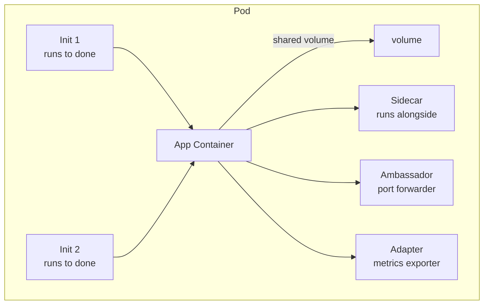

# Sidecar / Ambassador / Adapter / Init Patterns

> **Category:** Advanced Patterns

Multi-container Pods let you attach supporting processes to the main container. Each **pattern** has a distinct shape and lifetime. This doc covers the four canonical patterns and when to use each.

## The Four Patterns

| Pattern | Lifetime | Purpose | Example |
|---------|----------|---------|---------|
| **Sidecar** | Same as app | Extend/aid the app | log forwarder, proxy |
| **Ambassador** | Same as app | Translate a protocol the app expects | local Redis -> AWS ElastiCache proxy |
| **Adapter** | Same as app | Transform/normalize data | Prometheus exporter |
| **Init** | Runs to completion first | Setup the Pod | fetch secrets, wait for DB |



## Sidecar (most common)

A long-running helper tied to the Pod's life.

### Logging sidecar (Fluent Bit as sidecar, not DaemonSet)
```yaml
apiVersion: v1
kind: Pod
metadata: { name: app-with-logs }
spec:
  containers:
  - name: app
    image: myapp
    volumeMounts: [{name: varlog, mountPath: /var/log}]
  - name: fluent-bit
    image: fluent/fluent-bit:3.0
    volumeMounts:
    - name: varlog
      mountPath: /var/log
      readOnly: true
    - name: varlibdockercontainers
      mountPath: /var/lib/docker/containers
      readOnly: true
  volumes:
  - name: varlog
    emptyDir: {}
  - name: varlibdockercontainers
    hostPath: { path: /var/lib/docker/containers }
```

### Proxy sidecar (service mesh)
```yaml
containers:
- name: app
  image: myapp
- name: envoy-proxy
  image: envoyproxy/envoy:v1.30-latest
  ports: ["15005","15006","15008"]     # the app uses 15005; the mesh intercepts
  args:
  - "--config-path /etc/envoy/config.yaml"
```

## Ambassador (protocol adapter)

The app thinks it is talking to localhost:6379 (Redis), but the **ambassador** translates that to the managed cloud endpoint:

```yaml
containers:
- name: app                          # app expects a local Redis
  image: myapp
- name: redis-proxy                  # ambassador
  image: mgoodness/redis-proxy       # forwards localhost:6379 -> elasti...
  ports: [{containerPort: 6379}]
```
Real-world: the **Istio ingress gateway** as an ambassador (`--listener` on a port the app writes to), or a TCP proxy sidling a legacy app.

## Adapter (normalize/export)

An adapter reads the app's metrics/logs in one format and re-emits them in a normalized form — e.g. a JVM JMX exporter, or a `Prometheus exporter` that turns app stats into `/metrics`.

```yaml
containers:
- name: app
  image: myapp
- name: metrics-exporter
  image: myorg/app-exporter:latest
  ports: [{containerPort: 9888}]     # exposes /metrics in Prometheus format
```

## Init Containers (run-firs, then disappear)

Init containers run **serially, to completion**, before the main containers start. Each must succeed or the Pod retries.

### Wait-for-dependency pattern
```yaml
initContainers:
- name: wait-for-db
  image: busybox
  command: ["sh","-c","until nc -z db:5432; do echo waiting; sleep 2; done"]
- name: wait-for-migration
  image: myapp:{{ .Values.image.tag }}
  command: ["sh","-c","until curl -sf http://migration-svc/ready; do sleep 2; done"]
```

### One-shot setup (DB migration)
```yaml
initContainers:
- name: migrate
  image: myapp:{{ .Values.image.tag }}
  command: ["/bin/sh","-c","alembic upgrade head"]
  envFrom: [{configMapRef: {name: app-config}}]
  # this container exits 0; the app then starts against the migrated schema.
```
Init containers get their own resource requests/limits and each one blocks the next — if the 3rd init fails, containers 4+ never start, but the successful ones are not re-run (unless the Pod is re-created).

## shareProcessNamespace (Pod shares a single PID namespace)

When `shareProcessNamespace: true`, every container in the Pod shares PID 1 and can see the others' processes (`ps`, `nsenter`). Useful for a "debug sidecar" that can `kill -HUP 1` or inspect `/proc/1/root`.

## Common Issues

| Symptom | Cause | Fix |
|---------|-------|-----|
| Init container keeps restarting | It exits non-zero / hangs | `kubectl logs -p <pod> -c <init>` |
| Sidecar writes logs but app never sees file | volumeMounts missing `name` / path typo | share the same `emptyDir` volume |
| App can't reach sidecar on `localhost` | Sidecar listens on `0.0.0.0` or a different port | ensure sidecar binds the Pod IP/localhost |
| OOM under load with sidecar | Sidecar has no limit too | Give the sidecar its own requests/limits |

## Interview Questions

**Q: When do you use an init container vs. a sidecar?**
A: Init container = setup that must **complete first** and never re-runs (wait for DB, run a migration, fetch a secret). Sidecar = a long-running partner that lives the entire Pod lifetime (proxy, log forwarder, metrics exporter). The lifetime is the tell: init = transient-first; sidecar = co-terminus with the app.

**Q: How do containers in the same Pod share data?**
A: Via a `volume` mounted into multiple containers (most commonly `emptyDir: {}` for same-node, ephemeral sharing). Each container `volumeMounts` the same volume name at the same or different paths. For live log tailing from another container, you can also `shareProcessNamespace: true`.

**Q: What is the difference between a sidecar and an ambassador?**
A: A **sidecar** augments the app (log shipper, metrics exporter) and usually shares data with it. An **ambassador** is a subset that **translates a protocol/endpoint** the app expects into something it does not — e.g. app writes to `localhost:6379`, ambassador proxies that to a managed Redis over TLS on a different host. All ambassadors are sidecars, not all sidecars are ambassadors.

## Related Resources
- [Pods](../03-workloads/pods.md)
- [Multi-container pods in CKAD](../16-interview-prep/ckad.md)
- [Service Mesh](../12-service-mesh/service-mesh.md) (proxy sidecar)
- [Observability](../13-observability/README.md)
