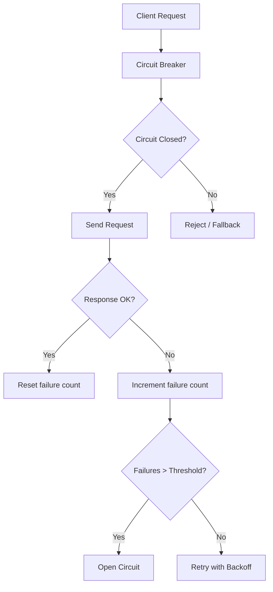

# Resilience Patterns

> **Category:** Advanced Patterns / Reliability

## What It Is

**Resilience patterns** are design strategies that help distributed systems handle failures gracefully. In Kubernetes, these patterns are essential because network partitions, Pod failures, and node outages are normal.

## Pattern Overview



---

## 1. Circuit Breaker

**What:** Stops sending requests to a failing service after N failures, then periodically tests if it's recovered.

**When to use:** When downstream services can fail and you want fast failure instead of waiting for timeouts.

### Implementation (Istio/Envoy)

```yaml
apiVersion: networking.istio.io/v1beta1
kind: DestinationRule
metadata:
  name: my-service
spec:
  host: my-service
  trafficPolicy:
    connectionPool:
      tcp:
        maxConnections: 100
      http:
        h2UpgradePolicy: DEFAULT
        http1MaxPendingRequests: 100
        http2MaxRequests: 1000
    outlierDetection:
      consecutive5xxErrors: 5      # Open after 5 errors
      interval: 30s                 # Check every 30s
      baseEjectionTime: 30m         # Eject for 30 minutes
      maxEjectionPercent: 50        # Max 50% of endpoints ejected
      minHealthPercent: 30          # Below 30%, circuit opens fully
```

### How It Works

1. **Closed state** — requests flow normally
2. After 5 consecutive 5xx errors → **Open state** — requests rejected instantly
3. After 30 minutes → **Half-open state** — test request sent
4. If test succeeds → **Closed state** — resume normal flow
5. If test fails → **Open state** — eject again

---

## 2. Retry with Backoff

**What:** Automatically retries failed requests with increasing delays to avoid overwhelming the failing service.

**When to use:** For transient failures (network blips, temporary overloads).

### Implementation (Istio/Envoy)

```yaml
apiVersion: networking.istio.io/v1beta1
kind: VirtualService
metadata:
  name: my-service
spec:
  hosts:
  - my-service
  http:
  - route:
    - destination:
        host: my-service
    retries:
      attempts: 3                   # Max 3 retries
      perTryTimeout: 2s             # Timeout per retry
      retryOn: "5xx,reset,connect-failure"  # Retry conditions
      retryRemoteLocalities: true   # Retry on different locality
```

### Kubernetes Native Retry

```yaml
# Job backoff with exponential backoff
apiVersion: batch/v1
kind: Job
metadata:
  name: my-job
spec:
  backoffLimit: 3           # Max 3 retries
  activeDeadlineSeconds: 600
  template:
    spec:
      restartPolicy: Never
      containers:
      - name: worker
        image: my-worker:1.0
```

---

## 3. Timeout

**What:** Limits how long a request can take before being cancelled.

**When to use:** Always — prevents cascading failures from slow services.

### Implementation (Istio/Envoy)

```yaml
apiVersion: networking.istio.io/v1beta1
kind: VirtualService
metadata:
  name: my-service
spec:
  hosts:
  - my-service
  http:
  - timeout: 10s                    # Global timeout
    route:
    - destination:
        host: my-service
    retries:
      attempts: 3
      perTryTimeout: 3s             # Timeout per retry attempt
```

---

## 4. Rate Limiting

**What:** Limits the number of requests a client can make in a time window.

**When to use:** Protect services from being overwhelmed.

### Implementation (Istio/Envoy)

```yaml
apiVersion: networking.istio.io/v1beta1
kind: DestinationRule
metadata:
  name: my-service
spec:
  host: my-service
  trafficPolicy:
    connectionPool:
      http:
        h2UpgradePolicy: DEFAULT
        http1MaxPendingRequests: 100
        http2MaxRequests: 1000
        maxRequestsPerConnection: 10
```

---

## 5. Bulkhead (Pool Isolation)

**What:** Isolates resources so failure in one area doesn't take down everything.

**When to use:** When multiple services share resources.

### Implementation (Namespace Isolation)

```yaml
# ResourceQuota per namespace
apiVersion: v1
kind: ResourceQuota
metadata:
  name: team-quota
  namespace: team-a
spec:
  hard:
    requests.cpu: "10"
    requests.memory: 20Gi
    limits.cpu: "20"
    limits.memory: 40Gi
    pods: "50"
```

### Implementation (Network Policy)

```yaml
# Isolate team namespaces
apiVersion: networking.k8s.io/v1
kind: NetworkPolicy
metadata:
  name: deny-cross-namespace
  namespace: team-a
spec:
  podSelector: {}
  policyTypes:
  - Ingress
  ingress:
  - from:
    - namespaceSelector:
        matchLabels:
          name: team-a
```

---

## 6. Graceful Degradation

**What:** Reduces functionality when dependencies fail instead of failing completely.

**When to use:** For critical services that can operate with partial data.

### Example: Cache Fallback

```python
# Pseudocode for cache fallback
def get_product(product_id):
    try:
        # Try database first
        data = db.query(product_id)
        cache.set(product_id, data, ttl=300)
        return data
    except DatabaseError:
        # Fallback to cache
        data = cache.get(product_id)
        if data:
            return data
        # Fallback to default
        return DEFAULT_PRODUCT
```

---

## Best Practices

| Practice | Why |
|----------|-----|
| **Set timeouts everywhere** | Prevent cascading failures |
| **Use circuit breakers** | Fail fast, recover fast |
| **Implement retry budgets** | Prevent retry storms |
| **Use bulkheads** | Isolate failures |
| **Monitor circuit state** | Alert on open circuits |
| **Test failure modes** | Use Chaos Mesh / Litmus |
| **Use PDBs** | Protect during voluntary disruptions |

## Common Issues

| Symptom | Pattern Missing | Fix |
|---------|-----------------|-----|
| Cascading failure | Circuit breaker | Add outlierDetection |
| Retry storm | Retry budget | Limit retry attempts |
| Slow response | Timeout | Add timeout rules |
| Service overload | Rate limiting | Add connectionPool limits |
| Partial failure | Bulkhead | Add ResourceQuota + NetworkPolicy |

## Related

- [Chaos Engineering](chaos-engineering.md)
- [Istio](../12-service-mesh/istio.md)
- [Network Policies](../04-networking/network-policies.md)
- [Incident Case Studies](../14-troubleshooting/incidents/README.md)
