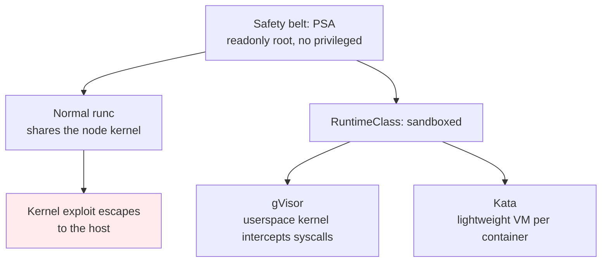

# Sandboxed Runtimes — gVisor, Kata Containers & RuntimeClass

> **Category:** Advanced Patterns / Security

A **sandboxed runtime** runs a container's workload in an extra isolation layer between the container and the node's host kernel — useful for **untrusted, multi-tenant, or privileged-looking workloads** you wouldn't run on a normal `containerd`/`runc` Pod. The two mainstream options are **gVisor** (a userspace kernel that intercepts syscalls) and **Kata Containers** (a lightweight VM per container). Both are wired in via a `RuntimeClass`.

## Why not just Pod Security Standards?


PSA/PSA admission stops a lot — but a **kernel CVE** still escapes a `runc` container because the container shares the host kernel. Sandbox runtimes add a kernel boundary (userspace kernel for gVisor, separate VM kernel for Kata).

## gVisor

Runs a container's processes against a **userspace implementation of the Linux kernel** (Google's `runsc`). Syscalls are intercepted by gVisor — not the host kernel — so a container can't reach the host kernel. There is no VM, so startup is fast (~10ms).

```yaml
apiVersion: node.k8s.io/v1
kind: RuntimeClass
metadata: { name: gvisor }
handler: runsc            # the gVisor runtime on the node
---
apiVersion: v1
kind: Pod
spec:
  runtimeClassName: gvisor
  containers:
  - name: worker
    image: my/untrusted-image
```

Pros: fast startup, low overhead, easy multi-tenant. Cons: not every syscall/device is implemented (some GPU/special drivers won't work); a small compatibility surface.

## Kata Containers

Runs each container in a **lightweight VM** (QEMU/AMD Sev/KVM) with a **dedicated kernel**. Strongest isolation (real VM boundary). Startup is heavier (~1-2s) than gVisra.

```yaml
apiVersion: node.k8s.io/v1
kind: RuntimeClass
metadata: { name: kata }
handler: kata
cost: 10           # optional: scheduling "cost" of a Kata pod
---
apiVersion: v1
kind: Pod
spec:
  runtimeClassName: kata
```

## Installing the runtimes

```bash
# gVisor (runsc) onto a node:
sudo apt-get install gvisor-containerd-shim-runsc-dev runsc
# configure containerd:
containerd config patch <<'EOF'
[plugins."io.containerd.grpc.v1.cri".containerd.runtimes.runsc]
  runtime_type = "io.containerd.runsc.v1"
EOF
# Kata:
sudo kata-runtime set-default-runtime.sh   # or install via kata-deploy
```
Both register a `RuntimeClass.handler` the kubelet maps to a containerd/CRI-O runtime. Pods with `runtimeClassName: runsc` / `kata` get the sandboxed runtime; everything else uses the default.

## RuntimeClass + Scheduling

`RuntimeClass` is cluster-scoped; you can gate it with `scheduling` (nodeSelector/ tolerations) so only nodes with the runtime installed pick up sandboxed Pods, and use `overhead` to reserve extra CPU/memory per Pod:

```yaml
apiVersion: node.k8s.io/v1
kind: RuntimeClass
metadata: { name: kata }
handler: kata
scheduling:
  nodeSelector: { katacontainers.io/kata-runtime: "true" }
overhead:
  podFixed:
    cpu: "0.5"
    memory: "512Mi"
```

## Common Issues

| Symptom | Cause | Fix |
|---------|-------|-----|
| Pod `Pending` (no node matches) | RuntimeClass `scheduling.nodeSelector` has no matching nodes | label the nodes or relax the selector |
| High startup latency / OOM | Kata VM memory too small / overhead not reserved | set `RuntimeClass.overhead` |
| Seccomp/AppArmor not honored | sandbox runtime ignores some host security contexts | use the runtime's own config; gVisor has its own seccomp |
| Device/GPU not found | gVisor doesn't implement the special device | run GPU workloads on the normal runtime; isolate them another way |

## Interview Questions

**Q: What is a RuntimeClass, and how does it choose a runtime?**
A: A `RuntimeClass` maps a name (e.g. `kata`) to a `handler` string that the kubelet resolves to a CRI runtime pre-registered on the node (`containerd`'s `runsc` or Kata's shim). Pods set `spec.runtimeClassName`; the scheduler uses the optional `.scheduling` (nodeSelector/tolerations) to place them on nodes that actually have that runtime installed.

**Q: Compare gVisor and Kata Containers — when to use each?**
A: gVisor = fast startup + lower overhead, intercepts syscalls in userspace (no VM) — good for multi-tenant SaaS / untrusted code that doesn't need special devices. Kata = a real lightweight VM per container — strongest isolation, heavier startup — good for truly untrusted workloads (multi-tenant HPC, untrusted CI) where a kernel-level boundary is required and you can afford ~1-2s boot.

**Q: Why aren't sandboxed runtimes the default?**
A: Overhead (latency/memory), incomplete device/driver support (gVisra GPUs, Kata startup time), and node-image/operator complexity. They're a targeted control for the untrusted slice of workloads, not a Pod Security replacement.

## Related Resources
- [Container Runtimes](../02-architecture/container-runtimes.md)
- [Security](../06-security/README.md)
- [Pod Patterns](pod-patterns.md)
- [CKA/CKAD](../16-interview-prep/ckad.md)
