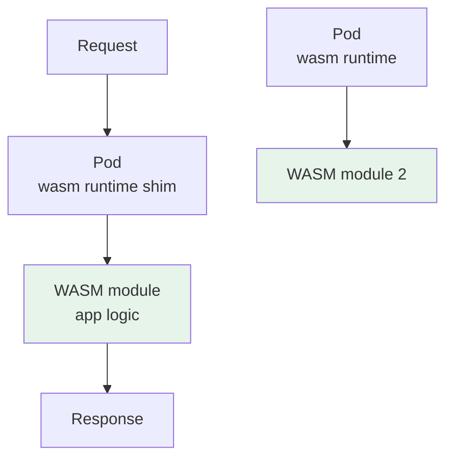

# WASM on Kubernetes — WebAssembly as a Workload

> **Category:** Advanced Patterns / Runtimes

**WebAssembly (WASM)** on Kubernetes lets you run **tiny, sandboxed modules** (not full containers) as workloads — think of a WASM runtime (wasmtime, wasmtime, wasmEdge, wasmtime) embedded in a Pod or as a KubeEdge-style shim that executes `.wasm` instead of unpacking an OCI image. It is lighter than a container (no OS, fast start, ~KB footprint) and sandboxed by the WASM engine itself.

## Where it fits


A WASM workload in K8s is usually a **Pod whose container is a thin WASM runtime**, pulling a `.wasm` (often packaged as an OCI artifact) and executing it. `wasmtime`/`wasmEdge` can be used via a **RuntimeClass** or via specialized runtimes like **K Wasm** (a CRI shim that runs WASM instead of containers).

## Runtimes & integrations

| Runtime | How it plugs into K8s | Notes |
|---------|-----------------------|-------|
| **wasmEdge** | K Wasm CRI shim / containerd-wasm | CNCF; mature; WASI + Wasm HTTP + plugins |
| **wasmtime** | KubeEdge-Tinyflux / wasmtime-runtime; `wasm` RuntimeClass | CNCF; used by Spin |
| **wasmer** | wasmer-containerd | language-agnostic, WASI |
| **Krustlet** (deprecated) | former "wasi RuntimeClass" | deprecated in favor of containerd-wasm/KWasm |
| **Spin on K8s** | Fermyon's `spin-operator` + KWasm | "WebAssembly apps" model |

### RuntimeClass with a WASM runtime (containerd-wasm)

```yaml
apiVersion: node.k8s.io/v1
kind: RuntimeClass
metadata: { name: wasm-wasmtime }
handler: wasmtime                 # containerd configured with the wasmtime runtime
---
apiVersion: v1
kind: Pod
spec:
  runtimeClassName: wasm-wasmtime
  containers:
  - name: greet
    image: ghcr.io/.../greet.wasm:latest    # a WASM module pushed as an OCI artifact
    command: ["greet.wasm"]
```

## Why (and why not) run WASM vs containers

| Dimension | Container (runc) | WASM |
|-----------|------------------|------|
| Startup | ~100ms–1s | ~1–10ms |
| Size | 50–500MB image | ~KB `.wasm` |
| Sandbox | kernel namespaces + seccomp | WASM linear memory + WASI |
| Devices/sidecar | full Linux + kernel modules | WASI limited (network/filesystem via hosts) |
| Ecosystem | vast | growing (still niche) |
| Multi-language | yes (each language a base image) | excellent (compile target, polyglot) |

**Use WASM for:** tiny plugins, per-request handlers, edge logic, untrusted user code, polyglot microservices sharing one base runtime. **Don't use** for anything needing kernel features, GPUs, or full Linux sidecars.

## Packaging WASM as an OCI artifact

A `.wasm` module can be pushed to an OCI registry and referenced as a Pod image:
```bash
oras push localhost:5000/myapp:v1 greet.wasm
```
Then `image: localhost:5000/myapp:v1` + a wasmtime containerd runtime pulls and executes `greet.wasm` instead of a rootfs.

## Common Issues

| Symptom | Cause | Fix |
|---------|-------|-----|
| Pod `OOMKilled` / exits | WASM runtime configured wrong, or host memory too small | verify containerd `runc.vs` vs `wasmtime` shim; set resource limits |
| `runtime handler wasm not found` | RuntimeClass handler not registered on the node | install the CRI shim (`containerd-wasm`/`kWasm`) and label the node |
| network/filesystem access denied | WASI has no network by default unless enabled | enable `wasmtimes` network/WASI args or use a host networking shim |
| image `greet.wasm` not an OCI image | registry returned a manifest the runtime won't accept | use `oras` to push as a single-arch artifact with correct media type |

## Interview Questions

**Q: How is running a WASM module on Kubernetes different from running a container?**
A: A container is a Linux process in a rootfs + namespaces (runc unpacks an OCI image). A WASM workload still runs as a Pod, but its "container" is a thin **WASM runtime** that executes a `.wasm` module from a WASI filesystem — no container image layers, no OS userspace, sub-second start, and sandbox via the WASM engine, not Linux namespaces.

**Q: When would you choose KWasm/containerd-wasm over plain containers?**
A: For tiny, bursty, multi-tenant, or polyglot handlers where image size + startup time matter (edge, plugins, untrusted user code). Not for workloads that need kernel features, GPUs, init containers, or full sidecar compositions.

## Related Resources
- [Pod Patterns](pod-patterns.md)
- [Sandboxed Runtimes](sandbox-runtimes.md)
- [CRDs & Operators](crds-operators.md)
- [Container Runtimes](../02-architecture/container-runtimes.md)
