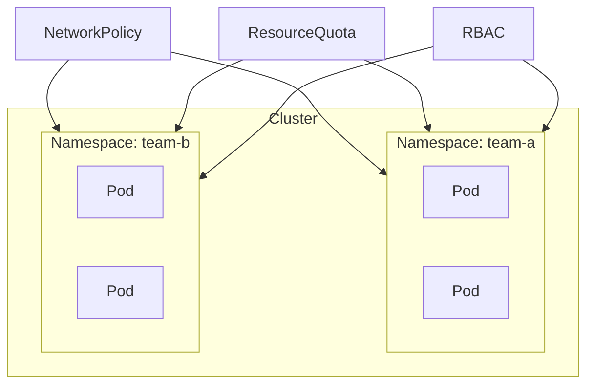
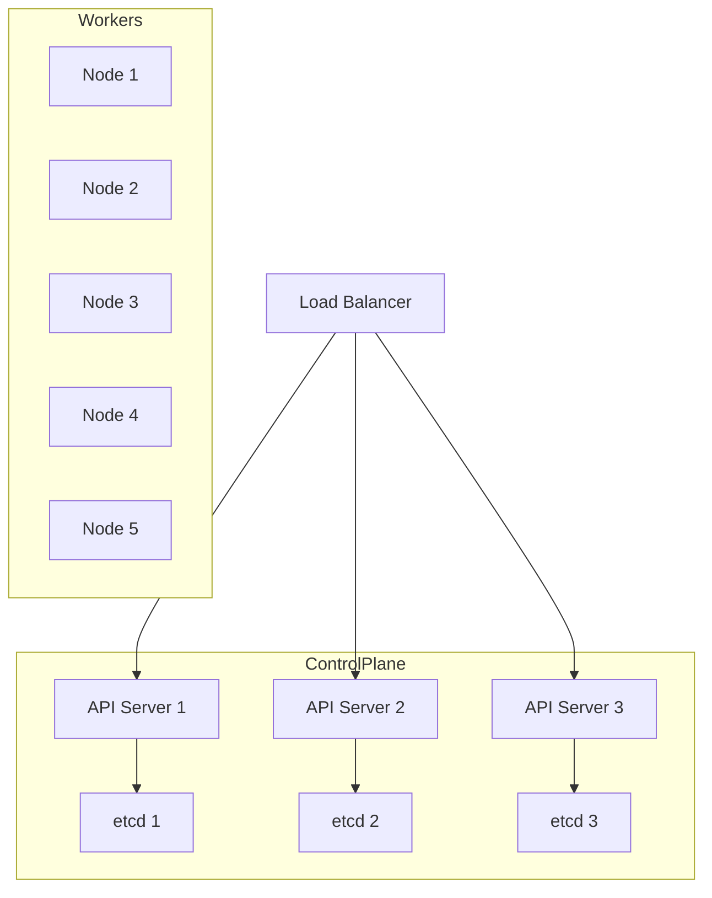
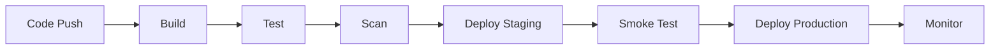
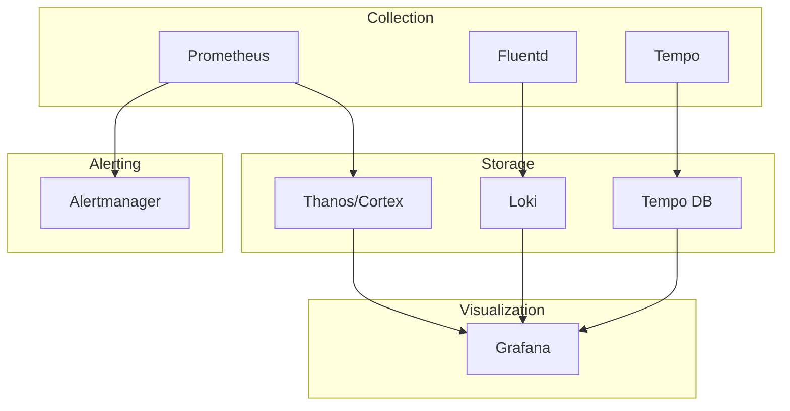
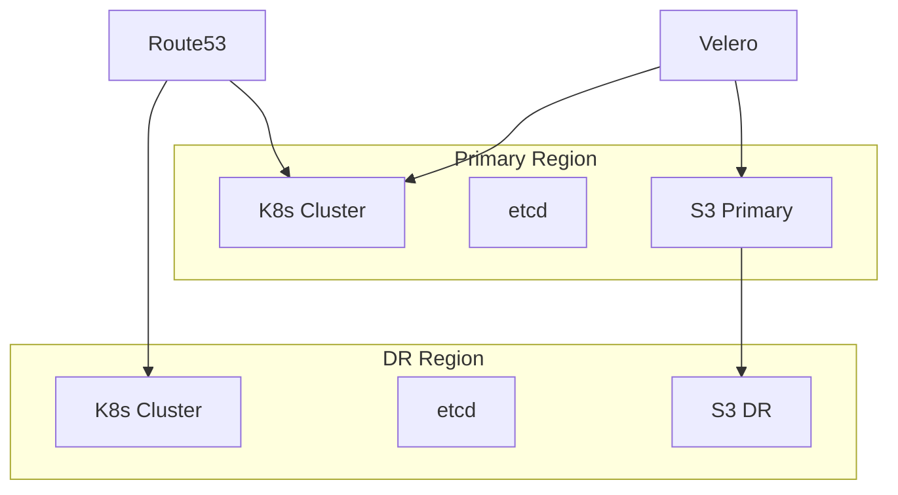
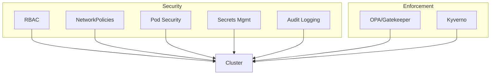
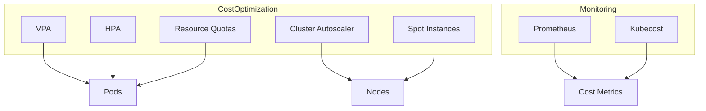
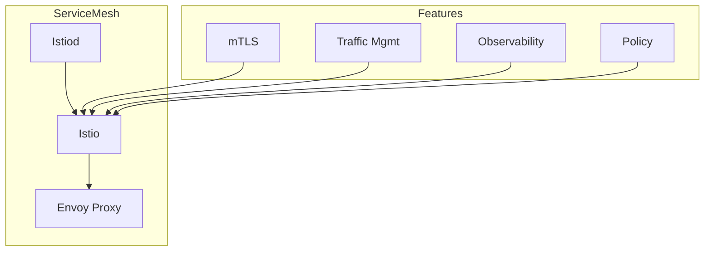

# Kubernetes System Design Questions

> **Category:** Interview Prep / System Design
> Common Kubernetes system design interview questions with answers.

## 1. Design a Multi-Tenant Kubernetes Cluster

### Requirements
- Support multiple teams/environments
- Resource isolation
- Network isolation
- RBAC per tenant

### Solution

### Key Components

| Component | Purpose |
|-----------|---------|
| Namespaces | Tenant isolation |
| ResourceQuotas | Resource limits |
| NetworkPolicies | Network isolation |
| RBAC | Access control |
| PodSecurityPolicies | Security policies |

### Answer Outline

1. **Namespaces**: One per tenant with labels
2. **ResourceQuotas**: CPU/memory limits per namespace
3. **NetworkPolicies**: Default deny + allow rules
4. **RBAC**: Roles and bindings per tenant
5. **Admission Controllers**: OPA/Kyverno for policy enforcement

## 2. Design a High-Availability Kubernetes Cluster

### Requirements
- Control plane HA
- Worker node HA
- No single point of failure
- Auto-scaling

### Solution

### Key Components

| Component | Purpose |
|-----------|---------|
| Multiple API servers | Control plane HA |
| etcd cluster | State storage HA |
| Load balancer | API server distribution |
| Node auto-scaling | Worker HA |
| Pod anti-affinity | Pod distribution |

### Answer Outline

1. **Control Plane**: 3+ API servers behind load balancer
2. **etcd**: 3 or 5 node cluster for quorum
3. **Workers**: Auto-scaling group with min/max
4. **Pod Distribution**: Anti-affinity rules
5. **Storage**: Replicated storage (Ceph, Portworx)

## 3. Design a CI/CD Pipeline for Kubernetes

### Requirements
- Automated builds
- Automated testing
- Automated deployment
- Rollback capability

### Solution

### Key Components

| Component | Purpose |
|-----------|---------|
| GitOps (ArgoCD/Flux) | Git-based deployment |
| Tekton/Jenkins | CI pipeline |
| Harbor/ECR | Container registry |
| OPA/Kyverno | Policy enforcement |
| Prometheus/Grafana | Monitoring |

### Answer Outline

1. **Source**: Git-based source control
2. **Build**: Container image build and push
3. **Test**: Unit, integration, security tests
4. **Scan**: Vulnerability scanning
5. **Deploy**: GitOps-based deployment
6. **Monitor**: Health checks and alerts

## 4. Design a Monitoring Stack

### Requirements
- Metrics collection
- Log aggregation
- Alerting
- Dashboards

### Solution

### Key Components

| Component | Purpose |
|-----------|---------|
| Prometheus | Metrics collection |
| Thanos/Cortex | Long-term storage |
| Fluentd | Log collection |
| Loki | Log storage |
| Tempo | Distributed tracing |
| Grafana | Visualization |
| Alertmanager | Alert routing |

### Answer Outline

1. **Metrics**: Prometheus + Thanos for long-term
2. **Logs**: Fluentd + Loki for log aggregation
3. **Traces**: Tempo for distributed tracing
4. **Dashboards**: Grafana for visualization
5. **Alerts**: Alertmanager for routing

## 5. Design a Disaster Recovery Solution

### Requirements
- Regular backups
- Point-in-time recovery
- Cross-region replication
- Automated failover

### Solution

### Key Components

| Component | Purpose |
|-----------|---------|
| Velero | Backup and restore |
| S3 cross-region | Data replication |
| Route53 | DNS failover |
| etcd backup | State backup |
| PDBs | Availability guarantees |

### Answer Outline

1. **Backups**: Automated etcd and PV backups
2. **Replication**: Cross-region S3 replication
3. **Failover**: DNS-based failover
4. **Testing**: Regular DR drills
5. **Monitoring**: Backup verification

## 6. Design a Secure Kubernetes Cluster

### Requirements
- RBAC
- Network policies
- Pod security
- Secret management
- Audit logging

### Solution

### Key Components

| Component | Purpose |
|-----------|---------|
| RBAC | Access control |
| NetworkPolicies | Network isolation |
| Pod Security Admission | Pod security |
| OPA/Gatekeeper | Policy enforcement |
| External Secrets | Secret management |
| Audit Logging | Compliance |

### Answer Outline

1. **RBAC**: Least privilege access
2. **Network**: Default deny policies
3. **Pod Security**: PSA with enforce mode
4. **Secrets**: External secrets operator
5. **Audit**: API server audit logging

## 7. Design a Cost-Optimized Cluster

### Requirements
- Right-sizing
- Auto-scaling
- Spot instances
- Resource quotas

### Solution

### Key Components

| Component | Purpose |
|-----------|---------|
| VPA | Right-sizing |
| HPA | Pod auto-scaling |
| Cluster Autoscaler | Node auto-scaling |
| Spot instances | Cost reduction |
| Resource Quotas | Cost control |
| Kubecost | Cost monitoring |

### Answer Outline

1. **Right-sizing**: VPA for resource recommendations
2. **Scaling**: HPA + Cluster Autoscaler
3. **Spot**: Use spot for non-critical workloads
4. **Quotas**: Prevent cost runaway
5. **Monitoring**: Track and optimize costs

## 8. Design a Service Mesh

### Requirements
- mTLS
- Traffic management
- Observability
- Policy enforcement

### Solution

### Key Components

| Component | Purpose |
|-----------|---------|
| Istio | Service mesh |
| Envoy | Sidecar proxy |
| Istiod | Control plane |
| VirtualService | Traffic routing |
| DestinationRule | Load balancing |
| AuthorizationPolicy | Access control |

### Answer Outline

1. **mTLS**: Automatic certificate management
2. **Traffic**: Canary, blue/green deployments
3. **Observability**: Metrics, logs, traces
4. **Policy**: Authorization and rate limiting
5. **Security**: Zero-trust networking

## Related

- [Interview Questions](interview-questions.md)
- [CKA Mock Exam](cka-mock-exam.md)
- [CKAD Mock Exam](ckad-mock-exam.md)
- [CKS Mock Exam](cks-mock-exam.md)
