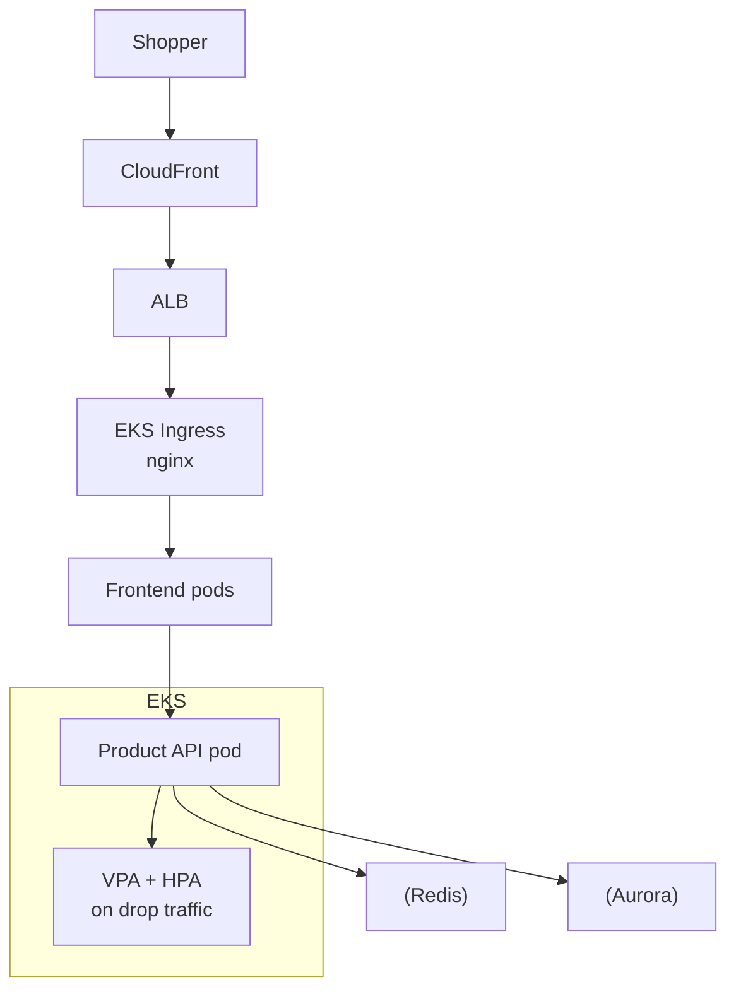

# Adidas — E-commerce Platform on Kubernetes

> **Category:** Case Study / E-commerce

| Field | Detail |
|-------|--------|
| **Industry** | Sportswear / E-commerce |
| **Region** | Germany (global) |
| **Adoption** | 2022 (EKS) |
| **Scale** | 400+ pods during peaks ~ hundreds of microservices |

## Who & Why K8s

Adidas rebuilt its e-commerce platform (adidas.com) on **EKS** to handle major release drops — which spike traffic ~10x in minutes. The old monolith couldn't scale fast enough for limited-edition sneaker launches. Kubernetes gave them autoscaling per-service and, on EKS, AWS IAM for S3 (product images) without keys.

## Journey

1. 2021: evaluated options during a replatform effort.
2. 2022: chose EKS; began containerizing the commerce monolith.
3. Present: headless commerce stack (frontend + backend services) on EKS, with strict scale-out for drop events.

## Architecture

- Clusters: EKS per region (EU-central, US-East) with separate prod/staging.
- Scaling: pods scale via HPA on requests; node groups (Spot + On-Demand) absorb drops.
- Identity: IRSA for S3 (product images) and DynamoDB (recommendations).

## Tooling

- Argo CD for GitOps of commerce services.
- Prometheus + Grafana for "drop" SLOs (checkout latency < 200ms).
- S3 for assets; CloudFront CDN in front.
- Sealed Secrets + KMS for secrets at rest.

## Key Decisions

- EKS over GKE — AWS was the existing adidas cloud; S3 + CloudFront integration mattered for media.
- Headless commerce split (frontend decoupled from backend services) — let frontend teams ship independently of the monolith split.
- Spot + On-Demand node mix — cut drop-event costs while keeping baseline capacity.

## Interview Angle

Adidas engineers said the real test was Black Friday and Yeezy drops: Kubernetes autoscaling + Spot node groups kept the checkout latency under 200ms even when traffic spiked 10x, without pre-purchasing a year of capacity.

## Related Resources
- [Companies Using Kubernetes](../companies-using-kubernetes.md)
- [EKS](../09-cloud-integrations/eks.md)
- [E-commerce](../17-company-cases/zalando.md)
- [GitOps](../15-advanced-patterns/gitops.md)
