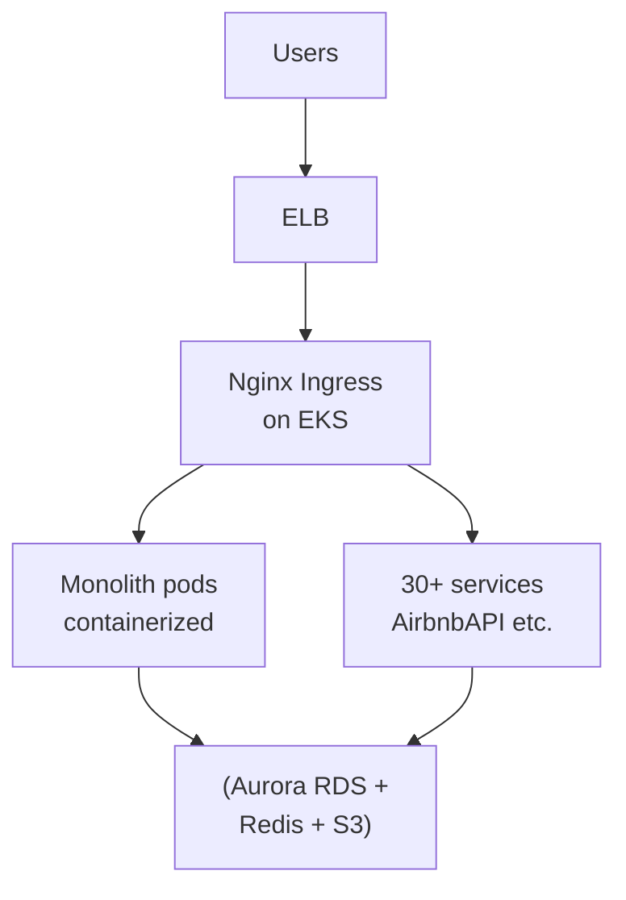

# Airbnb — Migrating a Monolith to Kubernetes Without Downtime

> **Category:** Case Study / Tech

| Field | Detail |
|-------|--------|
| **Industry** | Travel / Marketplace |
| **Region** | US (global traffic, AWS) |
| **Adoption** | 2021 (EKS, gradual) |
| **Scale** | 30+ services · 30M+ hosts · 100M+ guests |

## Who & Why K8s

Airbnb ran a massive Rails monolith ("Monorail") on AWS for years. The K8s migration (announced ~2021, completed rollout over ~2 years) was driven by the need to **modernize the runtime** (Brotli, better JVM tuning), **reduce EC2 waste**, and **let teams ship services** that the monolith couldn't host efficiently (Airbnb's ML and image-processing pipelines).

## Journey

1. **2021**: Announced the move; decided on **EKS** to stay on AWS (the monolith lived there).
2. **"Strangler" + lift-and-shift**: containerized monolith services first, then migrated users over a multi-year window without turning the site off.
3. **2022–23**: new microservices default to EKS; the monolith slices keep migrating service-by-service.

## Architecture

- **Clusters**: a handful of EKS clusters (prod + staging), **not** per-team — teams share but use namespaces + `NetworkPolicy`s for isolation.
- **Identity**: **IRSA** binds service accounts to IAM roles for S3 (image storage) and DynamoDB — Airbnb had zero keys on disk even mid-migration.
- **Ingress**: **nginx-ingress** (their choice over ALB) because they needed fine-grained canary/traffic splitting during the live migration.

## Tooling

- **Spinnaker** still handles CD — they layered the K8s manifests into their existing Spinnaker pipelines rather than rip-and-replace.
- **Custom service mesh** (the open-source `airbnb/symfony` / envoy sidecars) for mTLS between the monolith and new services during the split — eventually replaced by standard EKS networking.
- **Ares** (their monitoring, built on Prometheus) scrapes both EKS and the legacy fleet.

## Key Decisions

- **EKS, not GKE** — AWS home since day one; the migration goal was modernizing infra, not moving clouds.
- **Keep Spinnaker** — avoided a second risky migration (CI/CD) on top of the first (runtime).
- **nginx-ingress over ALB** — needed canary weights for the live cutover; ALB couldn't give the fine-grained routing they needed at the time.
- **Gradual strangler** — never cut the site over; each service migrated independently reduced blast radius.

## Interview Angle

> "We didn't lift-and-shift the monolith and call it done. We containerised it, ran it on EKS, and *then* kept pulling services out — so the migration also became the modernization."

## Related Resources
- [Companies Using Kubernetes](../companies-using-kubernetes.md)
- [GitOps](../15-advanced-patterns/gitops.md)
- [EKS](../09-cloud-integrations/eks.md)
- [Deployment Strategies](../03-workloads/deployment-strategies.md)
