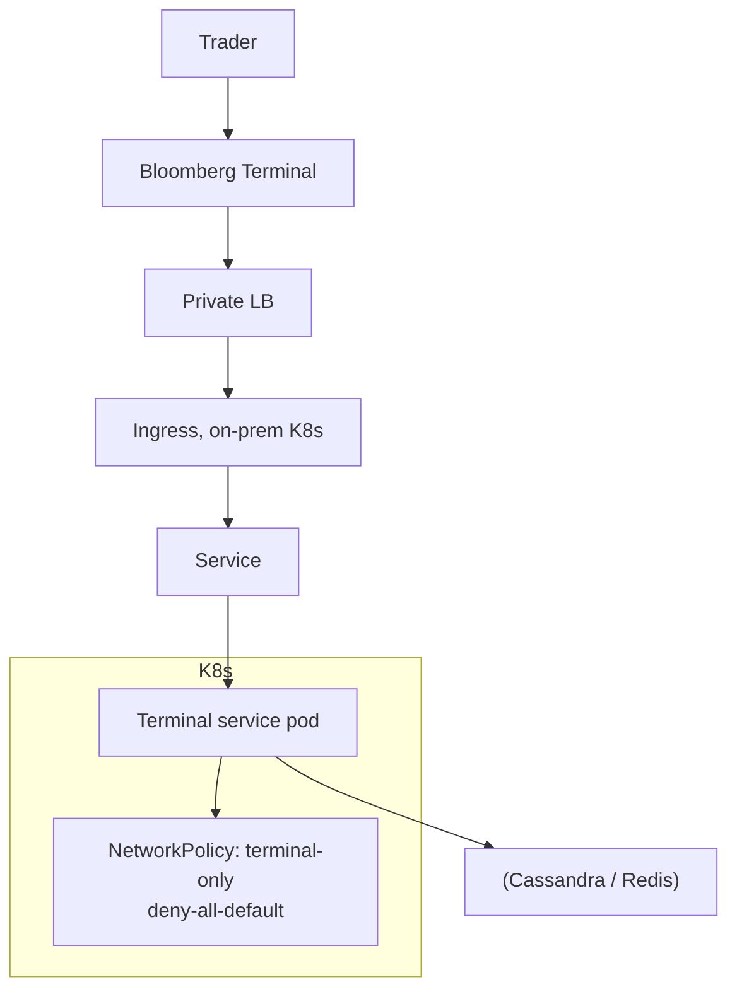

# Bloomberg — Financial Terminal on Kubernetes

> **Category:** Case Study / Financial Services

| Field | Detail |
|-------|--------|
| **Industry** | Financial Terminal / Data |
| **Region** | US (global) |
| **Adoption** | 2019 (on-prem + private cloud K8s) |
| **Scale** | 500+ services · Bloomberg Terminal |

## Who & Why K8s

Bloomberg runs the **Bloomberg Terminal** backend and a vast data/infra platform partly on **on-prem Kubernetes** and private cloud. Unlike the AWS-heavy banks, Bloomberg already had a massive private data-center footprint, so K8s here is about **modernizing a private cloud** and giving infra teams a consistent surface for 500+ services (data feeds, terminals, analytics) while keeping data on-prem for latency/regulation.

## Journey

1. **2018–19**: stood up an internal Kubernetes platform on private data centers.
2. **2019–20**: migrated terminal data feeds + backend services into K8s namespaces.
3. **Present**: core Terminal services run on-prem K8s with strict network isolation.

## Architecture

- **Clusters**: on-prem Kubernetes clusters (private data center, not EKS/GKE) — data locality and regulation drove this.
- **Networking**: very strict `NetworkPolicy` (deny-all default) so terminal traffic stays within bounded paths.
- **Data tier**: co-located Redis/Cassandra clusters (private cloud) for sub-ms data access critical to trading.

## Tooling

- **Prometheus** (Bloomberg is a major Prometheus contributor) + in-house Grafana fork for terminal SLOs.
- Custom **admission controllers** enforcing PCI-style isolation on-prem.
- **Image registry** private to Bloomberg; all images scanned by a custom pipeline.

## Key Decisions

- **On-prem K8s, not EKS/GKE** — Bloomberg's data and latencies required staying on-prem; K8s modernized the private cloud without ceding data.
- **NetworkPolicies as the security boundary** — Terminal data can't cross into non-terminal paths; enforced via admission + default-deny.
- **Prometheus** as the core metric layer (and Bloomberg contributes back).

## Interview Angle

> "We didn't move to the public cloud for the Terminal — we moved to Kubernetes in our own data centers, so we got the platform benefits without moving a byte of sensitive financial data off-prem."

## Related Resources
- [Companies Using Kubernetes](../companies-using-kubernetes.md)
- [Security](../06-security/README.md)
- [Networking](../04-networking/README.md)
- [GitOps](../15-advanced-patterns/gitops.md)
