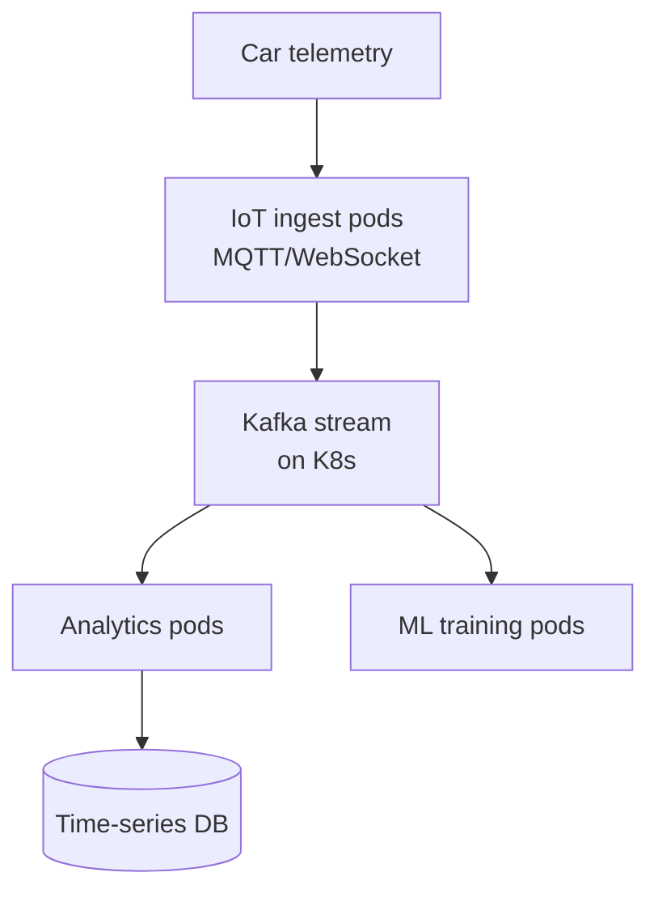

# BMW — Connected Car & Manufacturing on Kubernetes

> **Category:** Case Study / Automotive

| Field | Detail |
|-------|--------|
| **Industry** | Automotive / Manufacturing |
| **Region** | Germany (global) |
| **Adoption** | 2022 (Kubernetes) |
| **Scale** | 200+ services · connected-car data platform |

## Who & Why K8s

BMW uses Kubernetes for its **connected-car platform** (telemetry ingestion from vehicles) and manufacturing-analytics services. The goal: stream data from millions of BMW vehicles, run analytics/predictive maintenance, and serve fleet-management dashboards — all with a scalable, cloud-native runtime.

## Journey

1. 2021: evaluated platforms for connected-car telemetry.
2. 2022: deployed Kubernetes (hybrid: on-prem for EU data, AWS for scale).
3. Present: 200+ services; real-time fleet analytics.

## Architecture

- Ingestion: MQTT/WebSocket ingest pods handle vehicle connections.
- Streams: Kafka (self-managed on K8s) buffers telemetry.
- Analytics: real-time analytics + predictive-maintenance ML pipelines.

## Tooling

- Argo CD for GitOps across regions.
- Prometheus + Grafana for vehicle-telemetry SLOs (latency to dashboard).
- Kafka-on-K8s (Strimzi operator) for the streaming backbone.
- Vault for car-device credentials.

## Key Decisions

- On-prem for EU telemetry (GDPR); AWS for ML training burst.
- Kafka-on-K8s (Strimzi) over managed Kafka — needed control over retention for compliance.
- Per-region K8s clusters so EU vehicle data never leaves EU nodes.

## Interview Angle

BMW's connected-car team said the KPI was end-to-end latency from car to fleet dashboard: running Kafka + analytics on Kubernetes in-region shaved the p95 from ~90 seconds (legacy) to under 5 seconds, which is what enables real-time fleet actions (recall alerts, range estimates).

## Related Resources
- [Companies Using Kubernetes](../companies-using-kubernetes.md)
- [GitOps](../15-advanced-patterns/gitops.md)
- [Jobs](../03-workloads/jobs.md)
