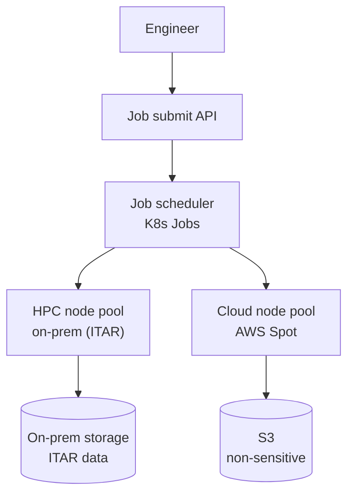

# Boeing — Aerospace HPC & Simulations on Kubernetes

> **Category:** Case Study / Manufacturing / Aerospace

| Field | Detail |
|-------|--------|
| **Industry** | Aerospace / Defense |
| **Region** | US |
| **Adoption** | 2021 (on-prem + cloud K8s) |
| **Scale** | 50+ workloads · engineering simulations |

## Who & Why K8s

Boeing uses Kubernetes to run **aerospace engineering workloads** (CFD simulations, structural modeling, supply-chain data) across a hybrid of on-prem HPC and AWS. The goal: give engineers a uniform compute substrate that scales from a single simulation to thousands of parallel cores, with the cost benefits of Spot/cloud burst and the data security of on-prem for ITAR-sensitive work.

## Journey

1. 2020: stood up an internal Kubernetes platform for engineering.
2. 2021: migrated simulations from direct HPC scheduling to K8s Jobs.
3. Present: 50+ simulation workloads; on-prem for ITAR data, AWS for burst.

## Architecture

- Workload model: simulations are `Job` resources with `nodeAffinity`/`nodeSelector` for GPU or high-CPU nodes.
- Separation: ITAR-sensitive data/simulations pinned to on-prem via taints + tolerations; non-sensitive burst to AWS Spot.
- Storage: on-prem parallel filesystem for sensitive data; S3 for outputs.

## Tooling

- Custom operator wraps simulation jobs as K8s CRDs.
- Slurm integration for the HPC nodes (K8s schedules, Slurm runs MPI).
- Prometheus for job completion/failure metrics.

## Key Decisions

- Hybrid (on-prem + AWS) — ITAR data must stay on-prem; cloud only for surge.
- K8s Jobs over direct HPC scheduler — gave engineers a uniform API across sites.
- Taints/tolerations to force ITAR workloads onto labeled on-prem nodes.

## Interview Angle

Boeing's platform engineer said the metric was engineer-hours waiting for a simulation slot: moving CFD jobs onto Kubernetes with AWS Spot burst cut the average queue from 6 hours to under 30 minutes for non-sensitive runs, while ITAR jobs stayed pinned to the on-prem HPC.

## Related Resources
- [Companies Using Kubernetes](../companies-using-kubernetes.md)
- [GitOps](../15-advanced-patterns/gitops.md)
- [Jobs](../03-workloads/jobs.md)
- [Scheduling](../07-scheduling-autoscaling/README.md)
