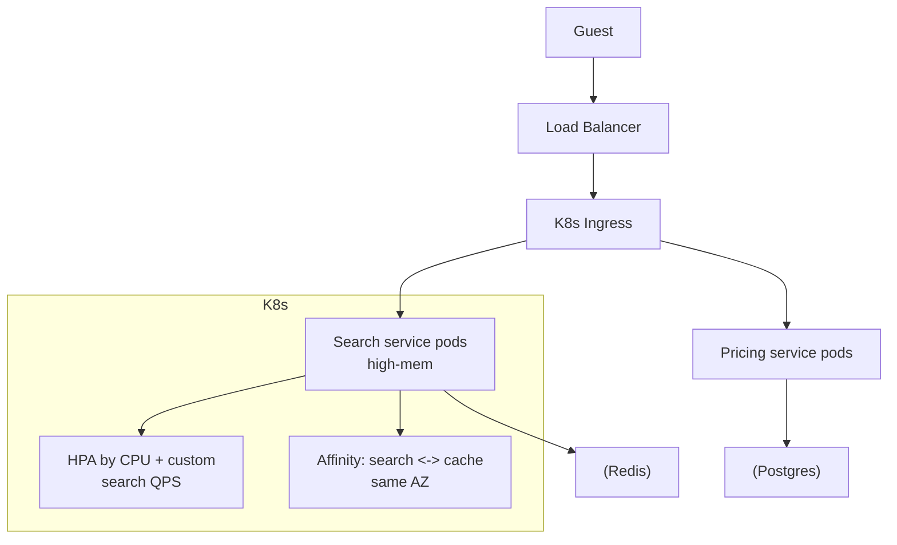

# Booking.com — Travel Booking on Kubernetes

> **Category:** Case Study / Travel Tech

| Field | Detail |
|-------|--------|
| **Industry** | Travel / Booking |
| **Region** | Netherlands (global) |
| **Adoption** | 2022 (Kubernetes on-prem + public) |
| **Scale** | 300+ services ~ 1.5 million room-nights booked/day |

## Who & Why K8s

Booking.com migrated its travel-booking platform to Kubernetes to break its monolith into independently scalable services (search, pricing, bookings, recommendations). With ~1.5 million room-nights booked daily and huge seasonal spikes, they needed a uniform runtime that scales per-service. They run a hybrid: some services on-prem K8s, some on public-cloud K8s.

## Journey

1. 2021: began breaking the booking monolith into microservices.
2. 2022: adopted Kubernetes as the common runtime across on-prem and cloud.
3. Present: 300+ services, with search/pricing on high-memory pools.

## Architecture

- Clusters: on-prem K8s (for data-heavy, cost-sensitive services) + public-cloud K8s for customer-facing traffic.
- Workload tuning: search services use high-memory node pools; pricing uses CPU-optimized pools.
- Networking: locality-aware routing so search caches stay in the same AZ.

## Tooling

- Internal platform tooling (Booking built proprietary schedulers/operators) for the hybrid model.
- Prometheus + Grafana for search latency (a primary conversion metric).
- Custom autoscaling on business metrics (QPS for search), not just CPU.

## Key Decisions

- Hybrid K8s (on-prem + cloud) — kept data-intensive workloads on-prem for cost, customer traffic on cloud for scale.
- Custom autoscaling on QPS — CPU-based scaling missed the search spike pattern.
- Affinity rules for search/cache locality — cut tail latency significantly.

## Interview Angle

Booking.com's platform lead said the metric that mattered was p99 search latency during European summer: Kubernetes + custom QPS-based autoscaling + AZ-affinity caching kept the conversion-critical search under 100ms even at 120% of normal traffic.

## Related Resources
- [Companies Using Kubernetes](../companies-using-kubernetes.md)
- [GitOps](../15-advanced-patterns/gitops.md)
- [Security](../06-security/README.md)
