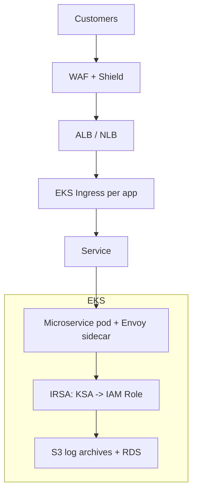

# Capital One — Bank RegTech on Kubernetes (EKS)

> **Category:** Case Study / Financial Services

| Field | Detail |
|-------|--------|
| **Industry** | Financial Services / Fintech |
| **Region** | US (AWS) |
| **Adoption** | 2018 (EKS, early adopter) |
| **Scale** | 1,500+ containers · hundreds of microservices |

## Who & Why K8s

Capital One was one of the first big U.S. banks to go all-in on AWS and Kubernetes. Goal: replace data centers with a cloud-native control plane for banking apps while keeping PCI + regulatory compliance. **EKS** won because it is AWS-native (CapOne was already all-in on AWS) and gave fine-grained IAM + network-policy controls they could bake into a self-managed "Container Platform."

## Journey

1. **2015–16**: first wave of migration to AWS (lift some EC2 workloads).
2. **2017–18**: adopted EKS for new microservices; stood up an internal Container Platform team.
3. **2019+**: nearly all new apps target EKS; legacy apps progressively containerized, with policy-as-code gates.

## Architecture

- **Clusters**: multiple EKS clusters (prod/staging) with strict per-app namespaces guarded by Pod Security Standards + `NetworkPolicy`.
- **Identity**: **IRSA** binds service accounts to IAM roles — no AWS keys in pods, every AWS call attributable → audit-ready.
- **Ingress**: **AWS Load Balancer Controller** provisions ALBs/NLBs; CapOne layers WAF + Shield before traffic hits the cluster.

## Tooling

- **Spinnaker** drives CD into EKS across environments.
- **Prometheus + Datadog** for metrics and compliance dashboards; PCI workloads monitored separately.
- **Vault + KMS** for secrets (runtime fetch, never in images).
- **OPA/Gatekeeper + Kyverno** as policy-as-code (no unscanned images, no privileged, etc.).

## Key Decisions

- **EKS over raw ECS** — wanted a standardized Kubernetes API surface for the platform team.
- **IRSA everywhere** — "keys in code kill audits"; IRSA made IAM attributable per microservice.
- **WAF/Shield at the edge** — handled DDoS/WAF before traffic reached the cluster (a compliance must for finance).

## Interview Angle

> "We moved to EKS not for cost, but for velocity and compliance: IRSA made every AWS call attributable to a service account — which is what the auditors actually cared about."

## Related Resources
- [Companies Using Kubernetes](../companies-using-kubernetes.md)
- [EKS](../09-cloud-integrations/eks.md)
- [Security](../06-security/README.md)
- [GitOps](../15-advanced-patterns/gitops.md)
