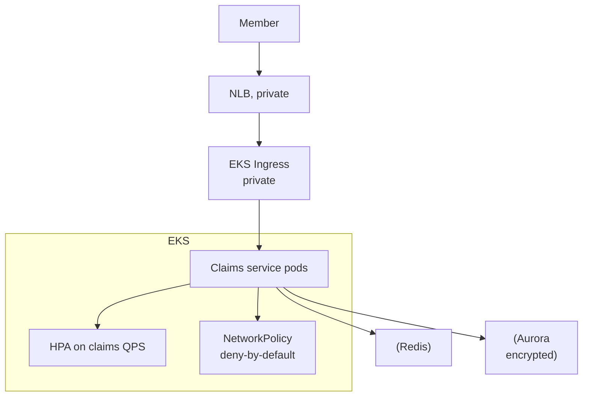

# CVS Health — Health Records & Claims on Kubernetes

> **Category:** Case Study / Healthcare

| Field | Detail |
|-------|--------|
| **Industry** | Healthcare / Insurance |
| **Region** | US (AWS) |
| **Adoption** | 2022 (EKS) |
| **Scale** | 150+ services ~ 30 million members |

## Who & Why K8s

CVS Health (which runs CVS Pharmacy, Aetna, MinuteClinic, and pharmacy benefits) adopted **EKS** to modernize its healthcare platform — claims processing, member records, and the pharmacy-benefits engine. The driver: need **HIPAA compliance** + per-service scaling for claims spikes during flu season and pharmacy rushes, on an AWS footprint they already owned.

## Journey

1. 2021: decided on EKS for HIPAA-eligible services.
2. 2022: migrated claims + member-services APIs.
3. Present: 150+ services; strict network + image-signing controls.

## Architecture

- Clusters: private EKS clusters (no direct internet) in multiple regions.
- Compliance: HIPAA-required encryption at rest/in transit + audit-logging to CloudWatch.
- Scaling: claims services scale on QPS; pharmacy benefits spike during open enrollment.

## Tooling

- Spinnaker + internal CI for CD.
- Prometheus + Datadog for HIPAA audit dashboards.
- Vault + KMS for secrets; Aurora encrypted.
- Cosign + Kyverno for signed, non-root images only.

## Key Decisions

- EKS for HIPAA — AWS BAA + private endpoints fit the compliance model.
- Default-deny NetworkPolicy — PHI can't route to non-health paths.
- Cosign signing enforced at admission — supply-chain integrity is a HIPAA concern.

## Interview Angle

CVS Health's platform team said the real win was open enrollment: EKS autoscaling handled 5x claims-traffic while HIPAA audit logging stayed continuous — and the signed-image admission policy caught a stray unsigned image on its first day, catching what could have been a compliance incident.

## Related Resources
- [Companies Using Kubernetes](../companies-using-kubernetes.md)
- [EKS](../09-cloud-integrations/eks.md)
- [Security](../06-security/README.md)
- [GitOps](../15-advanced-patterns/gitops.md)
