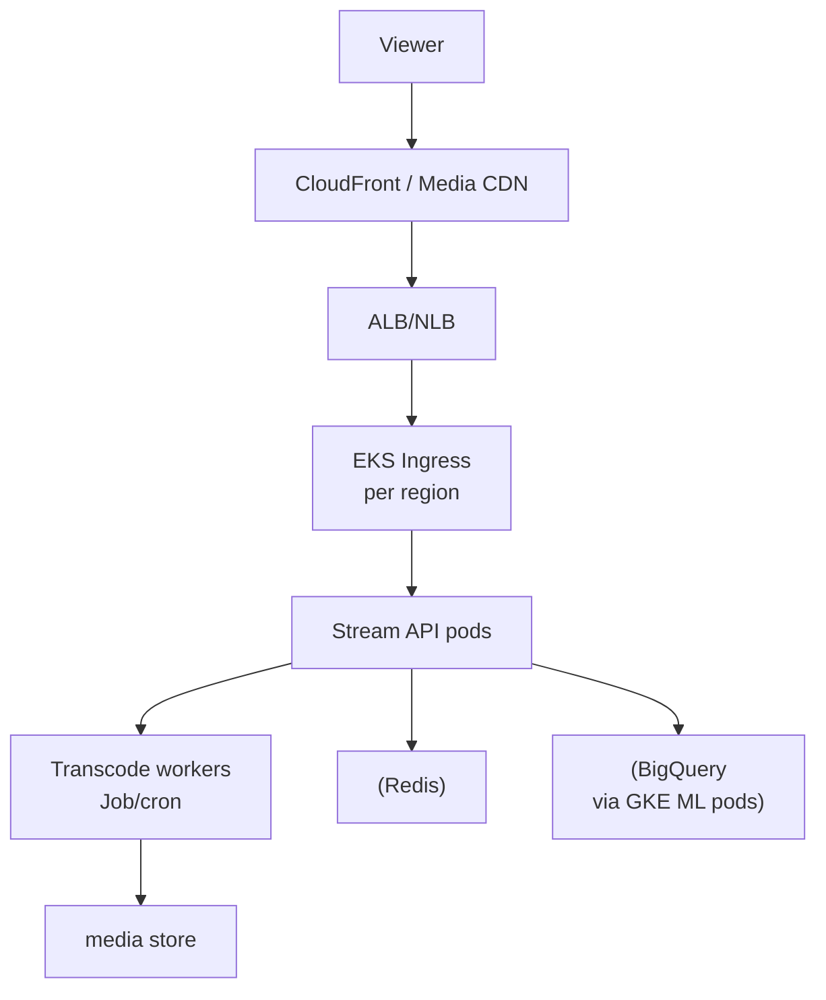

# Disney+ — Streaming at Scale on Kubernetes

> **Category:** Case Study / Media

| Field | Detail |
|-------|--------|
| **Industry** | Media / Streaming |
| **Region** | US (AWS, some GCP) |
| **Adoption** | 2021 (EKS + GKE) |
| **Scale** | 200+ services ~ 160 million subscribers |

## Who & Why K8s

Disney+ runs its global streaming platform on **EKS** (primary) with some **GKE** for data/ML. The driver: serve 160M+ subscribers during global launches (e.g., Marvel drops) with a uniform, autoscaling runtime, while integrating with AWS (CDN, media store) and GCP (BigQuery analytics). Kubernetes let them scale transcoding + recommendation pipelines independently.

## Journey

1. Pre-2021: Disney built Disney+ on a mix of VMs and containers.
2. 2021: standardized on EKS for serving (global rollout); GKE for ML/analytics.
3. Present: 200+ services; transcoding workers scale to zero between waves.

## Architecture

- Clusters: per-region EKS (us-east-1, eu-west-1, ap-southeast-1) + dedicated GKE for ML.
- Transcoding: batch workers (K8s Jobs/CronJobs) that scale to zero; on-demand during content waves.
- Identity: IRSA (AWS) + Workload Identity (GCP) for S3/BigQuery without keys.

## Tooling

- Argo CD + Spinnaker for GitOps.
- Prometheus + Datadog for stream-quality SLOs (rebuffering < 0.5%).
- S3 for media; CloudFront CDN; BigQuery for viewing analytics.

## Key Decisions

- EKS primary + GKE for ML — AWS for global media, GCP for BigQuery-based personalization.
- Transcode workers as Jobs that scale to zero — saved the massive cost of always-on transcode VMs.
- Regional clusters + CloudFront — required for 99.9% availability during global launches.

## Interview Angle

A Disney streaming engineer said the real stress test was the Marvel launch day: Kubernetes Jobs let transcoding scale from zero to thousands of containers in minutes on EKS, while regional EKS clusters behind CloudFront kept rebuffering under 0.5% — the metric Disney tracks most closely.

## Related Resources
- [Companies Using Kubernetes](../companies-using-kubernetes.md)
- [EKS](../09-cloud-integrations/eks.md) · [GKE](../09-cloud-integrations/gke.md)
- [GitOps](../15-advanced-patterns/gitops.md)
