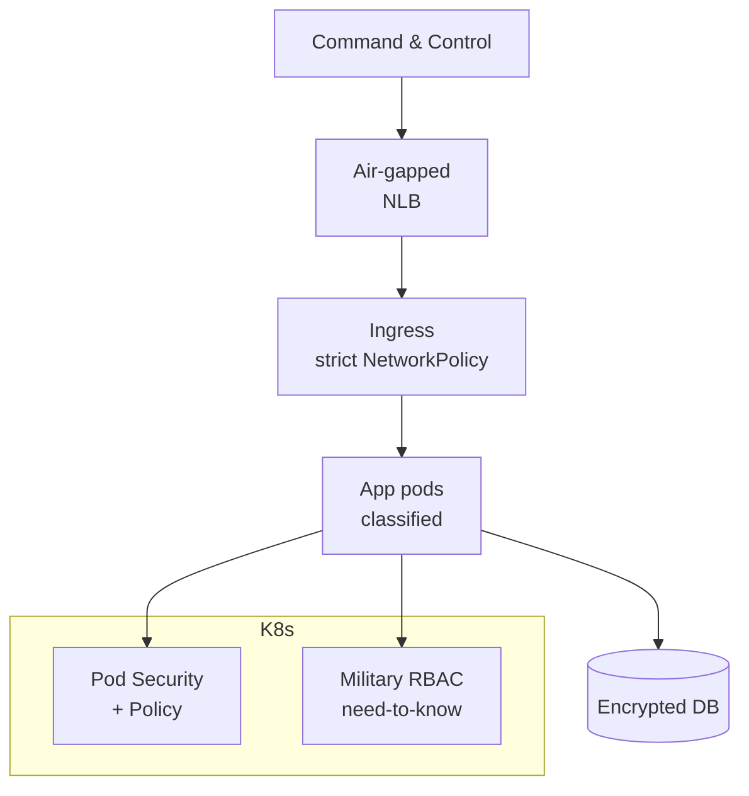

# U.S. Department of Defense — DoD K8s & Classified Workloads

> **Category:** Case Study / Government

| Field | Detail |
|-------|--------|
| **Industry** | Federal Government / Defense |
| **Region** | US |
| **Adoption** | 2020 (Kubernetes, classified) |
| **Scale** | DoD JEDI/JWCC workloads · classified clusters |

## Who & Why K8s

The U.S. Department of Defense adopted Kubernetes as part of the **JEDI/JWCC** cloud program to modernize defense applications — logistics, intelligence analysis, command-and-control. The challenge: run microservices **on classified networks** with strict air-gapped, multi-level-security (MLS) requirements. Kubernetes gives them a containerized runtime that can be hardened for classified workloads.

## Journey

1. 2019–20: JWCC awarded to AWS/Azure/GCP; DoD began standing up K8s at classification levels.
2. 2020+: deployed hardened Kubernetes (often DODIIS/secret regions) for defense apps.
3. Present: classified K8s clusters supporting logistics + analytics workloads.

## Architecture

- Clusters: isolated per classification level (e.g., Secret); separate physical/virtual clusters.
- Security: hardened Pod Security Standards, `NetworkPolicy` deny-by-default, no egress to the internet.
- Identity: military PKI + RBAC mapped to clearances (need-to-know).

## Tooling

- DoD-approved Kubernetes distributions (Red Hat OpenShift, upstream K8s) with DISA STIGs.
- Prometheus (air-gapped) for metrics; ELK stack for logs.
- PKI + DoD Public Key Infrastructure for cert-based auth.

## Key Decisions

- Separate cluster per classification level — you cannot mix Secret and Unclass in one cluster.
- Pod Security Standards + STIG hardening — required before any DoD K8s goes live.
- Air-gap + no egress — clusters mirror packages internally; no direct internet.

## Interview Angle

A DoD platform engineer noted the metric they cared about was "time to deploy a classified container image": with hardened Kubernetes + an internal image registry mirrored weekly under DISA STIGs, they got a new logistics analytics image from dev to a Secret cluster in under 48 hours — something the old virtual-machine process took weeks.

## Related Resources
- [Companies Using Kubernetes](../companies-using-kubernetes.md)
- [Security](../06-security/README.md)
- [GitOps](../15-advanced-patterns/gitops.md)
