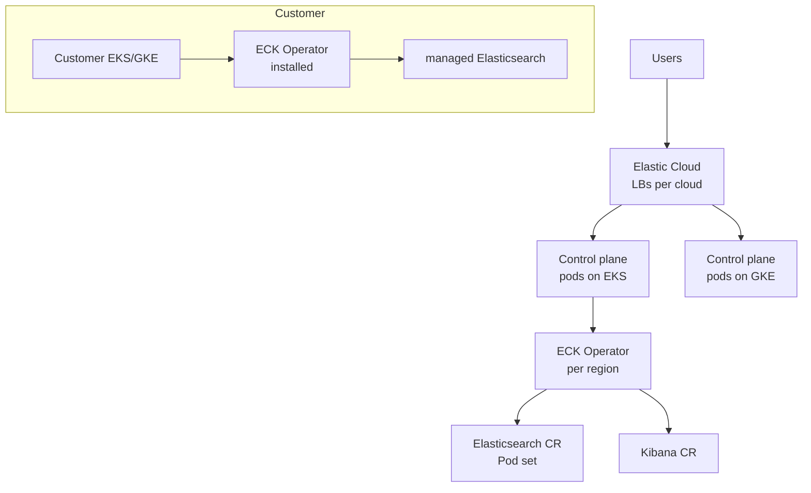

# Elastic — Cross-Cloud Observability on Kubernetes

> **Category:** Case Study / Observability SaaS

| Field | Detail |
|-------|--------|
| **Industry** | Observability / Search SaaS |
| **Region** | Global (AWS + GCP) |
| **Adoption** | 2020 (Kubernetes + Elastic Stack on K8s) |
| **Scale** | 50+ clusters · Elastic Cloud · 100K+ customers |

## Who & Why K8s

Elastic (Elasticsearch, Kibana, the Elastic Stack) runs **Elastic Cloud** — multi-cloud (AWS + GCP). The K8s adoption was two-fold: (1) they ship the **Elastic Stack as Helm charts / Helm-based operators** to run Elasticsearch on K8s for customers, and (2) their own SaaS control plane runs on K8s across clouds. The trigger was **portable, multi-cloud control plane** and the need to let customers run Elasticsearch anywhere (EKS, GKE, AKS, on-prem).

## Journey

1. **2019**: open-sourced the **ECK** (Elastic Cloud on Kubernetes) operator so customers can manage Elasticsearch/Kibana on any K8s.
2. **2020**: moved the Elastic Cloud control plane onto Kubernetes (their own infra), so the SaaS is "K8s managing K8s."
3. **Present**: 50+ clusters across AWS/GCP; customer clusters managed by ECK operator.

## Architecture

- **ECK (Elastic Cloud on Kubernetes) Operator**: a Kubernetes operator that watches `Elasticsearch`/`Kibana`/`ApmServer` CRDs and reconciles StatefulSets, PVCs, and config. It's both a customer product and the core of their SaaS.
- **Clusters**: per-region clusters (AWS us-east-1, GCP us-central1, etc.) running the control plane; plus customer-managed clusters that get the ECK operator.
- **Identity**: cross-cloud IAM via cloud-native SAs — EKS pods use IRSA, GKE pods use Workload Identity — so ES nodes fetch object stores without keys on either cloud.

## Tooling

- **ECK Operator** (the headline) — the operator that manages Elasticsearch lifecycle on any K8s.
- **Prometheus** (which Elastic also sponsors) scrapes cluster metrics; Elastic's own stack monitors itself.
- **Helm** for the SaaS control plane installs; operator manages Elasticsearch via CRDs.

## Key Decisions

- **ECK operator over raw manifests** — Elasticsearch has complex lifecycle (master/data roles, rolling upgrades with quorum). The operator encodes that in a controller instead of hand-rolled YAML.
- **Multi-cloud via K8s** — the same ECK operator + the same Pod security model works on EKS, GKE, and on-prem; that portability won them enterprise customers.
- **Run the SaaS on K8s too** — dogfooding: their own observability backend runs on the same primitives they ship.

## Interview Angle

> "We didn't just support Kubernetes — we built an operator that *is* Elasticsearch on Kubernetes, and then we ran our own SaaS on Kubernetes too. So when a customer asks 'does Elasticsearch work on my GKE?', the answer is 'we run ours there'."

## Related Resources
- [Companies Using Kubernetes](../companies-using-kubernetes.md)
- [Operators (CRDs)](../15-advanced-patterns/crds-operators.md)
- [Observability](../13-observability/README.md)
- [GKE](../09-cloud-integrations/gke.md) · [EKS](../09-cloud-integrations/eks.md)
