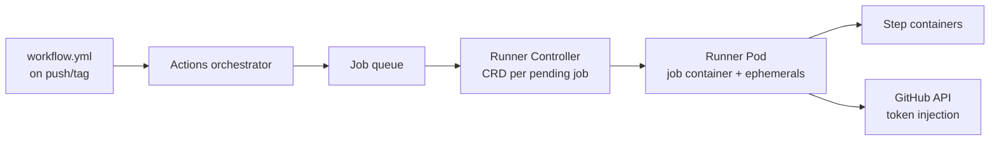

# GitHub — Every CI Step Runs Inside a Lockdown Kubernetes Pod

> **Category:** Case Study / Tech

| Field | Detail |
|-------|--------|
| **Industry** | DevOps Platform / SaaS |
| **Region** | Global (multi-cloud) |
| **Adoption** | 2019–2020 (GitHub Actions on Kubernetes) |
| **Scale** | 30+ clusters · GitHub Actions · 100M+ developers |

## Who & Why K8s

GitHub's largest Kubernetes footprint is **GitHub Actions** — the CI/CD engine behind 100M+ repositories. Workflows do not run on GitHub's own metal; they run on **short-lived Kubernetes Pods** that GitHub provisions per job. The motivation was **elastic, multi-tenant-safe CI**: spinning up a VM per Action would be too slow and costly, and securing a shared runner pool to run untrusted `run:` steps from any repo is far easier when each job is its own locked-down Pod.

## Journey

1. **Pre-2019**: early Actions runners on pooled VMs (limited elasticity, noisy-neighbor issues).
2. **2019–20**: built a custom controller that provisions a **Pod per job** on self-managed Kubernetes clusters.
3. **Present**: Actions scales by autoscaling the underlying K8s node pools; per-job Pods are created, run, and destroyed in seconds.

## Architecture

- **Clusters**: 30+ clusters across regions/clouds that GitHub provisions and operates for the Actions workload.
- **Runner controller**: a Kubernetes controller watches a custom resource (one per pending job) and creates a single Pod; on completion the Pod is deleted automatically.
- **Job isolation**: each job runs in its own Pod with a tight `SecurityContext` (no `privileged`, read-only root FS, dropped capabilities) — essential because Actions must run **untrusted** code from any repository.
- **Secrets**: job secrets are mounted as an **ephemeral Secret volume** that is deleted immediately after the job finishes, so secrets never linger on a node.

## Tooling

- The **`actions-runner-controller`** (a Kubernetes operator) manages the runner lifecycle — open-sourced precisely because the multi-tenant model needed to be reproducible.
- Each step in a workflow (`run:`, `uses:`) is its own container in the job Pod, so steps get clean, isolated filesystems.
- **Prometheus** metrics from the controller and the node pools drive autoscaling of the worker pools based on queue depth.

## Key Decisions

- **K8s for job isolation over VMs** — Pods are seconds to start vs. minutes for VMs, and a per-Pod `SecurityContext` makes sandboxing untrusted code far more tractable than VM images.
- **Custom controller instead of Argo/Tekton** — GitHub's per-repo, per-job isolation and billing model are stricter than a generic workflow engine, so they built their own.
- **One Pod per job (not per workflow)** — a workflow may fan out into N parallel jobs, each its own Pod, giving accurate per-job isolation and per-job billing.

## Interview Angle

> "Actions runs on Kubernetes. Every `run:` step you see is a container in a short-lived Pod we provision, run, and delete — that is what lets us safely run untrusted CI for 100M repositories."

## Related Resources
- [Companies Using Kubernetes](../companies-using-kubernetes.md)
- [GitOps](../15-advanced-patterns/gitops.md)
- [CI/CD](../11-ci-cd-gitops/ci-cd.md)
