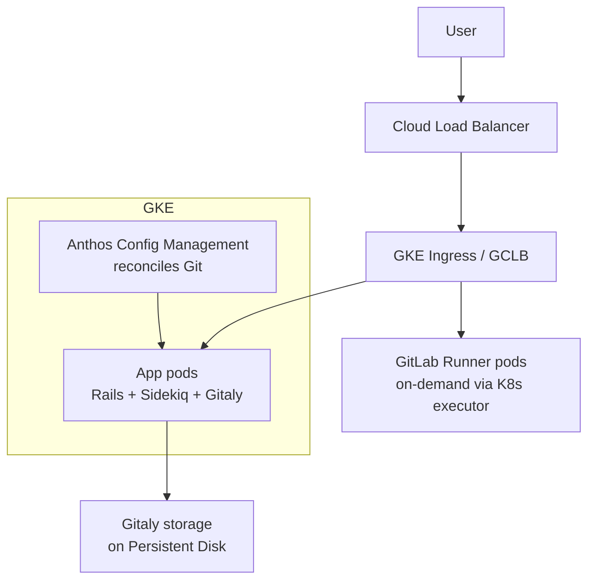

# GitLab — Kubernetes as a Service on GKE, Built by SREs Who Eat Their Own Dog Food

> **Category:** Case Study / Tech

| Field | Detail |
|-------|--------|
| **Industry** | DevOps / SaaS (CI/CD) |
| **Region** | Global (GKE us/eu) |
| **Adoption** | 2020 (GKE + Anthos Config Management) |
| **Scale** | 40+ clusters · GitLab SaaS · 30M+ registered users |

## Who & Why K8s

GitLab.com runs **entirely on Kubernetes (GKE)** — and GitLab *also* sells Kubernetes integration in its product. This is one of the most public "dog-food" stories: their SREs run the SaaS platform on GKE, and their CI/CD pipeline features (Auto DevOps, GKE integration) ship based on what worked in their own clusters. The trigger was moving off raw GCE instances to a model that the **product team could also ship to customers**.

## Journey

1. **Pre-2020**: GitLab.com on a mix of GCE VMs + bespoke orchestration.
2. **2020**: Migration to GKE clusters + Anthos Config Management (ACM) for config — driven by GitLab's own push to **support GKE as a first-class deploy target** in-product.
3. **Now**: 40+ clusters across prod/staging per region; every GitLab feature (CI runners, Gitaly, Rails API, Pages) runs on K8s.

## Architecture

- **Clusters**: per-environment (production, staging) and per-region (us, eu) — **one GKE cluster each**, not per team.
- **Runners**: GitLab CI runs on K8s runners that **autoscale per pipeline** (the famous "runners on GKE" integration). A pipeline that needs parallelism spins up N runner Pods, then they're deleted.
- **Config**: **Anthos Config Management** pulls from a `config/` Git repo and reconciles clusters — GitLab's own "infrastructure as code" layer.
- **Storage**: Gitaly storage on **GCE Persistent Disks** (ReadWriteOnce — they shard Gitaly by project to avoid the single-RW lock).

## Tooling

- **GitLab CI/CD** itself runs **on** GKE runnels — the "runners" are a K8s Deployment with the GitLab Runner executor that **spins up per-build Pods**.
- **Anthos Config Management** (Config Sync) = GitLab's GitOps layer (same concept as Flux, just Google's).
- **Prometheus + Grafana** for cluster metrics; **Stackdriver** (now Cloud Monitoring) for the SaaS logs.
- **GitLab's own Kubernetes integration** (the product feature) talks to these same clusters via a service account — so the product feature was literally developed against this infrastructure.

## Key Decisions

- **GKE over EKS** — GitLab's largest infra partner is Google; GKE's managed Prometheus + the tight GCP integration made it the natural home.
- **One cluster per env/region, not per team** — keeps the operator burden ~40 clusters (manageable) but requires strong namespace/quotas.
- **Anthos Config Management** for config — GitLab used their own GitOps needs to build the **GKE-native** integration in the product.
- **Runners scale-to-zero** — the K8s executor for CI is the feature that convinced other teams GitLab "got" containers.

## Results

- 30M+ users on a platform whose SREs literally ship the Kubernetes integration features used by their customers.
- Per-build runner pods = CI costs track with actual CI usage, not always-on VMs.
- Gitaly PD sharding + K8s autoscaling absorbed growth "GameStop-style" spikes without manual node provisioning.

## Interview Angle

> "We run GitLab.com on GKE and we ship the GKE integration feature. Our SREs built the product against the infra they run — that's why the Kubernetes CI integration shipped in weeks, not years."

## Related Resources
- [Companies Using Kubernetes](../companies-using-kubernetes.md)
- [GitOps](../15-advanced-patterns/gitops.md)
- [GKE](../09-cloud-integrations/gke.md)
- [CI/CD](../11-ci-cd-gitops/ci-cd.md)
