# Goldman Sachs — Marquee & Consumer Banking on Kubernetes

> **Category:** Case Study / Financial Services

| Field | Detail |
|-------|--------|
| **Industry** | Investment Banking / Finance |
| **Region** | Global |
| **Adoption** | 2020 (Kubernetes, multi-cloud) |
| **Scale** | 20+ teams · thousands of services |

## Who & Why K8s

Goldman Sachs runs **Marquee** (developer/data platform) and consumer-banking services (Marcus, Apple Card) on Kubernetes across clouds. Driver: **developer velocity + multi-cloud portability** — one control plane for trading-analytics services, data pipelines, and customer-facing apps, each with different compliance postures but the same platform story.

## Journey

1. **2019–20**: built an internal "K8s Platform" to back Marquee services; standardized on a runtime.
2. **2020**: rolled out to consumer-banking (Marcus) and Marquee analytics.
3. **Present**: multi-cloud; heavy emphasis on image signing + zero-trust networking.

## Architecture

```mermaid
graph TD
    Dev --> GS[GS UI / API]
    GS --> Ingress[Ingress &#40;multi-cloud&#41;]
    Ingress --> Apps[App pods &#40;Marquee<br/>Marcus&#41;]
    Apps --> Cache[(Redis / Aerospike)]
    Apps --> DB[(Postgres / Dynamo)]
    subgraph K8s
        SPIFFE[SPIFFE/SPIRE<br/>mTLS identity]
        Apps --> SPIFFE
    end
```

- **Clusters**: EKS (primary) + GKE (data), with a common identity layer; per-app namespaces with deny-by-default `NetworkPolicy`.
- **Identity**: **SPIFFE/SPIRE** for service identity + cloud-native IAM (IRSA on AWS, Workload Identity on GCP) — Goldman was an early SPIFFE adopter.
- **Supply chain**: all images **signed with Cosign**; admission enforces it.

## Tooling

- Internal **platform-as-a-service** on Kubernetes; engineers consume via a CLI + catalog, not raw manifests.
- **Prometheus + Grafana** for SLOs; custom dashboards per trading/analytics product.
- **SPIFFE/SPIRE** for mTLS between services (zero-trust).
- **Cosign + Notary** for signing; policy engine (Kyverno) enforces signed images + non-root.

## Key Decisions

- **SPIFFE for identity** — a bank needs mutual TLS end-to-end, not just network policies.
- **Cosign signing as admission policy** — supply-chain trust is regulatory at Goldman.
- **Multi-cloud** — AWS for most, GCP for data/ML workloads.

## Interview Angle

> "We picked Kubernetes so a service written for Marquee could deploy the same way as a Marcus consumer app — and we layered SPIFFE + Cosign on top so 'zero trust' is mandatory, not optional."

## Related Resources
- [Companies Using Kubernetes](../companies-using-kubernetes.md)
- [EKS](../09-cloud-integrations/eks.md) · [GKE](../09-cloud-integrations/gke.md)
- [Security](../06-security/README.md)
- [Service Mesh](../12-service-mesh/service-mesh.md)
