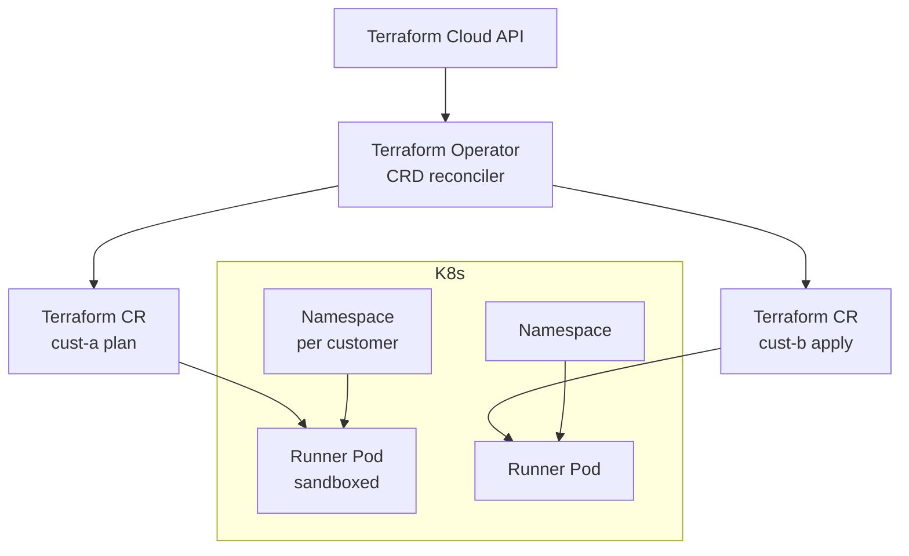

# HashiCorp — Terraform Cloud on Kubernetes, Operator-First

> **Category:** Case Study / SaaS

| Field | Detail |
|-------|--------|
| **Industry** | Infrastructure Software / SaaS |
| **Region** | US (multiple clouds) |
| **Adoption** | 2019 (Kubernetes + Terraform Operator) |
| **Scale** | 30+ services · Terraform Cloud · hundreds of customers |

## Who & Why K8s

HashiCorp runs **Terraform Cloud** (the SaaS) on Kubernetes — and, fittingly, builds the **Terraform Kubernetes Operator**. Their problem: provision and isolate **customer-app execution environments** (the VMs that run a customer's `terraform apply`) and the control plane of Terraform Cloud itself. K8s gave them a per-customer, sandboxed, autosizing substrate — and the Operator pattern let Terraform-native CRDs manage all of it declaratively.

## Journey

1. **2018–19**: built the **Terraform Kubernetes Operator** (`hashicorp/terraform-provider-kubernetes` → `hashicorp/terraform-k8s`) so a `Terraform` CR becomes a deployable resource.
2. **2019**: migrated Terraform Cloud control plane onto K8s.
3. **Present**: each customer's run is sandboxed in its own Pod/namespace via the operator pattern; the control plane scales as K8s workloads.

## Architecture

- **Operator**: a Custom Controller watches `Terraform` CRs; each CR = one Terraform Cloud run; the controller reconciles it by launching a run Pod.
- **Per-customer isolation**: each customer's execution runs in a dedicated namespace with a tight `ResourceQuota` and a default `deny-all` NetworkPolicy.
- **Identity**: K8s SAs map to cloud creds the customer configures; the runner Pod assumes them via IRSA/Workload Identity — no static tokens.

## Tooling

- The **Terraform Kubernetes Operator** itself (open source) — it's both the tool and the case study.
- **Helm** for the operator + CRDs.
- **Vault** (HashiCorp) still backs secrets for the control plane (run on K8s, ironically), and **Consul** service mesh connects the control-plane services within the cluster.
- **Prometheus** for Operator CRD metrics.

## Key Decisions

- **Operator over plain manifests** — Terraform's lifecycle (plan → apply → destroy) is *control-loop* logic, a perfect fit for the Operator pattern.
- **K8s for the run sandbox** — gave them autoscaling + per-customer isolation + multi-cloud portability in one move.
- **Identity via cloud-native SAs** (IRSA/WI) — let customers run with their own cloud creds without HashiCorp ever seeing keys.

## Interview Angle

> "We built the Terraform Operator so that 'infrastructure as code' becomes a Kubernetes resource; Terraform Cloud runs on Kubernetes so each customer's plan runs in a sandboxed Pod that the operator scales and destroys automatically."

## Related Resources
- [Companies Using Kubernetes](../companies-using-kubernetes.md)
- [Operators (CRDs)](../15-advanced-patterns/crds-operators.md)
- [GitOps](../15-advanced-patterns/gitops.md)
- [Security](../06-security/README.md)
