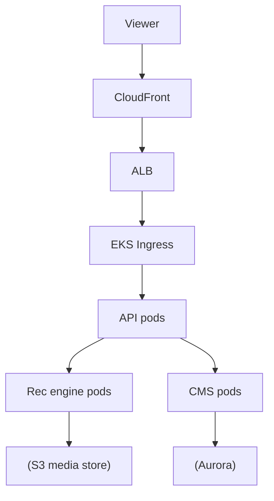

# HBO Max — Streaming Backend on Kubernetes

> **Category:** Case Study / Media

| Field | Detail |
|-------|--------|
| **Industry** | Media / Streaming |
| **Region** | US (AWS) |
| **Adoption** | 2021 (EKS) |
| **Scale** | 150+ services ~ 50 million monthly users |

## Who & Why K8s

HBO Max runs its streaming backend on **EKS** after consolidating from a legacy container platform. The migration (2021) addressed catalog management, personalization, and the need to scale during content premieres. K8s gave HBO a uniform runtime and AWS IAM for accessing media asset stores.

## Journey

1. Pre-2021: ran a legacy container scheduler for the streaming backend.
2. 2021: migrated the backend to EKS; adopted a GitOps model.
3. Present: 150+ services on EKS; canary rollouts for premieres.

## Architecture

- Clusters: EKS per region (us-east-1, us-west-2).
- Content delivery: CloudFront + S3 media store (read via IRSA).
- Personalization: separate Rec pods that query viewing-history stores.

## Tooling

- Argo CD for GitOps of backend services.
- Prometheus + Datadog for streaming SLOs.
- S3 + CloudFront; Aurora for user/catalog data.

## Key Decisions

- EKS over GKE — AWS-native media stack already in place.
- Argo CD canary rollouts — safer for live premieres (canary traffic split).
- IRSA for media assets — no keys in the catalog/asset-access path.

## Interview Angle

HBO's platform team said the first live premiere on the new EKS platform was the real test: Argo CD canary + EKS cluster autoscaling handled the launch spike with zero downtime, which is when they knew the migration had paid off.

## Related Resources
- [Companies Using Kubernetes](../companies-using-kubernetes.md)
- [EKS](../09-cloud-integrations/eks.md)
- [GitOps](../15-advanced-patterns/gitops.md)
