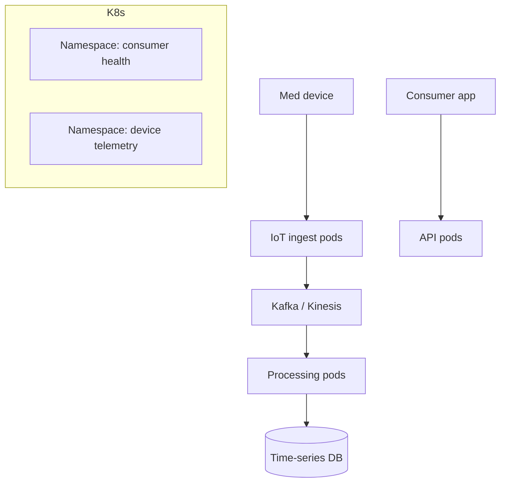

# Johnson & Johnson — Medical Devices & Health IT on Kubernetes

> **Category:** Case Study / Healthcare / MedTech

| Field | Detail |
|-------|--------|
| **Industry** | Medical Devices / Healthcare |
| **Region** | US (multi-cloud) |
| **Adoption** | 2021 (Kubernetes) |
| **Scale** | 100+ services ~ patient/device data platforms |

## Who & Why K8s

Johnson & Johnson runs a range of health platforms (patient engagement, medical-device telemetry, clinical data) on Kubernetes. The goal: a **unified, compliant control plane** across consumer-health apps and device-data ingestion, with HIPAA + device-regulation (FDA) compliance baked in. K8s let them run per-product namespaces with strict isolation.

## Journey

1. 2020: decided on a shared K8s platform across J&J health units.
2. 2021: deployed EKS (consumer health) + GKE (device telemetry).
3. Present: 100+ services; strict per-product namespace isolation.

## Architecture

- Isolation: each product (consumer apps, device telemetry) is a namespace with its own NetworkPolicy + quota.
- Compute: IoT ingestion pods on always-on nodes; processing on autoscaled pools.
- Compliance: image signing + runtime scanning; audit logs to cloud SIEM.

## Tooling

- Argo CD for GitOps across products.
- Prometheus + Grafana for device-telemetry SLOs.
- Vault for device-credential rotation; cloud KMS for PII.

## Key Decisions

- Per-product namespaces — keep FDA-regulated device data separate from consumer apps in the same cluster.
- Image signing mandatory — medical devices can't run unverified code (FDA software-of-unknown-provenance rules).
- Multi-cloud — consumer apps on EKS, device telemetry on GKE for BigQuery analytics.

## Interview Angle

J&J's platform team said the requirement that shaped everything was FDA traceability: every container running a medical device pipeline had to be signed and attributable — and Kubernetes admission + Cosign made that enforceable as code, which is what got internal audit sign-off.

## Related Resources
- [Companies Using Kubernetes](../companies-using-kubernetes.md)
- [Security](../06-security/README.md)
- [GitOps](../15-advanced-patterns/gitops.md)
