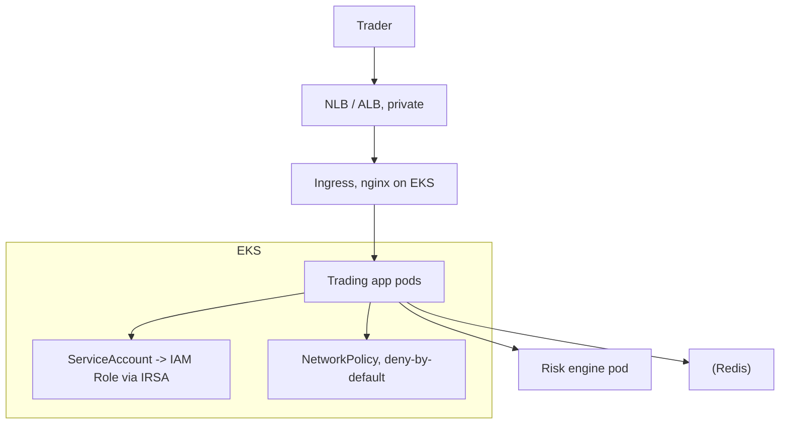

# JPMorgan Chase — Trading Desks on Kubernetes (EKS)

> **Category:** Case Study / Financial Services

| Field | Detail |
|-------|--------|
| **Industry** | Investment Bank / Finance |
| **Region** | US (global) |
| **Adoption** | 2021 (EKS, per-app clusters) |
| **Scale** | 50+ applications · 50,000+ engineers |

## Who & Why K8s

JPMorgan Chase adopted Kubernetes to give ~50,000 engineers a self-service platform for trading, risk, and analytics apps — many latency-sensitive. Goal: a uniform runtime for 50+ applications (trading UIs, risk engines, data pipelines) with per-app isolation and a cloud IAM story that fits a bank. Chose **EKS** to stay on AWS and integrate with existing identity/security.

## Journey

1. **2020**: built an internal "K8s Platform" (open-source tooling under `@jpmorgan`).
2. **2021–22**: rolled out per-app EKS clusters for flagship applications.
3. **Present**: expanding, with emphasis on security posture + network policies (banks can't afford permissive defaults).

## Architecture

- **Clusters**: **one EKS cluster per application** (not one giant cluster) — keeps regulatory blast radius tiny, matches audit "separation of duties."
- **Identity**: **IRSA** so pods assume IAM roles with least privilege — no long-lived credentials.
- **Security**: `NetworkPolicy` default-deny, image signing via **Cosign/Notary**, private registry; pods run non-root by admission.

## Tooling

- Internal **platform engineering** stack (Knative/Istio-based) wrapping EKS so engineers deploy via CLI/API, not raw manifests.
- **Prometheus + Grafana** for SLOs (trading apps have strict latency budgets); PagerDuty for alerts.
- **Cosign + Notary** for supply-chain signing; admission enforces "signed images only."

## Key Decisions

- **Per-app cluster model** — unusual (most do per-env), but a bank's compliance posture made one-app-one-cluster worthwhile.
- **IRSA as the only credential path** — consistent with zero-trust, no-static-keys culture.
- **EKS over GKE** — AWS identity + existing AWS spend tipped it.

## Interview Angle

> "At a bank, you can't just 'kubectl get pods' your way into compliance. Every pod maps to an IAM role via IRSA, every image is signed and enforced, and each trading app gets its own cluster so there's a hard regulatory boundary."

## Related Resources
- [Companies Using Kubernetes](../companies-using-kubernetes.md)
- [EKS](../09-cloud-integrations/eks.md)
- [Security](../06-security/README.md)
- [GitOps](../15-advanced-patterns/gitops.md)
