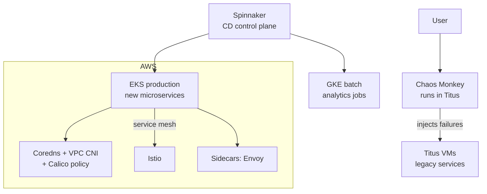

# Netflix — Chaos Engineering & the Microservices Mesh that Survived the Cloud

> **Category:** Case Study / Tech

| Field | Detail |
|-------|--------|
| **Industry** | Streaming Media / SaaS |
| **Region** | Global |
| **Adoption** | 2015–2019 (Titus container platform → Kubernetes evaluation) |
| **Scale** | 1,000+ engineers · ~1,200 microservices (pre-K8s) · ~160 million subscribers |

## Who & Why K8s

Netflix open-sourced much of its infrastructure and built **Titus** (a custom container orchestration platform) before the K8s ecosystem was mature. By 2019 they began **running Kubernetes clusters alongside Titus** for new services — not a wholesale migration, but an "extend the mesh" strategy. The trigger: Titus owned ~70% of Netflix's compute but teams increasingly wanted an off-the-shelf API for the 30% of greenfield services that didn't need Netflix-specific chaos integration.

## Journey

1. **2016–17**: Open-sourced Spinnaker (multi-cloud CD) and Chaos Monkey — tooling that assumed a container model but not K8s.
2. **2018**: Internal "Kubernetes platform" skunkworks — a team stood up EKS clusters for internal tooling.
3. **2019**: Decision — new services default to **EKS (or GKE)**, existing Titus services stay. The goal was never "kill Titus"; it was to let Kubernetes coexist and gradually take new workload.
4. **2020–present**: Titus services slowly migrating **service-by-service**; new microservices run on EKS.

## Architecture

Netflix's K8s clusters are **dedicated per major function** behind the Spinnaker/Titus control plane:

- **Clusters** are per-environment (prod/staging) and per-region (us-east-1/2, eu-west-1), with **Spinnaker pipelines** promoting images across them.
- **Networking**: AWS VPC CNI (so each Pod is an ENI/IP — needed for their custom load balancer integrations), CoreDNS, Calico for tenant isolation.
- **Identity**: IAM Roles for Service Accounts (IRSA) — a Pod assumes a role to read/write **S3** and **DynamoDB**. No AWS keys in code ever.
- **Service mesh**: a curated Istio deployment for new services (gradual replacement of their own Zuul-based edge).

## Tooling

- **Spinnaker** (`netflix/spinnaker`) is still the control-plane for CD across Titus and EKS — one pipeline defines the promotion from `staging` → `prod` on both platforms.
- **Atlas** (their Prometheus-fork, `netflix/atlas`) scrapes K8s metrics and Titus metrics into a single UI.
- **Chaos Engineering**: Chaos Monkey is wired into Titus, but they ported the chaos *model* to K8s via **Chaos Mesh** experiments in test clusters.
- **Eureka** (their service discovery) still backs legacy; new services use **K8s DNS + Istio** service entries.

## Key Decisions

- **Coexistence over conquest** — they kept Titus and added K8s instead of a risky big-bang migration. Most companies fail at the big-bang; Netflix hedged.
- **VPC CNI over kubenet** — because they need ENIs-per-Pod to integrate with their custom **Albany/JanusGraph** VPC routing and to assign IPs for their internal load-balancer IPAM. Trade-off: IP exhaustion risk, solved by wider VPC CIDRs.
- **IRSA as the credential path** for everything AWS. Avoids long-lived keys entirely.
- **No multitenancy**: one EKS cluster per major team/environment. They accept cluster sprawl because isolation is cheaper than a security incident at their scale.

## Results

- New services ship 30–40% faster through Spinnaker + EKS vs. Titus.
- The platform supports ~1,000 engineers across both backends with a single CD layer.
- Titus is now being **rewritten *on top of* Kubernetes primitives** (the "Titus v2" effort) — so eventually *all* Netflix compute is K8s, but the control plane was deliberately evolved, not replaced.

## Interview Angle

> "Kubernetes let us stop building the commodity orchestration primitives and spend engineering time on the edge — the chaos, the CDN, the streaming stack. We didn't migrate off Titus; we migrated Titus onto Kubernetes."

## Related Resources
- [Companies Using Kubernetes](../companies-using-kubernetes.md)
- [GitOps](../15-advanced-patterns/gitops.md)
- [Security](../06-security/README.md)
- [EKS](../09-cloud-integrations/eks.md) · [GKE](../09-cloud-integrations/gke.md)
