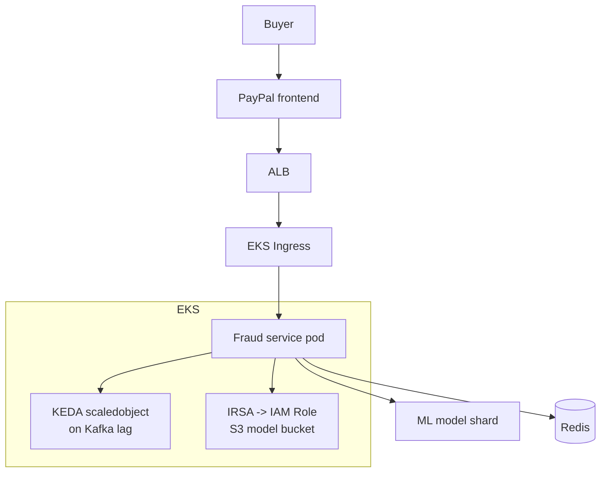

# PayPal — Fraud Detection at Scale on Kubernetes

> **Category:** Case Study / Financial Services

| Field | Detail |
|-------|--------|
| **Industry** | Payments / FinTech |
| **Region** | US (AWS) |
| **Adoption** | 2020 (EKS + Kubernetes) |
| **Scale** | 250+ services ~ 5 billion payments/year |

## Who & Why K8s

PayPal runs its global payments platform (checkout, fraud detection, risk) on **EKS**. The migration was driven by the need to modernize fraud-detection models (which scale unpredictably during sales) and to give engineering teams a self-service, autoscaling surface. K8s gave them per-service scaling + AWS IAM integration so payment services assume roles without embedded keys.

## Journey

1. Early 2020s: began containerizing fraud/risk microservices.
2. Mid-2020s: EKS adoption for new services; existing Java services ported gradually.
3. Present: 250+ services on EKS; fraud detection autoscales via KEDA on event load.

## Architecture

- Clusters: EKS clusters per region (prod, staging) with shared tenancy + namespace quotas.
- Autoscaling: fraud/risk services scale on Kafka lag (KEDA) and CPU, not just requests.
- Identity: IRSA for S3 (ML models) and DynamoDB (risk state); no keys in code.

## Tooling

- Spinnaker + internal CI for CD into EKS.
- Prometheus + Datadog for fraud-latency SLOs (fraud must stay <50ms).
- Vault for secrets; S3 for ML model artifacts (read via IRSA).
- Custom admission policies (no privileged, signed images).

## Key Decisions

- EKS over GKE — AWS-native IAM + the spend was already there.
- KEDA on Kafka lag — fraud workloads spike on events, not HTTP, so request-based HPA was wrong.
- IRSA as the only AWS credential path — PCI DSS compliance requires auditable, revocable credentials.

## Interview Angle

PayPal's fraud team repeated one metric: sub-50ms per transaction, globally. Kubernetes + KEDA gave them elastic scale on Kafka lag while IRSA kept every AWS access auditable — which is exactly what auditors ask for when you handle 5 billion payments a year.

## Related Resources
- [Companies Using Kubernetes](../companies-using-kubernetes.md)
- [EKS](../09-cloud-integrations/eks.md)
- [Security](../06-security/README.md)
- [GitOps](../15-advanced-patterns/gitops.md)
