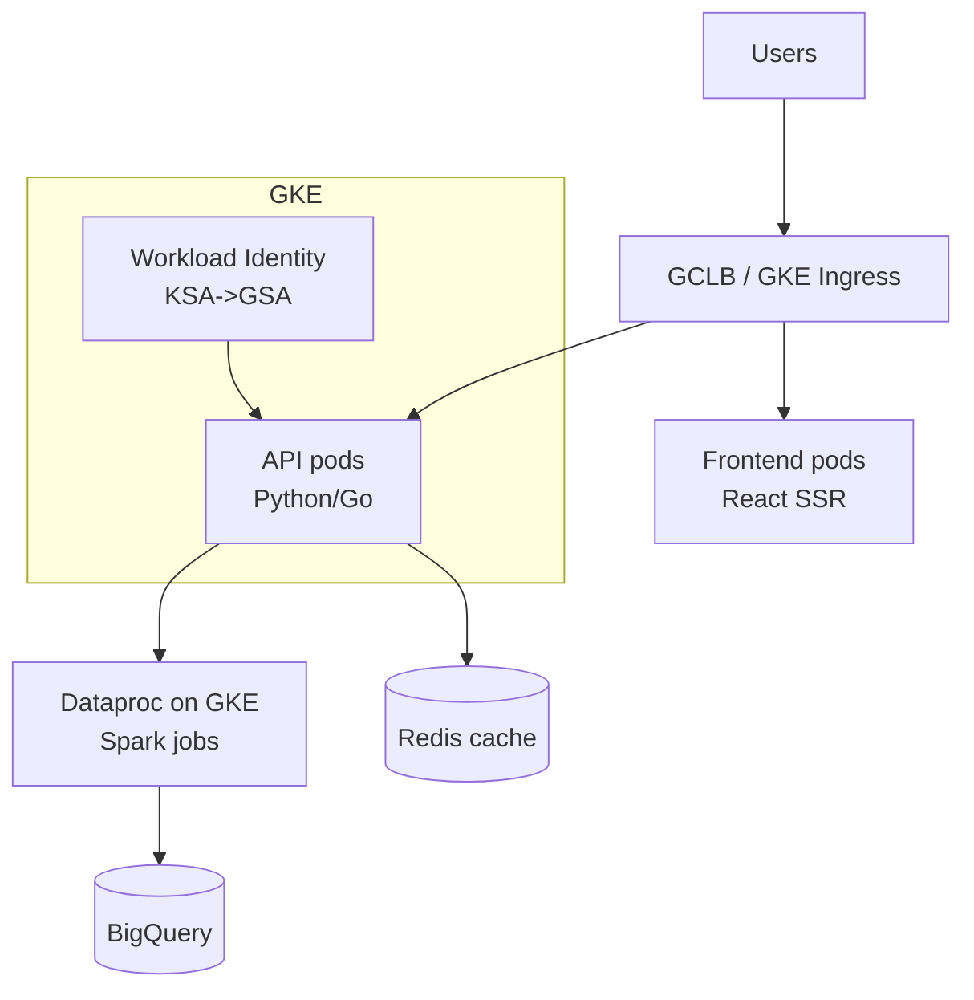

# Pinterest — Data Plane on GKE, 100+ Spark Jobs a Day

> **Category:** Case Study / Data

| Field | Detail |
|-------|--------|
| **Industry** | Social / Big Data |
| **Region** | US (GCP) |
| **Adoption** | 2020 (GKE) |
| **Scale** | 100+ data jobs/day · 500+ microservices · 450M+ pins |

## Who & Why K8s

Pinterest runs an intense **data + ML platform** (feed ranking, ad targeting). Their trigger for Kubernetes was the *data plane* problem: **100+ Spark/Beam jobs per day**, each needing ephemeral, rightsized clusters, and a growing fleet of 500+ serving microservices that had to share one networking/security story with the data jobs. GKE won because of native **Spark on GKE** + BigQuery + Workload Identity.

## Journey

1. **2019**: evaluated options; chose GKE to co-locate serving + data on one control plane (GCP home).
2. **2020–21**: ported the Spark jobs to **Dataproc on GKE** (Spark driver/executor Pods) and the serving services to GKE standard clusters.
3. **Present**: data + serving share the same identity (Workload Identity) and ingress story.

## Architecture

- **Clusters**: separate GKE clusters per tier (prod, staging, data) so the 100+ daily Spark jobs don't destabilize serving.
- **Data jobs**: **Spark on Kubernetes** via Dataproc — each job is a driver Pod + executor Pods; ephemeral, auto-deleted.
- **Identity**: **Workload Identity** binds a K8s SA to a GCP SA so jobs read GCS (training data) and write BigQuery with no keys.

## Tooling

- **Spark on K8s** as the batch substrate — `spark-on-k8s-operator` (the now-mature open-source operator) schedules Spark apps onto GKE.
- **Dataproc** managed the Spark runtime for a while, then they moved *to the operator* for more control.
- **Prometheus + Grafana** for cluster metrics; custom SLOs on Spark job latency.

## Key Decisions

- **GKE** — BigQuery + Spark-on-GKE + Workload Identity were a tighter story than AWS EKS + EMR.
- **Separate data cluster from serving** — 100+ Spark jobs/day would thrash the scheduler on a shared cluster.
- **Spark-on-K8s (not EMR/Dataproc managed)** eventually — to share the same IAM and autoscaling story as serving.
- **Identity-first**: Workload Identity let them kill key rotation for data jobs entirely.

## Interview Angle

> "We moved the data plane to Kubernetes so the same identity, autoscaling, and ingress story that powers our 500 serving services also runs our 100 daily Spark jobs — one fleet, one security model."

## Related Resources
- [Companies Using Kubernetes](../companies-using-kubernetes.md)
- [GitOps](../15-advanced-patterns/gitops.md)
- [GKE](../09-cloud-integrations/gke.md)
- [Security](../06-security/README.md)
