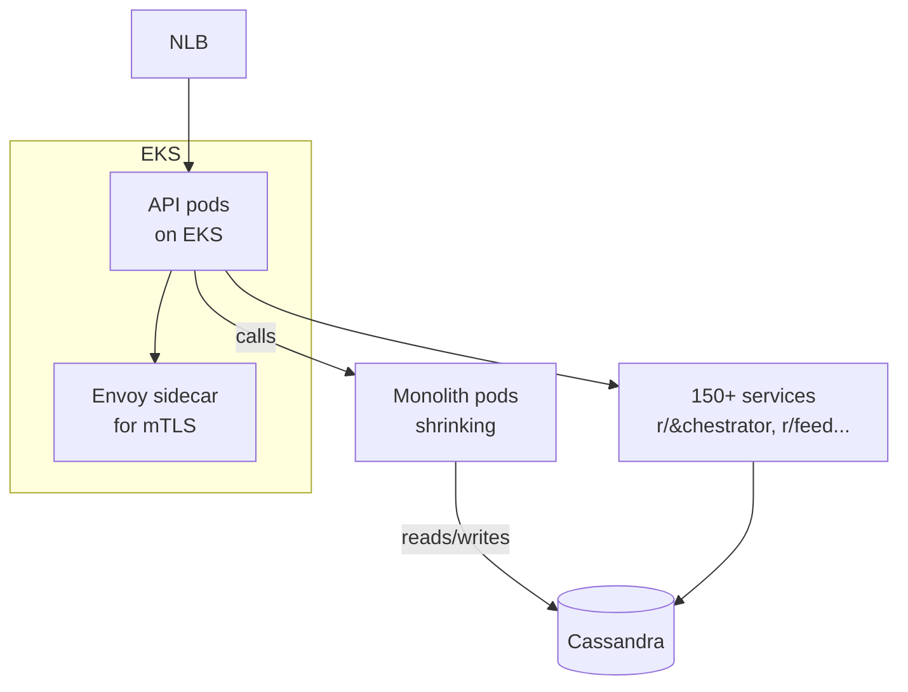

# Reddit — Lift-and-Shift onto EKS, Then Rewrote the Monolith

> **Category:** Case Study / Tech

| Field | Detail |
|-------|--------|
| **Industry** | Social / SaaS |
| **Region** | US (global traffic) |
| **Adoption** | 2021 (EKS) |
| **Scale** | 150+ services · dozens of clusters (dev/prod) · 50M+ DAU |

## Who & Why K8s

Reddit ran its monolith on dedicated AWS instances for years. The migration to Kubernetes (EKS) was driven by **scaling pain during growth spikes** (the famous "up 10x in months" period) and the need to **containerize the monolith** so teams could own slices of it independently. K8s gave them a uniform scheduling layer and a path to break the monolith into 150+ services without forklifting infra.

## Journey

1. **2021**: Decision to move to EKS (AWS-native = cheaper given existing AWS spend + support).
2. **"Strangler" migration**: containerize the existing monolith in one big Pod, then carve features out as separate services over ~2-3 years.
3. **Now**: a mix of legacy monolith Pods + 150+ Go/Python/Rust services, all on EKS, all via internal platform tooling.

## Architecture

- **Clusters**: separate EKS clusters per environment (prod, staging) — **not** per team; they rely on **namespace isolation + Pod Security Standards** instead.
- **Networking**: AWS VPC CNI (each Pod an ENI), **AWS Load Balancer Controller** provisioning NLBs per service (Reddit's services are mostly HTTP/gRPC; they moved away from classic ELBs).
- **Service mesh**: a lightweight **Envoy sidecar** mesh for mTLS + retries between services — not full Istio (they rejected the complexity), but a curated Envoy data plane.
- **Identity**: **IRSA** binds service accounts to IAM roles for S3 (image storage) and DynamoDB; most secrets still come from a Vault sidecar injected by their custom admission controller.

## Tooling

- **Spinnaker** still drives CD into EKS (Reddit is an AWS+Spinnaker shop historically; they layered K8s on top rather than replacing CD).
- **Vault** (HashiCorp) for secrets, injected via a custom sidecar injector (they built their own rather than adopt Sealed Secrets).
- **Cassandra** is still the primary store; new services use **Aurora RDS** for their own tables.
- **Envoy** as a data-plane sidecar (custom control plane, not Istio/Gloo).
- Internal **"platform"** (Go) — the self-service UI devs use to deploy a service.

## Key Decisions

- **EKS (not GKE)** — 90% of Reddit's spend/infra was already AWS; GKE would have added a second cloud's learning curve.
- **VPC CNI** — because they needed ENIs-per-Pod to bind to their existing AWS security groups (VPC-SC) used for network ACLs.
- **Envoy sidecars, not a mesh control plane** — mTLS + retries were the only "mesh" features they actually needed; Istio's multi-year config burden wasn't worth it.
- **Namespace-isolation model** over cluster-per-team — keeps cluster count manageable but requires strong RBAC + quotas (a trade-off they accepted).

## Results

- Migration let new teams ship services independently; Reddit went from ~30 services pre-K8s to 150+ on EKS within 2 years.
- Growth spikes (e.g., GameStop-era subreddit rushes) now auto-scale per-service instead of needing manual instance scaling of the monolith.
- Still actively shrinking the monolith Pod size as features migrate.

## Interview Angle

> "We containerized the monolith and ran it on EKS, then *slowly* pulled services out. K8s gave us a stable scheduler while the app architecture changed under it — much safer than a rewrite."

## Related Resources
- [Companies Using Kubernetes](../companies-using-kubernetes.md)
- [GitOps](../15-advanced-patterns/gitops.md)
- [EKS](../09-cloud-integrations/eks.md)
- [Security](../06-security/README.md)
