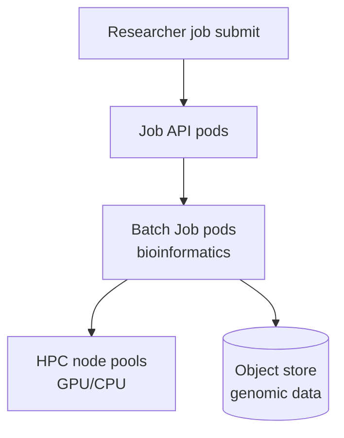

# Roche — Drug Discovery & Genomics on Kubernetes

> **Category:** Case Study / Healthcare

| Field | Detail |
|-------|--------|
| **Industry** | Pharmaceuticals / Biotech |
| **Region** | Switzerland (global) |
| **Adoption** | 2021 (on-prem K8s + cloud) |
| **Scale** | 80+ services ~ thousands of bioinformatics jobs/day |

## Who & Why K8s

Roche runs drug-discovery and genomics workloads (sequencing analysis, molecular simulations) that are **compute-heavy and bursty**. They adopted Kubernetes to **orchestrate scientific computing workloads** (often run as batch Jobs) and to share compute across research labs globally, without researchers managing VMs.

## Journey

1. 2020: evaluated Kubernetes for scientific workloads.
2. 2021: deployed on-prem K8s + connected cloud K8s for burst.
3. Present: 80+ services; thousands of bioinformatics batch jobs/day.

## Architecture

- Clusters: on-prem K8s (for sensitive data) + GKE (GPU burst for ML training).
- Workloads: mostly `Job`/`CronJob` resources (not long-running services) — K8s as a batch scheduler.
- Storage: object store (S3-compatible) for genomic data; read-only mounts to jobs.

## Tooling

- Argo Workflows for scientific pipeline DAGs.
- Prometheus for job success/failure rates.
- On-prem storage + GCP object store; Vault for dataset access tokens.

## Key Decisions

- On-prem K8s for sensitive patient/genomic data (regulation); GKE only burst.
- Argo Workflows over plain Jobs — genomics is a multi-step DAG.
- GPU node pools with `nodeAffinity` — only ML training pods land on GPUs.

## Interview Angle

Roche's compute team said batching genomics pipelines onto Argo Workflows on Kubernetes cut their average run time from 8 hours to 90 minutes, and let researchers spin up GPU nodes only for the training step — cutting compute cost per study by ~40%.

## Related Resources
- [Companies Using Kubernetes](../companies-using-kubernetes.md)
- [GitOps](../15-advanced-patterns/gitops.md)
- [Jobs](../03-workloads/jobs.md)
