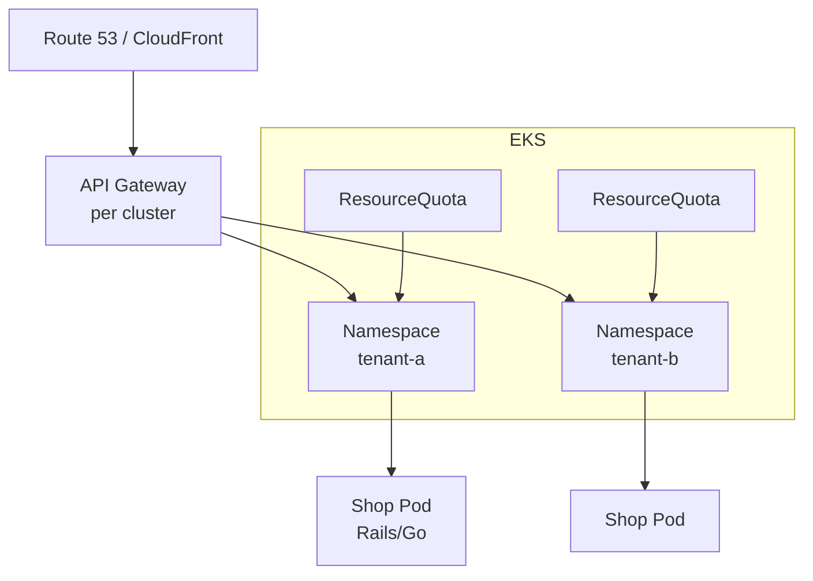

# Shopify — Multi-Tenant Tenants, Namespace Isolation, and EKS

> **Category:** Case Study / E-commerce

| Field | Detail |
|-------|--------|
| **Industry** | E-commerce / SaaS |
| **Region** | Canada (global infra on AWS) |
| **Adoption** | 2021 (EKS, then multi-cluster) |
| **Scale** | 200+ services · 1M+ sites · 300K+ shops per cluster slice |

## Who & Why K8s

Shopify powers a million+ merchants on one shared platform. Their problem: isolate **thousands of tenants** from noisy neighbors while letting each merchant's shop scale independently — all on a single, billable platform. Kubernetes (EKS) let them move from a giant Rails monolith running on EC2 to **per-merchant isolation via namespaces + quotas**, while keeping a single fleet operator.

## Journey

1. **2018–20**: monolith-to-services: split "Shop" (merchant storefronts) out of the Rails core into ~200 services.
2. **2021**: picked **EKS** (large AWS footprint already) and built a "tenant-per-namespace" model.
3. **Now**: hundreds of "tenant groups" (shops grouped for efficiency) each live in their own K8s namespace with a hard `ResourceQuota`.

## Architecture

- **Clusters**: several EKS clusters; shops are bucketed into tenant groups, each group a namespace, each namespace capped by a `ResourceQuota` so no tenant can starve another.
- **Identity & billing**: each tenant namespace maps to a set of AWS accounts (the "Billing Account" model), so AWS cost attribution == namespace == tenant.
- **Networking**: AWS VPC CNI + **AWS Load Balancer Controller**; per-shop Ingress via a custom controller that builds an NLB/Service per active shop.

## Tooling

- **"K8s by the landlord"** model: Shopify *is* the landlord; merchants are namespaces. They open-sourced parts of this as the `shopify/k8s` tooling around quotas and namespace lifecycle.
- **Prometheus + Thanos** for cross-cluster metrics; `ResourceQuota` violations feed autoscaling of the underlying ASGs.
- **Vault** (HashiCorp) for per-namespace secrets (Stripe keys, domain TLS), injected via the Vault Agent Injector.

## Key Decisions

- **Namespace-per-tenant, not cluster-per-tenant** — at Shopify's scale, a million tenants would never fit as separate clusters; namespaces + quotas give isolation cheaper.
- **EKS on AWS** — to reuse the AWS billing/identity story and avoid re-platforming their (huge) AWS presence.
- **Custom tenant controller** that reconciles "shop needs a namespace" into the right cluster slice — this is the secret sauce, not vanilla K8s.

## Interview Angle

> "We put each group of shops in its own Kubernetes namespace with a hard quota, and AWS cost = namespace = tenant. That is how you run a million stores on one shared fleet without noisy neighbors."

## Related Resources
- [Companies Using Kubernetes](../companies-using-kubernetes.md)
- [GitOps](../15-advanced-patterns/gitops.md)
- [EKS](../09-cloud-integrations/eks.md)
- [Security](../06-security/README.md)
