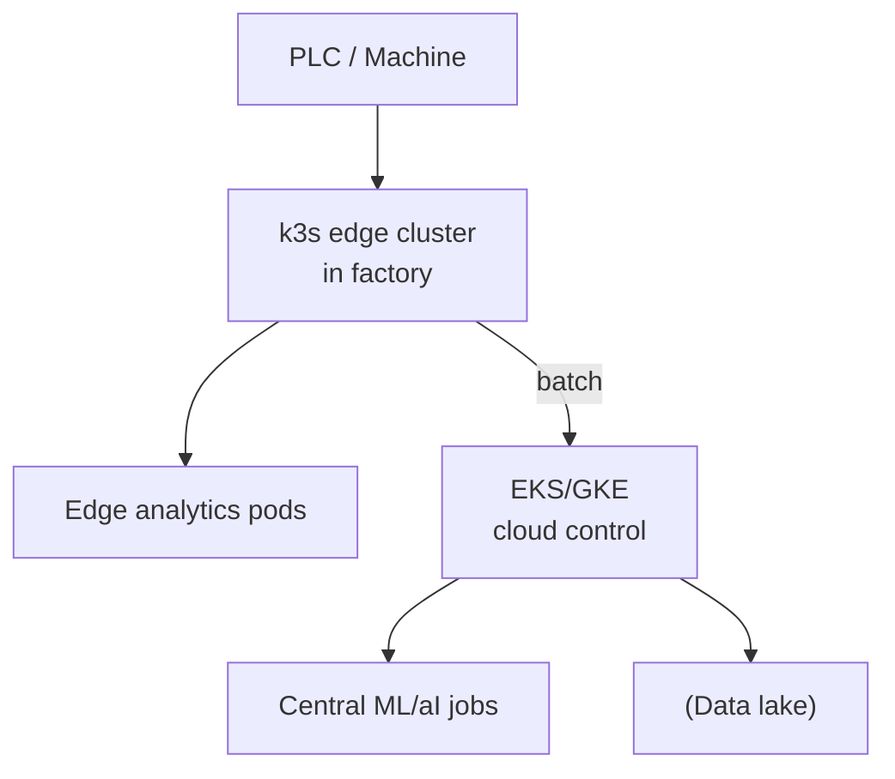

# Siemens — Industrial IoT & Edge on Kubernetes

> **Category:** Case Study / Industrial / Edge

| Field | Detail |
|-------|--------|
| **Industry** | Industrial Automation / IoT |
| **Region** | Germany (global) |
| **Adoption** | 2021 (Kubernetes + edge K3s) |
| **Scale** | 100+ services · IIoT edge fleet |

## Who & Why K8s

Siemens uses Kubernetes to run its **industrial IoT (IIoT)** platform — collecting telemetry from factory PLCs/machines and running edge analytics. The challenge: a huge fleet of on-prem/edge sites with intermittent connectivity. K8s (with **k3s** at the edge, full K8s in the cloud) gave them a uniform runtime from edge to cloud.

## Journey

1. 2020: built an IIoT platform spanning edge + cloud.
2. 2021: standardized on k3s at the edge + EKS/GKE in the cloud.
3. Present: 100+ services; edge clusters manage factory equipment.

## Architecture

- Edge: **k3s** clusters inside factories (single binary, low footprint).
- Cloud: EKS/GKE ingest the batched edge telemetry.
- Workload type: edge runs lightweight analytics pods; cloud runs heavy ML.

## Tooling

- Helm for edge app packages; Argo CD for cloud GitOps.
- k3s for the edge control plane (single binary, can run offline).
- Prometheus for edge metrics; central Grafana in the cloud.

## Key Decisions

- k3s at the edge — full K8s is too heavy for a factory floor; k3s is a single binary.
- Same API surface (k3s ≈ K8s) end-to-end — one set of skills, one CI/CD for edge + cloud.
- Local-first: edge clusters keep running if the cloud connection drops.

## Interview Angle

Siemens' IIoT lead said the metric was factory uptime: using k3s at the edge meant they could push analytics updates with the same GitOps workflow as the cloud, and when the WAN went down (common in a factory), the edge kept running the last-known-good config — which is what kept production lines up.

## Related Resources
- [Companies Using Kubernetes](../companies-using-kubernetes.md)
- [k3s](../09-cloud-integrations/k3s.md)
- [GitOps](../15-advanced-patterns/gitops.md)
